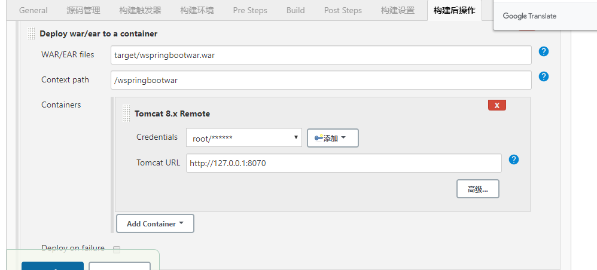

# Jenkins

## 第一个jenkin部署的项目

> 1.搭建一个springboot的war包项目
>
> 2.提交到github管理
>
> 3.jenkins配置：插件安装，触发器配置，git配置，jdk配置 ,maven配置 ，构建配置，部署配置等

## 安装jenkins：

注意：需提前安装好jdk ，maven，git

参考：https://blog.csdn.net/qq_35868412/article/details/89475386

更简单的办法：将jenkins的war放入tomcat的webapp下，然后，再启动tomcat即可。

### 卸载jenkins：

```java
1、rpm卸载
rpm -e jenkins
2、检查是否卸载成功
rpm -ql jenkins 
3、彻底删除残留文件：
find / -iname jenkins | xargs -n 1000 rm -rf
```

### 添加插件：

安装插件太慢，解决办法：https://www.cnblogs.com/hellxz/p/jenkins_install_plugins_faster.html

从官网下载插件，再离线上传插件办法：https://blog.csdn.net/tianhua79658788/article/details/78249908

**添加maven插件**：Maven Integration plugin

**添加git插件**：GitHub

**添加中文插件**：Localization: Chinese (Simplified)

**添加部署插件**：Deploy to container


官网下载插件：https://wiki.jenkins.io/display/JENKINS/Plugins


## 配置：

### 全局配置jdk，maven


### 创建一个maven任务


### 配置Git


### 构建

> 清空workspace，从git仓库取文件，进行构建


### 设置tomcat热部署

更改端口：server.xml，搜索8080，改为8081

修改webapps/manager/META-INF/context.xml，注释如图标签。


修改conf/tomcat-user.xml文件，添加如下内容：

```
<user username="root" password="root" roles="manager-script,admin-script,admin-gui,tomcat,manager-gui"/>
```

### 部署配置

> 前提：安装Deploy to a container插件



### 添加hook，实现提交代码，出发构建以及部署

github配置jenkins的hook地址


触发器勾选github hook


## FAQ

### 问题1：新建任务时，没有【构建一个maven项目】的选项

解决办法：需要安装插件 ,搜索：maven integration

参考：https://www.cnblogs.com/zhizhao/p/9442411.html


### 问题2：版本太低，插件无法安装

解决办法：下载最新的war包，替换/usr/lib/jenkins下的war，重新启动service jenkins start

### 问题3：No such file or directory) and 'parent.relativePath' points at no local POM @ line 5

原因分析：jenkins对maven仓库路径没有权限，需要linux授权

解决办法：https://blog.csdn.net/qq_33278354/article/details/103684956