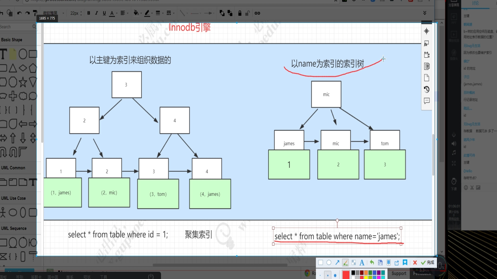

# Mysql

## 存储引擎

> Myisam 不支持事务：
>
> innodb 支持事务：以主键为索引组织数据；若未设置主键，则默认选择一个长整型字段。若无长整型字段，则会生成一个_id的长整型索引字段。

Innodb的b+tree如下图：主键索引树的叶子节点存储了整条数据，其他字段的索引树存储主键的值。



## 事务隔离级别

```
读未提交（read-uncommitted）
不可重复读（read-committed）	
可重复读（repeatable-read）【mysql默认】
串行化（serializable）
```

参考：https://www.cnblogs.com/wyaokai/p/10921323.html

## 三大范式和反范式设计

## SQL优化

### sql优化基本规则

### sql优化工作实例

开启事务

- **BEGIN**/**start Transaction** 开始一个事务
- **ROLLBACK** 事务回滚
- **COMMIT** 事务确认

### 执行计划

```
system > const > eq_ref > ref > fulltext > ref_or_null > index_merge
> unique_subquery > index_subquery > range > index > ALL
```

参考：http://www.wenjiangs.com/article/mysql-explain.html

**查看sql语句在mysql引擎最终的执行语句：**

```
EXPLAIN
select * from etc_test where id = 1;
show WARNINGS
```


## MySQL规约

### 建表规约

1.   【强制】表达是与否概念的字段，必须使用 is _ xxx 的方式命名，数据类型是tinyint（ 1 表示是，0 表示否 ）  

2. 【强制】表名、字段名必须使用小写字母或数字 ； 禁止出现数字开头，禁止两个下划线中间只出现数字。数据库字段名的修改代价很大，因为无法进行预发布，所以字段名称需要慎重考虑。

正例： getter _ admin ， task _ config ， level 3_ name

反例： GetterAdmin ， taskConfig ， level _3_ name

3. 【强制】表名不使用复数名词。

说明：表名应该仅仅表示表里面的实体内容，不应该表示实体数量， 

4. 【强制】禁用保留字，如 desc 、 range 、 match 、 delayed 等 

5. 【强制】唯一索引名为 uk _字段名 ； 普通索引名则为 idx _字段名。

说明： uk _ 即 unique key；idx _ 即 index 的简称。

6. 【强制】小数类型为 decimal ，禁止使用 float 和 double 。

说明： float 和 double 在存储的时候，存在精度损失的问题，很可能在值的比较时，得到不

正确的结果。如果存储的数据范围超过 decimal 的范围，建议将数据拆成整数和小数分开存储。

7. 【强制】如果存储的字符串长度几乎相等，使用 char 定长字符串类型。

8. 【强制】 varchar 是可变长字符串，不预先分配存储空间，长度不要超过 5000，如果存储长度大于此值，定义字段类型为 text ，独立出来一张表，用主键来对应，避免影响其它字段索引效率。

9. 【推荐】表的命名最好是加上“业务名称_表的作用”。

正例： tiger _ task / tiger _ reader / mpp _ config

10. 【推荐】库名与应用名称尽量一致。

11. 【推荐】如果修改字段含义或对字段表示的状态追加时，需要及时更新字段注释。

12. 【推荐】字段允许适当冗余，以提高性能，但是必须考虑数据同步的情况。冗余字段应遵循：

1 ） 不是频繁修改的字段。

2 ） 不是 varchar 超长字段，更不能是 text 字段。

正例：商品类目名称使用频率高，字段长度短，名称基本一成不变，可在相关联的表中冗余存储类目名称，避免关联查询。

13. 【参考】合适的字符存储长度，不但节约数据库表空间、节约索引存储，更重要的是提升检索速度。

###  索引规约

1. 【强制】业务上具有唯一特性的字段，即使是组合字段，也必须建成唯一索引。

说明：不要以为唯一索引影响了 insert 速度，这个速度损耗可以忽略，但提高查找速度是明显的

2. 【建议】 尽量避免多表join 。需要 join 的字段，数据类型保持绝对一致 ； 多表关联查询时，保证被关联的字段需要有索引。

说明：即使双表 join 也要注意表索引、 SQL 性能。

3. 【强制】在 varchar 字段上建立索引时，必须指定索引长度，没必要对全字段建立索引，根据实际文本区分度决定索引长度。

4. 【推荐】如果有 order by 的场景，请注意利用索引的有序性。 order by 最后的字段是组合索引的一部分，并且放在索引组合顺序的最后，避免出现 file _ sort 的情况，影响查询性能。

正例： where a =? and b =? order by c; 索引： a _ b _ c

反例：索引中有范围查找，那么索引有序性无法利用，如： WHERE a >10 ORDER BY b; 索引a _ b 无法排序。

5. 【推荐】利用覆盖索引来进行查询操作，来避免回表操作。

如果需要查询的字段全在索引中保存，就不需要回到表中来获取记录，而是直接从索引中获取数据。

6. 【推荐】利用延迟关联或者子查询优化超多分页场景。

说明： MySQL 并不是跳过 offset 行，而是取 offset + N 行，然后返回放弃前 offset 行，返回N 行，那当 offset 特别大的时候，效率就非常的低下，要么控制返回的总页数，要么对超过特定阈值的页数进行 SQL 改写。

正例：先快速定位需要获取的 id 段，然后再关联：

SELECT a.* FROM 表 1 a, (select id from 表 1 where 条件 LIMIT 100000,20 ) b where a.id=b.id

7. 【推荐】建组合索引的时候，区分度最高的在最左边。

正例：如果 where a =? and b =? ， a 列的几乎接近于唯一值，那么只需要单建 idx _ a 索引即

可。

说明：存在非等号和等号混合判断条件时，在建索引时，请把等号条件的列前置。如： where a >?

and b =? 那么即使 a 的区分度更高，也必须把 b 放在索引的最前列。

8. 【参考】创建索引时避免有如下极端误解：

1 ） 误认为一个查询就需要建一个索引。

2 ） 误认为索引会消耗空间、严重拖慢更新和新增速度。

3 ） 误认为唯一索引一律需要在应用层通过“先查后插”方式解决。

###  SQL 规约

1. 【强制】不要使用 count( 列名 ) 或 count( 常量 ) 来替代 count( * ) ， count( * ) 

说明： count( * ) 会统计值为 NULL 的行，而 count( 列名 ) 不会统计此列为 NULL 值的行。

2. 【强制】 count(distinct col) 计算该列除 NULL 之外的不重复数量。注意 count(distinct

col 1, col 2 ) 如果其中一列全为 NULL ，那么即使另一列有不同的值，也返回为 0。

3. 【强制】当某一列的值全是 NULL 时， count(col) 的返回结果为 0，但 sum(col) 的返回结果为NULL ，因此使用 sum() 时需注意

4. 【强制】使用 ISNULL() 来判断是否为 NULL 值。注意： NULL 与任何值的直接比较都为 NULL。

说明：

1 ） NULL<>NULL 的返回结果是 NULL ，而不是 false 。

2 ） NULL=NULL 的返回结果是 NULL ，而不是 true 。

3 ） NULL<>1 的返回结果是 NULL ，而不是 true 。

5. 【强制】 在代码中写分页查询逻辑时，若 count 为 0 应直接返回，避免执行后面的分页语句。

6. 【强制】不得使用外键与级联，一切外键概念必须在应用层解决。

说明： （ 概念解释 ） 学生表中的 student _ id 是主键，那么成绩表中的 student _ id 则为外键。如果更新学生表中的 student _ id ，同时触发成绩表中的 student _ id 更新，则为级联更新。

级联更新是强阻塞，存在数据库更新风暴的风险 ； 外键影响数据库的插入速度。

7. 【强制】禁止使用存储过程，存储过程难以调试和扩展，更没有移植性。

8. 【强制】数据订正时，删除和修改记录时，要先 select ，避免出现误删除，确认无误才能执行更新语句。

9. 【推荐】 in 操作能避免则避免，若实在避免不了，需要仔细评估 in 后边的集合元素数量，控制在 1000 个之内。

10. 【参考】所有的字符存储与表示，均以 utf -8 编码

11. 【参考】 TRUNCATE TABLE 比 DELETE 速度快，且使用的系统和事务日志资源少，但 TRUNCATE无事务且不触发 trigger ，有可能造成事故，故不建议在开发代码中使用此语句。

说明： TRUNCATE TABLE 在功能上与不带 WHERE 子句的 DELETE 语句相同。