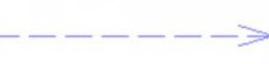

# UML

参考：https://www.cnblogs.com/chen-chen-chen/p/12295463.html

## 依赖

## 关联

| 关联                                             | 聚合                                             | 组合                                                         |
| ------------------------------------------------ | ------------------------------------------------ | ------------------------------------------------------------ |
|                                                  | 关联的一种，箭头指向组成物                       | 关联的一种，箭头指向组成物                                   |
| 有自关联，相互关联等                             | 2者可独立存在，如森林和树。森林不止有树。        | 2者关系紧密，生命周期相同，如：树与树叶，树没了，树叶也就没了。 |
|  |  |              |

## 继承

## 实现

