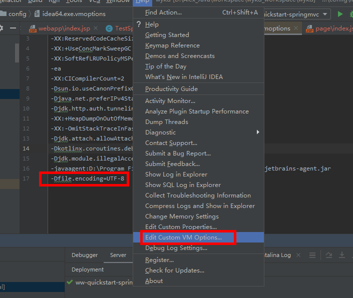
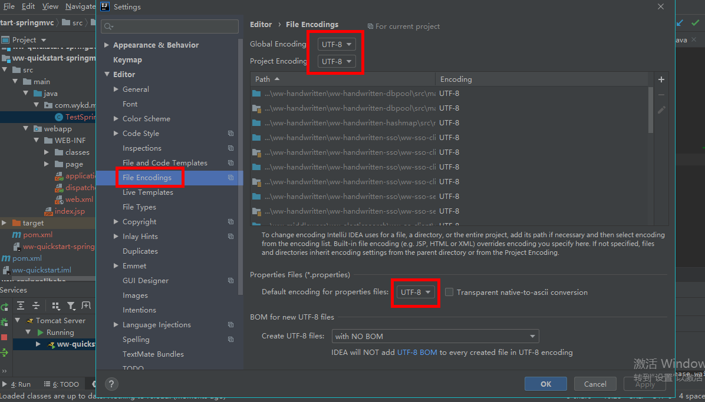

# IDEA

## 快捷键

```
1.idea快速命令
	1)psvm			main方法
	2)sout          System.out.println
	3)ifn			if(args != null){
	4)fori			for(int i=0;i<;i++){}
	
2.快捷键
	Ctrl+D     		复制一行
	Ctrl+X     		删除一行
	
	Alt+insert  	get/set等
	Alt+enter		自动修正 ,引入class
	Ctrl+Shift+Space   自动补全代码
	.var			增加属性定义
	Ctrl＋Alt＋T	   代码添加try/catch
	
	Ctrl+B		    方法实现及调用
	Alt+F8			Debug模式，可查看变量的值
	
	Ctrl+N			查找类
	Ctrl+Shift+F	全局检索（包括源码）
	Ctrl+Shift+R	全局检索替换
	
	Shift+F6 		重命名
	Alt+Shift+↑   	代码往上移动一行
	
	Ctrl+Alt+ left/right 		返回至上次浏览的位置
	Ctrl+Shift+Backspace     	跳转到上次编辑的地方
	Ctrl＋F12		显示当前方法的结构
	Ctrl+H   		查看类的所有继承关系
	
	Alt+UP			上下方法间移动
	Alt+Down		上下方法间移动
	Ctrl+/     		注释行
	Ctrl+Shift+/    注释段落
	Ctrl+Alt+L      格式化
	
	Alt+鼠标左键	  纵列选择：
	Ctrl+Shirt+u	大小写转换：
```


## IDEA的下载以及破解

**下载旗舰版（Ultimate）：**


**破解：**

参考：https://www.52pojie.cn/thread-1062067-1-1.html

参考2：https://www.cnblogs.com/exmyth/p/12453869.html

## settings

maven设置：


编译版本：


## IDEA springloaded热部署：

https://segmentfault.com/a/1190000017439626

## JRebel热部署

激活参考：https://cloud.tencent.com/developer/article/1460743

生成GUID的网站：https://www.guidgen.com/

码云上下载这个开源的程序代码：https://gitee.com/gsls200808/JrebelLicenseServerforJava

运行：

```shell
nohup java -jar JrebelBrainsLicenseServerforJava-1.0-SNAPSHOT-jar-with-dependencies.jar  >/dev/null 2>&1
```


## 控制台乱码问题解决

1.增加 -Dfile.encoding=UTF-8



2. 设置编码格式




## 热门插件

**打印最终的sql：Mybatis-log-plugin**

**滚动条变宽 ：CodeGlance**

**日志：lombok**

**sql-mapper接口切换：Free-idea-mybatis**

**自动生成工具：easy-code**

**生成接口文档：DocumentAssistant**