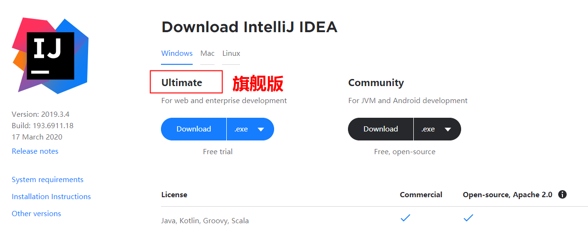
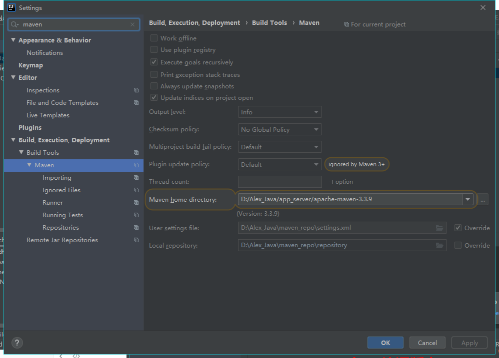
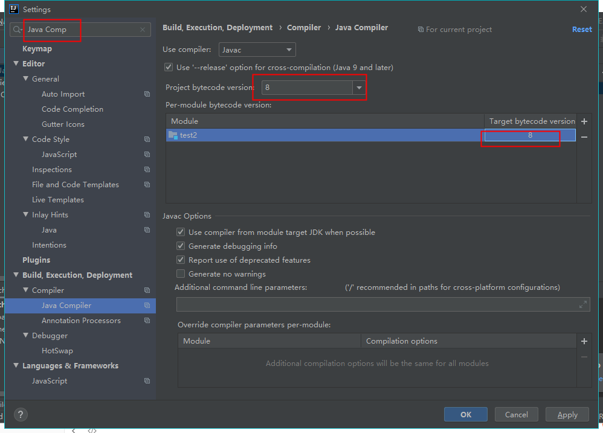

# IDEA

## IDEA的下载以及破解

**下载旗舰版（Ultimate）：**



**破解：**

## settings

maven设置：




编译版本：




## 创建一个最简单的maven项目


## 创建一个最简单的springboot项目


## 快捷键

```
1.idea快速命令
	1)psvm			main方法
	2)sout          System.out.println
	3)ifn			if(args != null){
	4)fori			for(int i=0;i<;i++){}
	
2.快捷键
	Ctrl+D     		复制一行
	Ctrl+X     		删除一行
	
	Alt+insert  	get/set等
	Alt+enter		自动修正 ,引入class
	Ctrl+Shift+Space   自动补全代码
	Ctrl＋Alt＋T	   代码添加try/catch
	
	Ctrl+Alt+B		方法实现
	Alt+F7			方法调用
	Ctrl+F7			本类的方法调用
	
	Ctrl+N			查找类
	Ctrl+Shift+F	全局检索（包括源码）
	Ctrl+Shift+R	全局检索替换
	
	Shift+F6 		重命名
	Alt+Shift+↑   	代码往上移动一行
	
	Ctrl+Alt+ left/right 		返回至上次浏览的位置
	Ctrl+Shift+Backspace     	跳转到上次编辑的地方
	Ctrl＋F12		显示当前方法的结构
	Ctrl+H   		查看类的所有继承关系
	
	Alt+UP			上下方法间移动
	Alt+Down		上下方法间移动
	Ctrl+/     		注释行
	Ctrl+Shift+/    注释段落
	Ctrl+Alt+L      格式化
```