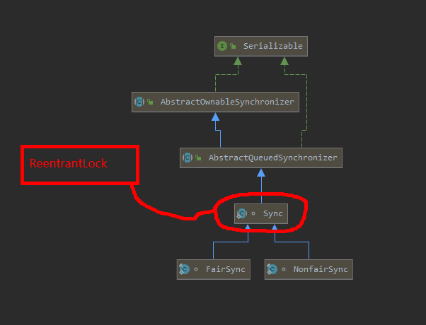

# Lock


Main类

```java
package com.wykd.jiazhuang.controller;

import com.wykd.jiazhuang.service.SellingReentrantLockTicketService;
import com.wykd.jiazhuang.service.SellingSynchronizedService;
import com.wykd.jiazhuang.service.SellingTicketService;

public class TestLock {

	
	public static void main(String[] args) {
		
		//普通售票
//		SellingTicketService sell = new SellingTicketService();
		
		//使用了Synchronized块的售票
//		SellingSynchronizedService sell = new SellingSynchronizedService();
		
		//使用了ReentrantLock的售票
		SellingReentrantLockTicketService sell = new SellingReentrantLockTicketService();
		
		for (int i = 0; i < 5; i++) {
			new Thread(sell).start();
		}
		
	}
	
}

```

普通购票程序：

```java
package com.wykd.jiazhuang.service;

public class SellingTicketService implements Runnable {

	
	private int tickets  = 100;
	
	@Override
	public void run() {
		
		while(tickets>0) {
			
			if(tickets>0) {
				try {
					Thread.sleep(100);
				} catch (InterruptedException e) {
					// TODO Auto-generated catch block
					e.printStackTrace();
				}
				System.out.println("正在出售第"+tickets+"票！");
				tickets --;
			}
		}
	}

}

```


## Synchronized

```java
package com.wykd.jiazhuang.service;

public class SellingSynchronizedService implements Runnable {
	private int tickets  = 100;
	@Override
	public void run() {
		synchronized (this) {
			while(tickets>0) {
				if(tickets>0) {
					try {
						Thread.sleep(100);
					} catch (InterruptedException e) {
						// TODO Auto-generated catch block
						e.printStackTrace();
					}
					System.out.println("正在出售第"+tickets+"票！");
					tickets --;
				}
			}
		}
	}
}

```


## Lock

```java
package com.wykd.jiazhuang.service;

import java.util.concurrent.locks.Lock;
import java.util.concurrent.locks.ReentrantLock;

public class SellingReentrantLockTicketService implements Runnable {

	//可重入锁
	private Lock lock = new ReentrantLock();
	private int tickets  = 100;
	
	@Override
	public void run() {
		
		lock.lock();
		try {	
			while(tickets>0) {
				if(tickets>0) {
					Thread.sleep(100);
					System.out.println("正在出售第"+tickets+"票！");
					tickets --;
				}
			}
		} catch (InterruptedException e) {
			// TODO Auto-generated catch block
			e.printStackTrace();
		}finally{
			lock.unlock();
		}
	}

}

```


### Lock源码解读



> addWaiter方法：构造双向节点
>
> acquireQueued：将等待的节点的线程，阻塞

```java
public final void acquire(int arg) {
		
        if (!tryAcquire(arg)  //获取到锁的线程，返回true 
            // 未获取到锁的线程，即需要等待的线程继续往下执行
            && acquireQueued(addWaiter(Node.EXCLUSIVE), arg))
            selfInterrupt();
    }
```


```java
private Node enq(final Node node) {
        for (;;) {  
            Node t = tail;
            if (t == null) { // Must initialize
                if (compareAndSetHead(new Node()))  //乐观锁，保证只有一个线程初始化成功。
                    tail = head;
            } else {
                node.prev = t;
                if (compareAndSetTail(t, node)) {
                    t.next = node;
                    return t;
                }
            }
        }
    }
```

```java
 final boolean acquireQueued(final Node node, int arg) {
        boolean failed = true;
        try {
            boolean interrupted = false;
            for (;;) {
                final Node p = node.predecessor();
                if (p == head && tryAcquire(arg)) {  //若前节点为head节点，并抢占到锁，则将head节点设置为null，并将当前节点设置为head节点，清除线程，以及pre节点。
                    setHead(node);
                    p.next = null; // help GC
                    failed = false;
                    return interrupted;
                }
                if (shouldParkAfterFailedAcquire(p, node) &&
                    //阻塞当前线程
                    parkAndCheckInterrupt())
                    interrupted = true;
            }
        } finally {
            if (failed)
                cancelAcquire(node);
        }
    }
```


```java
//尝试获得锁
protected final boolean tryAcquire(int acquires) {
            final Thread current = Thread.currentThread();
            int c = getState();
            if (c == 0) {  //判断锁的状态
                if (!hasQueuedPredecessors() &&
                    compareAndSetState(0, acquires)) {  //乐观锁，确保仅一个线程成功修改锁的状态
                    setExclusiveOwnerThread(current);   //设置获得锁的线程
                    return true;
                }
            }
            else if (current == getExclusiveOwnerThread()) {
                //若当前线程再次获得锁，则将状态值+1，实现可重入
                int nextc = c + acquires;
                if (nextc < 0)
                    throw new Error("Maximum lock count exceeded");
                setState(nextc);
                return true;
            }
    		//若线程未抢到锁，或 不是已获得锁的线程，则返回false
            return false;
        }		
```


## 分布式锁

定义一个接口：

```java
package com.wykd.jiazhuang.lock;

public interface DistributeLock {

	void lock(String key, String value);

	boolean unlock(String key, String value);

	boolean tryLock(String key,String value,int expireTime );
}

```

配置文件：

```yaml
server:
  port: 9053
  servlet:
    context-path: /wykd-distribute-lock
spring:
  application:
    name: service-wykd-distribute-lock
  devtools:
    restart:
      enabled: true
  redis:
    host: 120.24.87.121
    port: 6379
    password: wangwei2048
    database: 1
    jedis:
      pool:
        max-active: 1024
        max-wait: -1
        max-idle: 500
        min-idle: 0
    timeout: 10000  
zookeeper:
  address: 120.24.87.121:2181
  timeout: 4000
```


### redis实现

> 参考：https://blog.csdn.net/zzti_erlie/article/details/102884025

```java
package com.wykd.jiazhuang.service;


import org.apache.log4j.Logger;
import org.springframework.beans.factory.annotation.Autowired;
import org.springframework.stereotype.Component;

import com.wykd.jiazhuang.lock.DistributeLock;
import com.wykd.jiazhuang.util.JedisClient;

@Component
public class SellingRedisLockTicketService implements Runnable {
	
	private  Logger LOGGER = Logger.getLogger(JedisClient.class);
	
	@Autowired
	private DistributeLock redisLock;
	
	private int tickets  = 100;
	
	@Override
	public void run() {
		String key = "redisLock";
		String value = "redisValue";
		while(tickets>0) {
			redisLock.lock(key,value);
			try {	
				if(tickets>0) {
					Thread.sleep(100);
					System.out.println("正在出售第"+tickets+"票！");
					LOGGER.info("正在出售第"+tickets+"票！");
					tickets --;
				}
			} catch (InterruptedException e) {
				e.printStackTrace();
			}finally{
				redisLock.unlock(key,value);
			}
		}
	}

}

```


```java
package com.wykd.jiazhuang.lock;


import org.springframework.beans.factory.annotation.Autowired;
import org.springframework.stereotype.Component;

import com.wykd.jiazhuang.util.JedisClient;

import redis.clients.jedis.JedisPool;

@Component
public class RedisLock implements DistributeLock{

	@Autowired
	private JedisClient redisCLient;
	
	@Autowired
	private JedisPool jedisPool;
	
	public boolean tryLock(String key,String value,int expireTime ) {
	
		String result = redisCLient.setnxAndExpire(key, value,expireTime);
		
		if("OK".equalsIgnoreCase(result)) {
			return true;
		}
		return false;
	}
	
	public boolean unlock(String key,String value) {
		
		Long success = 1L;
		Object result = redisCLient.unlock(key, value);
		if(success.equals(result)) {
			return true;
		}
		return false;
	}
	
	public void lock(String key,String value) {
		
		int expireTime = 10 * 1000;
		
		while(!tryLock(key, value, expireTime)) {
			try {
				Thread.sleep(5);
			} catch (InterruptedException e) {
				e.printStackTrace();
			}
		}
		
	}
}

```


```java
package com.wykd.jiazhuang.util;

import java.io.ByteArrayInputStream;
import java.io.ByteArrayOutputStream;
import java.io.ObjectInputStream;
import java.io.ObjectOutputStream;
import java.util.Arrays;
import java.util.List;
import java.util.Map;
import java.util.Set;

import org.slf4j.Logger;
import org.slf4j.LoggerFactory;
import org.springframework.beans.factory.annotation.Autowired;
import org.springframework.stereotype.Component;
 
import redis.clients.jedis.BinaryClient.LIST_POSITION;
import redis.clients.jedis.Jedis;
import redis.clients.jedis.JedisPool;
import redis.clients.jedis.SortingParams;
 
@Component
public class JedisClient{
 
	private static final Logger LOGGER = LoggerFactory.getLogger(JedisClient.class);
	
	@Autowired
	private JedisPool jedisPool;

public String setnxAndExpire(String key, String value,int expireTime) {
		Jedis jedis = null;
		try {
			jedis = jedisPool.getResource();
			String result = jedis.set(key, value, "NX","PX",expireTime);
			return result;
		} catch (Exception e) {
			e.printStackTrace();
			LOGGER.error(e.getMessage());
			return "";
		} finally {
			returnResource(jedisPool, jedis);
		}
	}
	
	public Object unlock(String key, String value) {
		
		Jedis jedis = null;
		try {
			jedis = jedisPool.getResource();
			String script = "if redis.call('get',KEYS[1]) == ARGV[1] then return redis.call('del',KEYS[1]) else return 0 end";
			
			Object result = jedis.eval(script,Arrays.asList(key),Arrays.asList(value));
			return result;
		}  catch (Exception e) {
			e.printStackTrace();
			LOGGER.error(e.getMessage());
			return "";
		} finally {
			returnResource(jedisPool, jedis);
		}
	}
}
```


```java
 @RequestMapping("getRedis")
    public String getRedis(){
    	
    	for (int i = 0; i < 5; i++) {
			new Thread(sell).start();
		}
        return "OK";
    }
```


### redisson实现

```java
package com.wykd.jiazhuang.service;


import org.redisson.Redisson;
import org.redisson.api.RLock;
import org.redisson.api.RedissonClient;
import org.redisson.config.Config;
import org.springframework.beans.factory.annotation.Autowired;
import org.springframework.stereotype.Component;

@Component
public class SellingRedissonLockTicketService implements Runnable {

	@Autowired
	private RedissonClient redissonClient;
	
//	private RLock lock = getRLock();
	
	String key = "redisLock";
	String value = "redisValue";
	
//	private RLock getRLock() {
//		RLock rlock = redissonClient.getLock(key);
//		return rlock;
//	}
	
	private int tickets  = 100;
	
	@Override
	public void run() {
		RLock rlock = redissonClient.getLock(key);
		while(tickets>0) {
			rlock.lock();
			try {	
				if(tickets>0) {
					Thread.sleep(100);
					System.out.println("正在出售第"+tickets+"票！");
					tickets --;
				}
			} catch (InterruptedException e) {
				// TODO Auto-generated catch block
				e.printStackTrace();
			}finally{
				rlock.unlock();
			}
		}
		
	}

}

```

### zookeeper实现

参考：https://blog.csdn.net/crazymakercircle/article/details/85956246

```java
import java.util.ArrayList;
import java.util.Collections;
import java.util.List;
import java.util.concurrent.CountDownLatch;

import org.apache.zookeeper.CreateMode;
import org.apache.zookeeper.KeeperException;
import org.apache.zookeeper.WatchedEvent;
import org.apache.zookeeper.Watcher;
import org.apache.zookeeper.ZooDefs;
import org.apache.zookeeper.ZooKeeper;
import org.apache.zookeeper.data.Stat;
import org.springframework.beans.factory.annotation.Autowired;
import org.springframework.stereotype.Component;


@Component
public class ZookeeperLock implements DistributeLock {

    private final String rootNode = "/zklock";
    private ThreadLocal<String> currZkNode = new ThreadLocal<>();  //非常关键，若不设置为ThreadLocal，会有线程安全问题

    @Autowired
    private ZooKeeper zookeeper;


    @Override
    public boolean tryLock() {
        try {
            /** 1.创建根节点 */
            //获取根节点状态
            Stat stat = zookeeper.exists(rootNode, false);
            //如果根节点不存在，则创建根节点，根节点类型为永久节点
            if (stat == null) {
                System.out.println("创建根节点");
                zookeeper.create(rootNode, "zkLock".getBytes(), ZooDefs.Ids.OPEN_ACL_UNSAFE, CreateMode.PERSISTENT);
            }

            /** 2.创建一个临时序列节点 , 非常关键：即使不解锁，当线程结束，该节点也会随着线程结束而消失*/
            currZkNode.set(zookeeper.create(rootNode + "/lock_", "zkLock".getBytes(), ZooDefs.Ids.OPEN_ACL_UNSAFE, CreateMode.EPHEMERAL_SEQUENTIAL));

//            System.out.println(Thread.currentThread().getName()+"创建节点："+currZkNode.get());

            //获取所有子节点
            List<String> childNodes = zookeeper.getChildren(rootNode, false);
            Collections.sort(childNodes);  //升序排列：lock_0000000001  lock_0000000002  ；  childNodes.get(0) 取最小的节点

//            System.out.println(Thread.currentThread().getName()+"最小节点==>"+rootNode + "/" + childNodes.get(0));
//            System.out.println(Thread.currentThread().getName()+"当前节点==>"+currZkNode.get());
//            System.out.println(Thread.currentThread().getName()+"是否与当前节点相同==>"+currZkNode.get().equalsIgnoreCase(rootNode + "/" + childNodes.get(0)));

            if (childNodes != null
                    && childNodes.size() > 0
                    && currZkNode.get().equalsIgnoreCase(rootNode + "/" + childNodes.get(0))) {
                /** 3.1 最小节点与当前节点一致，说明获取到锁 */
//                System.out.println(Thread.currentThread().getName()+"拿到锁");
                return true;
            } else {

                /** 3.2 等待锁，监听前一个节点的删除事件 */

                String watchNode = null;  //需要监听的节点
                //反向遍历子节点，获取前一个节点
                for (int i = childNodes.size() - 1; i >= 0; i--) {
                    if (childNodes.get(i).compareTo(currZkNode.get().substring(currZkNode.get().lastIndexOf("/") + 1)) < 0) {
                        watchNode = childNodes.get(i);
                        break;
                    }
                }
//                System.out.println(Thread.currentThread().getName()+"前一节点==>"+watchNode);

                final CountDownLatch latch = new CountDownLatch(1);

                zookeeper.exists(rootNode + "/" + watchNode, new Watcher() {
                    @Override
                    public void process(WatchedEvent event) {
                        if (Event.EventType.NodeDeleted.equals(event.getType())) {
                            //监听前一节点的删除事件
                            System.out.println(Thread.currentThread().getName() + "唤醒锁");
                            latch.countDown();
                        }
                    }

                });
                System.out.println(Thread.currentThread().getName() + "等待锁");
                latch.await();
                System.out.println(Thread.currentThread().getName() + "被唤醒");
            }


        } catch (KeeperException e) {
            // TODO Auto-generated catch block
            e.printStackTrace();
        } catch (InterruptedException e) {
            // TODO Auto-generated catch block
            e.printStackTrace();
        }
        return false;
    }

    @Override
    public void lock() {
        tryLock();
    }

    @Override
    public boolean unlock() {


        try {
            System.out.println(Thread.currentThread().getName()+"删除节点===>"+currZkNode.get());
            zookeeper.delete(currZkNode.get(), -1);
            currZkNode.remove();
//            zookeeper.close();   //非常关键，不可close ,会影响zookeeper的下次调用delete
        } catch (InterruptedException | KeeperException e) {
            // TODO Auto-generated catch block
            e.printStackTrace();
        }
        return false;
    }


}


```


```java

import org.apache.zookeeper.WatchedEvent;
import org.apache.zookeeper.Watcher;
import org.apache.zookeeper.ZooKeeper;
import org.springframework.beans.factory.annotation.Value;
import org.springframework.context.annotation.Bean;
import org.springframework.context.annotation.Configuration;

import java.util.concurrent.CountDownLatch;

@Configuration
public class ZkConfig {

    @Value("${zookeeper.address}")
    private String connectString;

    @Value("${zookeeper.timeout}")
    private int timeout;


    @Bean(name = "zkClient")
    public ZooKeeper zkClient() {
        ZooKeeper zooKeeper = null;
        try {
            final CountDownLatch countDownLatch = new CountDownLatch(1);
            //连接成功后，会回调watcher监听，此连接操作是异步的，执行完new语句后，直接调用后续代码
            //  可指定多台服务地址 127.0.0.1:2181,127.0.0.1:2182,127.0.0.1:2183
            zooKeeper = new ZooKeeper(connectString, timeout, new Watcher() {
                @Override
                public void process(WatchedEvent event) {
                    if (Watcher.Event.KeeperState.SyncConnected == event.getState()) {
                        //如果收到了服务端的响应事件,连接成功
                        countDownLatch.countDown();
                    }
                }
            });
            countDownLatch.await();

        } catch (Exception e) {
        }
        return zooKeeper;
    }


}
```


```java
package com.wykd.jiazhuang.service;

import java.util.concurrent.CountDownLatch;

import org.springframework.beans.factory.annotation.Autowired;
import org.springframework.stereotype.Service;

import com.wykd.jiazhuang.lock.DistributeLock;

@Service
public class SellingZkLockTicketService implements Runnable {

	@Autowired
	private DistributeLock zookeeperLock;
	
	private int tickets  = 100;
	
	private CountDownLatch countDownLatch;
	
	public CountDownLatch getCountDownLatch() {
		return countDownLatch;
	}

	public void setCountDownLatch(CountDownLatch countDownLatch) {
		this.countDownLatch = countDownLatch;
	}

	@Override
	public void run() {
		
		System.out.println("卖票。。。");
		
		try {
			countDownLatch.await();
		} catch (InterruptedException e1) {
			// TODO Auto-generated catch block
			e1.printStackTrace();
		}
		
		zookeeperLock.lock(null, null);
		try {	
			while(tickets>0) {
				if(tickets>0) {
					Thread.sleep(100);
					System.out.println("正在出售第"+tickets+"票！");
					tickets --;
				}
			}
		} catch (InterruptedException e) {
			e.printStackTrace();
		}finally{
			zookeeperLock.unlock(null, null);
		}
	}

}

```


```java
/**
     * @func 测试zookeeper分布式锁
     * @return
     */
    @RequestMapping("testDistributeZkLock")
    public String testDistributeZkLock(){
    	final CountDownLatch countDown = new CountDownLatch(5);
    	sellingZkLockTicketService.setCountDownLatch(countDown);
    	for (int i = 0; i < 5; i++) {
			new Thread(sellingZkLockTicketService).start();
			countDown.countDown();
		}
        return "OK";
    }
```

## 可重入锁

参考：https://blog.csdn.net/w8y56f/article/details/89554060

> 1.在一个线程执行过程中，可以反复获得ReentrantLock锁。
>
> 2.可重入锁，加锁的次数，与解锁的次数必须保持一致。否则其他线程获取不到锁。

测试类:

> 如下代码，因为第一个线程的加锁，解锁次数不一致，导致第二个线程永远拿不到锁，造成死锁。

```java
import java.util.Random;
import java.util.concurrent.locks.ReentrantLock;

public class ReentrantTest {
	public static void main(String[] args) {
		ReentrantLock lock = new ReentrantLock();
		
		new Thread(new Runnable() {
			@Override
			public void run() {
				try {
					lock.lock();
					System.out.println("第1次获取锁，这个锁是：" + lock);

					int index = 1;
					while (true) {
						try {
							lock.lock();
							System.out.println("第" + (++index) + "次获取锁，这个锁是：" + lock);
							
							try {
								Thread.sleep(new Random().nextInt(200));
							} catch (InterruptedException e) {
								e.printStackTrace();
							}
							
							if (index == 10) {
								break;
							}
						} finally {
//							lock.unlock();// 这里故意注释，实现加锁次数和释放次数不一样
						}

					}

				} finally {
					lock.unlock();
				}
			}
		}).start();
		
		
		new Thread(new Runnable() {
			
			@Override
			public void run() {
				try {
					lock.lock();
					
					for (int i = 0; i < 20; i++) {
						System.out.println("threadName:" + Thread.currentThread().getName());
						try {
							Thread.sleep(new Random().nextInt(200));
						} catch (InterruptedException e) {
							e.printStackTrace();
						}
					}
				} finally {
					lock.unlock();
				}
			}
		}).start();
		
		
	}
}

```

## Lock与Synchronized的区别

> 两者都是可重入锁

> synchronized在发生异常时，会自动释放线程占有的锁；Lock在发生异常时，需要在finally主动通过unLock()去释放锁