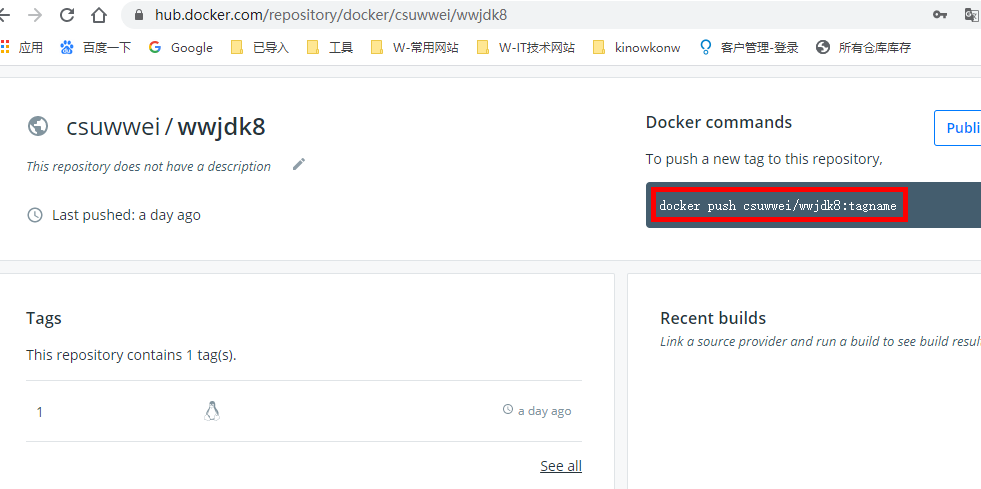

# Docker

## Docker简介

Docker 是一个开源的应用容器引擎，基于Go语言，并遵从 Apache2.0 协议开源。

Docker 可以让开发者可以打包他们的应用以及依赖包到一个可移植的镜像中，然后发布到任何流行的 Linux或Windows 机器上，也可以实现虚拟化。

容器是完全使用沙箱机制，相互之间不会有任何接口,更重要的是容器性能开销极低。

## Docker与虚拟机

## 镜像与容器


## 常见命令

```
service docker start
service docker stop

docker search redis  搜索镜像：
docker pull redis    拉取镜像
docker images  		 查看镜像
docker rmi [imageName]  删除镜像

docker ps  查看容器
	（docker ps -a 查看所有容器，包括未启动的容器）
docker rm [containerName]  删除容器
docker exec -it [containerName] /bin/bash   进入镜像

docker logs [containerName]   查看镜像的日志

//TODO
docker run -p 6379:6379 -d redis:latest redis-server  启动一个redis容器
	（-p  映射端口）
	（-v  挂载文件目录，即映射一个宿主机目录）
	（-d  后台运行）
	（--name 容器命名）
```


## Dockerfile

创建一个简单的springboot项目的Docker镜像，以及容器，

> 创建一个springboot项目
>
> 创建Dockerfile文件
>
> 将Dockerfire与jar放入同一目录。

参考：https://www.cnblogs.com/Scramblecode/archive/2019/07/11/11169010.html

```
# 基础镜像使用java
FROM java:8
# 暴露端口号
EXPOSE 8080
# 作者
MAINTAINER ww
# VOLUME 指定了临时文件目录为/tmp。
# 其效果是在主机 /var/lib/docker 目录下创建了一个临时文件，并链接到容器的/tmp
VOLUME /tmp 
# 设置常量，或者环境变量等
ENV name laowang
# 将jar包添加到容器中并更名为app.jar
ADD demo-0.0.1-SNAPSHOT.jar app.jar 
# 运行jar包
# touch /app.jar 用来修改文件时间戳，或者新建一个不存在的文件
RUN bash -c 'touch /app.jar'  
ENTRYPOINT ["java","-Djava.security.egd=file:/dev/./urandom","-jar","/app.jar"]
```

demo例子
```
FROM openjdk:8-jdk-alpine
EXPOSE 9010
VOLUME /tmp
ADD springboot-with-docker-0.0.1-SNAPSHOT.jar app.jar
RUN sh -c 'touch /app.jar'
ENV JAVA_OPTS=""
ENTRYPOINT [ "sh", "-c", "java $JAVA_OPTS -Djava.security.egd=file:/dev/./urandom -jar /app.jar" ]
```

创建镜像，以及启动容器：

```
# 创建镜像，后面的.号很重要，不可遗漏
docker build -t myspringbootdocker .
# 创建容器
docker run --name myspringboot -p 9010:9001 -d myspringbootdocker
```

访问：

```
# 通过宿主机访问容器
curl 127.0.0.1:9010/wspringboot/hello -X POST -d '{"hello": "world"}' --header "Content-Type: application/json"

# 直接访问容器
curl 172.17.0.3:9001/wspringboot/hello -X POST -d '{"hello": "world"}' --header "Content-Type: application/json"
```

根据容器生成镜像

```
# mydocker：创建的容器名
# newdockerimage：根据mydocker容器，生成的镜像
docker container commit mydocker newdockerimage
```


## docker inspect 

> source：宿主机挂载位置
>
> Destination：对应的容器挂载位置

```
 "Mounts": [
            {
                "Type": "volume",
                "Name": "9de6147546c490160b6b5ec64384b623f0c12f1a931ca53f3ac073b46c638d77",
                "Source": "/var/lib/docker/volumes/9de6147546c490160b6b5ec64384b623f0c12f1a931ca53f3ac073b46c638d77/_data",
                "Destination": "/tmp",
                "Driver": "local",
                "Mode": "",
                "RW": true,
                "Propagation": ""
            }
        ],

```

> Ports -> HostPort：映射到宿主机的端口为9011
>
> IPAddress：容器的ip

```
 "NetworkSettings": {
            "Bridge": "",
            "SandboxID": "dd6329c1db0263f56d9d9432f2cd19720ff174f2834f851e51db6753c0764c07",
            "HairpinMode": false,
            "LinkLocalIPv6Address": "",
            "LinkLocalIPv6PrefixLen": 0,
            "Ports": {
                "9010/tcp": [
                    {
                        "HostIp": "0.0.0.0",
                        "HostPort": "9011"
                    }
                ]
            },
            "SandboxKey": "/var/run/docker/netns/dd6329c1db02",
            "SecondaryIPAddresses": null,
            "SecondaryIPv6Addresses": null,
            "EndpointID": "42c39961cc9d46f2584cf1d543c8b44fa3261cf51cf803c20f3699cf01800c25",
            "Gateway": "172.17.0.1",
            "GlobalIPv6Address": "",
            "GlobalIPv6PrefixLen": 0,
            "IPAddress": "172.17.0.3",

```

## 创建一个自己的Docker镜像

Dockerfile

```
FROM openjdk:8-jdk-alpine
#FROM ascdc/jdk8
#FROM java:8
EXPOSE 8080
VOLUME /tmp
ADD springboot-with-docker-0.0.1-SNAPSHOT.jar /app.jar
RUN sh -c 'touch /app.jar'
ENV JAVA_OPTS=""
ENTRYPOINT [ "sh", "-c", "java $JAVA_OPTS -Djava.security.egd=file:/dev/./urandom -jar /app.jar" ]
```

创建镜像

```
docker build -t  wwjdk8 .
```

登录hub.docker

```
docker login
```

打标签

```
# wwjdk8 镜像
# docker.io/csuwwei/wwjdk8:1  hub.docker上的位置  :1是tag
docker tag wwjdk8 docker.io/csuwwei/wwjdk8:1
```

上传到hub.docker

```
docker push docker.io/csuwwei/wwjdk8:1
```

拉取镜像，并生成容器

```
docker pull csuwwei/wwjdk8:1
docker run -d -p 8082:8080 --name myjdk888 csuwwei/wwjdk8:1
```



## Docker安装服务器

### docker安装jenkins

-- 拉取海洋版jenkins的docker
docker pull jenkinsci/blueocean


--创建docker实例	
docker run --name jenkinsci-blueocean -u root --rm  -d -p 7005:8080 -p 50000:50000 -v /data/jenkins:/var/jenkins_home -v /var/run/docker.sock:/var/run/docker.sock jenkinsci/blueocean

### docker安装redis

cd /wangwei/app/redis-5.0.4/

```
# 启动redis
src/redis-server redis6380.conf

# 启动哨兵
src/redis-server sentinel.conf --sentinel

# 连接服务器
src/redis-cli -p 6380 -h 172.18.74.148 -a wangwei2048

#启动容器
docker run -p 6379:6379 -d redis:latest redis-server

# 启动redis客户端：
./usr/local/bin/redis-cli
```

### docker安装ElasticSearch

参考文档：https://www.cnblogs.com/wuxun1997/p/11771798.html

```
### 运行elasticsearch容器
docker run -d -p 9200:9200 -p 9300:9300 -e "ES_JAVA_OPTS=-Xms512m -Xmx512m" --name=myes elasticsearch:6.4.0

### 运行kibana容器
docker run -p 5601:5601 --name kibana \
--link myes:es \
-e "elasticsearch.hosts=http://es:9200" \
-d kibana:6.4.0
```


### docker安装Zookeeper

```
# 启动zookeeper的客户端：
./apache-zookeeper-3.6.0-bin/bin/zkCli.sh

# 创建通信网络
docker network create kafkanet


# 创建zk容器
docker run --net=kafkanet  --name myzk  -p 2181:2181  -d zookeeper:latest

# 查看zk的网络
docker inspect myzk
```


### docker安装kafka

docker run --net=docker --name mykafka -p 9092:9092 \

--link myzk \

-e KAFKA_ZOOKEEPER_CONNECT=172.18.0.2:2181 \

-e KAFKA_ADVERTISED_HOST_NAME=192.168.113.1 \

-e KAFKA_ADVERTISED_PORT=9092 \

-d wurstmeister/kafka


查看网络

docker inspect kafkanet


如下：2个容器已经包含在其中

[

​    {

​        "Name": "kafkanet",

​        "Id": "c750fcdc06fbdc3a3bdcd49aa27815d11ae006404918d9c3ee6a9d9828f8bd17",

​        "Created": "2020-04-09T14:28:12.597474763+08:00",

​        "Scope": "local",

​        "Driver": "bridge",

​        "EnableIPv6": false,

​        "IPAM": {

​            "Driver": "default",

​            "Options": {},

​            "Config": [

​                {

​                    "Subnet": "172.18.0.0/16",

​                    "Gateway": "172.18.0.1"

​                }

​            ]

​        },

​        "Internal": false,

​        "Attachable": false,

​        "Containers": {

​            "620609153dd0a923d7342edb85dcfd4446c2788f9416a660984b2e71d8fce534": {

​                "Name": "mykafka",

​                "EndpointID": "1d457f872150568dab578184028951ed5780a142519b7cbe0c6677919f49c4da",

​                "MacAddress": "02:42:ac:12:00:03",

​                "IPv4Address": "172.18.0.3/16",

​                "IPv6Address": ""

​            },

​            "c1c510460e79040d25554f5be52a533a30c3be7d16db077fd788f42a3d89bf67": {

​                "Name": "myzk",

​                "EndpointID": "52d960c675d9b6b6cbe9ec52c08e4260be333d30535a886575cb0374b908bf4c",

​                "MacAddress": "02:42:ac:12:00:02",

​                "IPv4Address": "172.18.0.2/16",

​                "IPv6Address": ""

​            }

​        },

​        "Options": {},

​        "Labels": {}

​    }

]

### docker安装rocketMq

参考文档：

https://blog.csdn.net/fenglibing/article/details/92378090


docker run -d -p 9876:9876 --name rmqserver -e "MAX_POSSIBLE_HEAP=100000000" rocketmqinc/rocketmq sh mqnamesrv


docker run -d -p 10911:10911 -p 10909:10909\

 --name rmqbroker --link rmqserver:namesrv\

 -e "NAMESRV_ADDR=namesrv:9876" -e "JAVA_OPTS=-Duser.home=/opt"  -e "MAX_POSSIBLE_HEAP=200000000" \

 -e "JAVA_OPT_EXT=-server -Xms128m -Xmx128m"\

 rocketmqinc/rocketmq sh mqbroker


安装rocketmq-console容器

docker run --name rmqconsole -e "JAVA_OPTS=-Drocketmq.namesrv.addr=192.168.113.129:9876 -Dcom.rocketmq.sendMessageWithVIPChannel=false" -p 8099:8080 -t styletang/rocketmq-console-ng


### docker安装Mysql

主从同步

## FAQ：

### 1.进入容器报错

docker exec -it myspboot /bin/bash

```
[root@localhost docker_springboot]# docker exec -it myspboot /bin/bash
rpc error: code = 2 desc = oci runtime error: exec failed: container_linux.go:235: starting container process caused "exec:or directory"
```

解决办法：https://www.cnblogs.com/leozhanggg/p/12023429.html