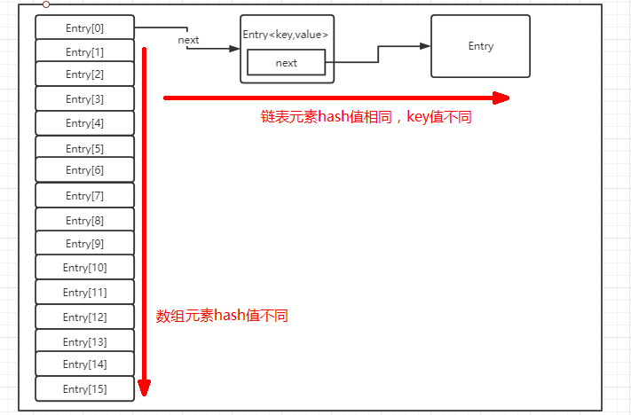

# HashMap

## HandWritten-HashMap

## jdk1.7-HashMap源码解读：

> HashMap：数组+链表，
>
> ​	  每个数组元素，都是一个链表。即：hash值相同的，存入到同一个数组下标的链表中。也可以理解为：hash值冲突的问题，通过链表解决。   
>
> ​      hash值不同，占用不同的数组下标。
>
> ​      插入元素的个数，不管是数组对象，还是链表对象，都会影响数组的长度，当插入的元素数量超过阈值，数组长度就会扩容2倍。	
>
> ​	【transient Entry[] table;】实现了数组效果，查找速度快。
>
> ​	【Entry<K,V> next;】实现了数组元素的链表效果，插入速度快。
>
> 

```java
/** 
* 初始大小，1左移4位，即 1*2*2*2*2 ===>16 
* 注释：十进制左移一位乘以10，二级制左移一位乘以2 
*/
static final int DEFAULT_INITIAL_CAPACITY = 1 << 4; 

/**
 * 加载因子参数，在3/4时的容量时，进行扩容。
 */
static final float DEFAULT_LOAD_FACTOR = 0.75f;

//数组
transient Entry[] table;

//阈值
int threshold;
 /**
  * The number of key-value mappings contained in this map.
  */
transient int size;
```

构造方法解读：

```java
//初始化构造方法
public HashMap(int initialCapacity, float loadFactor) {
        if (initialCapacity < 0)
            throw new IllegalArgumentException("Illegal initial capacity: " +
                                               initialCapacity);
        if (initialCapacity > MAXIMUM_CAPACITY)
            initialCapacity = MAXIMUM_CAPACITY;
        if (loadFactor <= 0 || Float.isNaN(loadFactor))
            throw new IllegalArgumentException("Illegal load factor: " +
                                               loadFactor);

        // Find a power of 2 >= initialCapacity
        int capacity = 1;
        while (capacity < initialCapacity)
            capacity <<= 1;

        this.loadFactor = loadFactor;
        threshold = (int)(capacity * loadFactor); //扩容阈值：最大值*加载因子
        table = new Entry[capacity];  //定义一个长度为16的Entry数组
        init();
    }

static class Entry<K,V> implements Map.Entry<K,V> {
        final K key;	
        V value;
        Entry<K,V> next;
        final int hash;  //根据key的hashCode计算的hash值

        /**
         * Creates new entry.
         */
        Entry(int h, K k, V v, Entry<K,V> n) {
            value = v;
            next = n;
            key = k;
            hash = h;
        }
}

public int size() {
    return size;
}
```

SET方法解读：

```java
//设值方法 
public V put(K key, V value) {
     if (key == null)
         //若key为空，则设置空值
         return putForNullKey(value);
     //1.取hashCode，再进行hash运算得到最终的hash值
     int hash = hash(key.hashCode());
     //2.根据hash值计算table索引，索引值尽量分散，且一定小于数组长度。
     int i = indexFor(hash, table.length);
     //3.从数组取第i个元素；判断是否为空。
     for (Entry<K,V> e = table[i]; e != null; e = e.next) {
         Object k;
         //☆☆☆☆☆hash值相同，并且key值相同，则替换原来的value
         //否则取next元素继续判断，若next元素为空，则跳出for循环。
         if (e.hash == hash && ((k = e.key) == key || key.equals(k))) {
             //3.1若key的hash已存在，则赋新值，返回旧值
             V oldValue = e.value;
             e.value = value;
             e.recordAccess(this);
             return oldValue;
         }
     }

     modCount++;
	 /*
	 *	情况1：hash值相同，key值不同的情况，即hash冲突。
	 *  情况2：新的key
	 */
     //4.在当前位置插入一个新的Entry，原Entry作为next存储。
     addEntry(hash, key, value, i);
     return null;
 }

void addEntry(int hash, K key, V value, int bucketIndex) {
    Entry<K,V> e = table[bucketIndex];
    //【☆☆☆☆☆在当前位置插入一个新的Entry，并且将原entry对象，赋值给next☆☆☆☆☆】
    table[bucketIndex] = new Entry<K,V>(hash, key, value, e);
    //判断是否扩容，
    //【☆☆☆☆☆每塞入一个元素，size+1；即：塞入元素的个数，间接影响了Entry数组的长度】
    if (size++ >= threshold)
        //新容量大小=旧容量大小*2
        resize(2 * table.length);
}

//扩容
void resize(int newCapacity) {
    Entry[] oldTable = table;
    int oldCapacity = oldTable.length;
    //原大小已经达到最大值，则直接返回，扩容失败！
    if (oldCapacity == MAXIMUM_CAPACITY) {
        threshold = Integer.MAX_VALUE;
        return;
    }

    Entry[] newTable = new Entry[newCapacity];
    //将原Entry数组元素，一一转移到新的数组
    transfer(newTable);
    table = newTable;
    //阈值重新计算（新的容量大小）
    threshold = (int)(newCapacity * loadFactor);
}

//通过遍历的方式，新数组元素逐一转移到新的数组
void transfer(Entry[] newTable) {
    Entry[] src = table;
    int newCapacity = newTable.length;
    for (int j = 0; j < src.length; j++) {
        Entry<K,V> e = src[j];
        if (e != null) {
            src[j] = null;
            do {
                Entry<K,V> next = e.next;
                //☆☆☆☆☆☆扩容的同时，对原Entry数组中的所有元素重新进行计算索引值，并存入新的Entry数组，以及数组元素的链表中。
                int i = indexFor(e.hash, newCapacity);
                e.next = newTable[i];
                newTable[i] = e;
                e = next;
            } while (e != null);
        }
    }
}
```

GET方法解读：

```java
public V get(Object key) {
    if (key == null)
        return getForNullKey();
	//计算hash值
    int hash = hash(key.hashCode());
    //从索引的位置，往下遍历，寻找hash值一致的Entry元素，返回Entry元素的value值
    for (Entry<K,V> e = table[indexFor(hash, table.length)];
         e != null;
         e = e.next) {
        Object k;
        if (e.hash == hash && ((k = e.key) == key || key.equals(k)))
            return e.value;
    }
    return null;
}
```


## jdk1.8-HashMap源码解读：