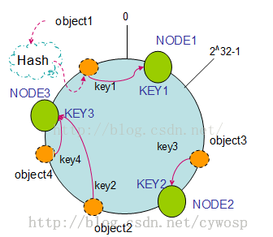

# HashMap

## HandWritten-HashMap

```java
package com.wykd;

public interface WMap<K,V> {
     V get(K k);

     V set(K k ,V v);

    int size();

    interface Entry<K ,V> {
         K getKey();

         V getValue();
    }
}

```

```java
package com.wykd;


import static java.util.Objects.hash;

public class WHashMap<K,V> implements WMap<K,V> {
    private static  int DEFAULT_SIZE = 16;
    private static  double DEFAULT_FACTOR = 0.75;
    private int size;

    private Entry[] tables ;

    public WHashMap(){
        this(DEFAULT_SIZE,DEFAULT_FACTOR);
    }

    public WHashMap(int defaultSize, double defaultFactor) {
        DEFAULT_SIZE = defaultSize;
        DEFAULT_FACTOR = defaultFactor;
        tables = new Entry[DEFAULT_SIZE];
    }


    @Override
    public V get(K k) {

        int index = whash(k);
        if(tables[index] == null){  //头结点为空，则直接返回空
            return null;
        }
        return (V) find(k,tables[index]);
    }

    private V find(K k, Entry<K,V> entry) {
        if(k == entry.getKey() || k.equals(entry.getKey())){
            return entry.getValue();
        }else{
            if(entry.next != null){
                return find(k,entry.next);
            }
        }
        return null;
    }

    @Override
    public V set(K key ,V value) {
        int index = whash(key);
        Entry<K,V> entry = tables[index];

        for (Entry<K,V> e = tables[index]; e != null; e = e.next) {
            //若头结点不为空，则进入此循环，链表往下查找
            if (e.k == key || key.equals(e.k)) {
                //若key也相等，则赋新值，返回旧值
                V oldValue = e.v;
                e.v = value;
                return oldValue;
            }
        }

        //头结点为空，或 链表未查找到，则新增节点。
        tables[index] = newEntry(key,value,entry);  //头部插入节点，将头节点往后挪
        size++;


        return (V) tables[index].getValue();
    }

    /**
     * 获取下一个索引值
     * @return
     */
    private int nextIndex() {
        return 0;
    }

    /**
     * 创建一个头结点
     * @return
     * @param k
     * @param v
     */
    private Entry<K, V> newEntry(K k, V v, Entry<K,V> next) {
        return new Entry<K,V>(k,v,next);
    }

    /**
     * 取下标
     * @param k
     * @return
     */
    private int whash(K k) {
        int m = DEFAULT_SIZE;
        int i = k.hashCode() % m;  //取 mol
        //hashCode方法有可能为负数
        return i >= 0 ? i : -i;
    }

    @Override
    public int size() {
        return this.size;
    }

    class Entry<K,V> implements  WMap.Entry<K,V>{

        K k;
        V v;
        Entry<K,V> next;


        public Entry(K k,V v, Entry<K,V> next){
            this.k = k;
            this.v = v;
            this.next = next;
        }

        @Override
        public K getKey() {
            return k;
        }

        @Override
        public V getValue() {
            return v;
        }
    }

}

		
```

测试类：

```java
package com.wykd;

public class TestWHashMap {

    public static void main(String[] args) {

        WMap map = new WHashMap();
        for (int i = 0; i < 1000; i++) {
            map.set("老王"+i+"号",i);
        }
        for (int i = 0; i < 1000; i++) {
            System.out.println("老王"+i+"号" + map.get("老王"+i+"号"));
        }
        for (int i = 0; i < 1000; i++) {
            map.set("老王"+i+"号",i+10000);
        }
        for (int i = 0; i < 1000; i++) {
            System.out.println("2222老王"+i+"号" + map.get("老王"+i+"号"));
        }

        System.out.println(map.size());
    }
}

```


## jdk1.7-HashMap源码解读：

> 数据结构：数组+链表，
>
> **关键点1**：hash值不同，占用不同的数组下标。
>
> **关键点2**：每个数组元素，都是一个链表。即：hash值相同的，存入到同一个数组下标的链表中。也可以理解为：hash值冲突的问题，通过链表解决。   
>
> **关键点3**： 插入元素的个数，不管是数组对象，还是链表对象，都会影响数组的长度，当插入的元素数量超过阈值，数组长度就会扩容2倍。	
>
> ​	【transient Entry[] table;】实现了数组效果，查找速度快。
>
> ​	【Entry<K,V> next;】实现了数组元素的链表效果，插入速度快。
>
> 

```java
/** 
* 初始大小，1左移4位，即 1*2*2*2*2 ===>16 
* 注释：十进制左移一位乘以10，二级制左移一位乘以2 
*/
static final int DEFAULT_INITIAL_CAPACITY = 1 << 4; 

/**
 * 加载因子参数，在3/4时的容量时，进行扩容。
 */
static final float DEFAULT_LOAD_FACTOR = 0.75f;

//数组
transient Entry[] table;

//阈值
int threshold;
 /**
  * The number of key-value mappings contained in this map.
  */
transient int size;
```

构造方法解读：

```java
//初始化构造方法
public HashMap(int initialCapacity, float loadFactor) {
        if (initialCapacity < 0)
            throw new IllegalArgumentException("Illegal initial capacity: " +
                                               initialCapacity);
        if (initialCapacity > MAXIMUM_CAPACITY)
            initialCapacity = MAXIMUM_CAPACITY;
        if (loadFactor <= 0 || Float.isNaN(loadFactor))
            throw new IllegalArgumentException("Illegal load factor: " +
                                               loadFactor);

        // Find a power of 2 >= initialCapacity
        int capacity = 1;
        while (capacity < initialCapacity)
            capacity <<= 1;

        this.loadFactor = loadFactor;
        threshold = (int)(capacity * loadFactor); //扩容阈值：最大值*加载因子
        table = new Entry[capacity];  //定义一个长度为16的Entry数组
        init();
    }

static class Entry<K,V> implements Map.Entry<K,V> {
        final K key;	
        V value;
        Entry<K,V> next;
        final int hash;  //根据key的hashCode计算的hash值

        /**
         * Creates new entry.
         */
        Entry(int h, K k, V v, Entry<K,V> n) {
            value = v;
            next = n;
            key = k;
            hash = h;
        }
}

public int size() {
    return size;
}
```

SET方法解读：

```java
//设值方法 
public V put(K key, V value) {
     if (key == null)
         //若key为空，则设置空值
         return putForNullKey(value);
     //1.取hash值
     int hash = hash(key.hashCode());
     //2.获取下标
     int i = indexFor(hash, table.length);
     //3.从数组取第i个元素；判断是否为空。
     for (Entry<K,V> e = table[i]; e != null; e = e.next) {
         Object k;
         //☆☆☆☆☆hash值相同，并且key值相同，则替换原来的value
         //否则取next元素继续判断，若next元素为空，则跳出for循环。
         if (e.hash == hash && ((k = e.key) == key || key.equals(k))) {
             //3.1若key的hash已存在，则赋新值，返回旧值
             V oldValue = e.value;
             e.value = value;
             e.recordAccess(this);
             return oldValue;
         }
     }

     modCount++;
	 /*
	 *	情况1：hash值相同，key值不同的情况，即hash冲突。
	 *  情况2：新的key
	 */
     //4.在当前位置插入一个新的Entry，原Entry作为next存储。
     addEntry(hash, key, value, i);
     return null;
 }

void addEntry(int hash, K key, V value, int bucketIndex) {
    Entry<K,V> e = table[bucketIndex];
    //【☆☆☆☆☆在当前位置插入一个新的Entry，并且将原entry对象，赋值给next☆☆☆☆☆】
    table[bucketIndex] = new Entry<K,V>(hash, key, value, e);
    //判断是否扩容，
    //【☆☆☆☆☆每塞入一个元素，size+1；即：塞入元素的个数，间接影响了Entry数组的长度】
    if (size++ >= threshold)
        //新容量大小=旧容量大小*2
        resize(2 * table.length);
}

//扩容
void resize(int newCapacity) {
    Entry[] oldTable = table;
    int oldCapacity = oldTable.length;
    //原大小已经达到最大值，则直接返回，扩容失败！
    if (oldCapacity == MAXIMUM_CAPACITY) {
        threshold = Integer.MAX_VALUE;
        return;
    }

    Entry[] newTable = new Entry[newCapacity];
    //将原Entry数组元素，一一转移到新的数组
    transfer(newTable);
    table = newTable;
    //阈值重新计算（新的容量大小）
    threshold = (int)(newCapacity * loadFactor);
}

//通过遍历的方式，新数组元素逐一转移到新的数组
void transfer(Entry[] newTable) {
    Entry[] src = table;
    int newCapacity = newTable.length;
    for (int j = 0; j < src.length; j++) {
        Entry<K,V> e = src[j];
        if (e != null) {
            src[j] = null;
            do {
                Entry<K,V> next = e.next;
                //☆☆☆☆☆☆扩容的同时，对原Entry数组中的所有元素重新进行计算索引值，并存入新的Entry数组，以及数组元素的链表中。
                int i = indexFor(e.hash, newCapacity);
                e.next = newTable[i];
                newTable[i] = e;
                e = next;
            } while (e != null);
        }
    }
}

//获取下标
/**
*	数组容量为什么必须是2的n次幂，原因如下：
*   比如：2^4-1 = 15  即：01111  ，任何的值与01111做“与运算”都会<16. 与取mol的值是同样的效果，但是速度快了很多倍。
*/
 static int indexFor(int h, int length) {
        return h & (length-1);
    }

```

GET方法解读：

```java
public V get(Object key) {
    if (key == null)
        return getForNullKey();
	//1.计算hash值
    int hash = hash(key.hashCode());
    //2.根据hash值，获取数组下标，遍历下标位置的链表，直至获取与key相同的节点。
    for (Entry<K,V> e = table[indexFor(hash, table.length)];
         e != null;
         e = e.next) {
        Object k;
        if (e.hash == hash && ((k = e.key) == key || key.equals(k)))
            return e.value;
    }
    return null;
}
```


## jdk1.8-HashMap源码解读：

> 关键点1：当链表的节点大于8，则转换成红黑树
>
> 关键点2：链表是尾部插入节点。
>
> 关键点3：当节点数大于阈值（容量* 加载因子），扩容*2
>
> 关键点4：容量为2的幂次方，原因是在算hash值的时候，方便进行与运算（index & index-1）
>
> 关键点5：与jdk1.7不同的地方，jdk1.8的节点类改为了Node


红黑树参考：https://baijiahao.baidu.com/s?id=1641940303518144126&wfr=spider&for=pc

Set方法源码解读

```java
 final V putVal(int hash, K key, V value, boolean onlyIfAbsent,
                   boolean evict) {
        Node<K,V>[] tab; Node<K,V> p; int n, i;
        if ((tab = table) == null || (n = tab.length) == 0)
            //1.创建Node数组
            n = (tab = resize()).length;
     
        if ((p = tab[i = (n - 1) & hash]) == null)
            //2.获取数组下标元素，若该坐标没有元素，则新建一个元素
            tab[i] = newNode(hash, key, value, null);
        else {
            Node<K,V> e; K k;
            if (p.hash == hash &&
                ((k = p.key) == key || (key != null && key.equals(k))))
                //3.1若数组下标元素，hash值相等，且key值相等，则直接替换
                e = p;
            else if (p instanceof TreeNode)
                //3.2若数组下标元素是一个树节点类型，则进行树结构处理
                e = ((TreeNode<K,V>)p).putTreeVal(this, tab, hash, key, value);
            else {
                //3.3链表处理，算法逻辑，参考jdk1.7版本HashMap
                for (int binCount = 0; ; ++binCount) {
                    if ((e = p.next) == null) {
                        //在链表的尾部插入一个节点
                        p.next = newNode(hash, key, value, null); 
                        if (binCount >= TREEIFY_THRESHOLD - 1) // -1 for 1st
                            //如果链表元素的长度>8，则转化成红黑树
                            treeifyBin(tab, hash);
                        break;
                    }
                    if (e.hash == hash &&
                        ((k = e.key) == key || (key != null && key.equals(k))))
                        break;
                    p = e;
                }
            }
            if (e != null) { // existing mapping for key
                V oldValue = e.value;
                if (!onlyIfAbsent || oldValue == null)
                    e.value = value;
                afterNodeAccess(e);
                return oldValue;
            }
        }
        ++modCount;
     	//4.当节点数大于阈值，进行扩容
        if (++size > threshold)
            resize();
        afterNodeInsertion(evict);
        return null;
    }
```

```java
 /**
 *  功能1：初始化数组
 *  功能2：扩容为2倍
 */
 final Node<K,V>[] resize() {
        Node<K,V>[] oldTab = table;
        int oldCap = (oldTab == null) ? 0 : oldTab.length;
        int oldThr = threshold;
        int newCap, newThr = 0;
        if (oldCap > 0) {
            if (oldCap >= MAXIMUM_CAPACITY) {
                threshold = Integer.MAX_VALUE;
                return oldTab;
            }
            //扩容：左位移1位，比如第1次扩容：10000 --> 100000 即：16->32
            else if ((newCap = oldCap << 1) < MAXIMUM_CAPACITY &&
                     oldCap >= DEFAULT_INITIAL_CAPACITY)
                newThr = oldThr << 1; // double threshold  阈值也翻倍
        }
        else if (oldThr > 0) // initial capacity was placed in threshold
            newCap = oldThr;
        else {               // zero initial threshold signifies using defaults
            newCap = DEFAULT_INITIAL_CAPACITY; //初始值
            newThr = (int)(DEFAULT_LOAD_FACTOR * DEFAULT_INITIAL_CAPACITY);
        }
        if (newThr == 0) {
            float ft = (float)newCap * loadFactor;
            newThr = (newCap < MAXIMUM_CAPACITY && ft < (float)MAXIMUM_CAPACITY ?
                      (int)ft : Integer.MAX_VALUE);
        }
        threshold = newThr;
        @SuppressWarnings({"rawtypes","unchecked"})
     		//初始化一个数组
            Node<K,V>[] newTab = (Node<K,V>[])new Node[newCap];
        table = newTab;
     
     	//将节点复制转移到 扩容后的结构中
        if (oldTab != null) {
            for (int j = 0; j < oldCap; ++j) {
                Node<K,V> e;
                if ((e = oldTab[j]) != null) {
                    oldTab[j] = null;
                    if (e.next == null)
                        newTab[e.hash & (newCap - 1)] = e;
                    else if (e instanceof TreeNode)
                        ((TreeNode<K,V>)e).split(this, newTab, j, oldCap);
                    else { // preserve order
                        Node<K,V> loHead = null, loTail = null;
                        Node<K,V> hiHead = null, hiTail = null;
                        Node<K,V> next;
                        do {
                            next = e.next;
                            if ((e.hash & oldCap) == 0) {
                                if (loTail == null)
                                    loHead = e;
                                else
                                    loTail.next = e;
                                loTail = e;
                            }
                            else {
                                if (hiTail == null)
                                    hiHead = e;
                                else
                                    hiTail.next = e;
                                hiTail = e;
                            }
                        } while ((e = next) != null);
                        if (loTail != null) {
                            loTail.next = null;
                            newTab[j] = loHead;
                        }
                        if (hiTail != null) {
                            hiTail.next = null;
                            newTab[j + oldCap] = hiHead;
                        }
                    }
                }
            }
        }
        return newTab;
    }
```

## Hashtable

```java
 public synchronized V put(K key, V value) {
        // Make sure the value is not null
        if (value == null) {
            throw new NullPointerException();
        }

        // Makes sure the key is not already in the hashtable.
        Entry<?,?> tab[] = table;
        int hash = key.hashCode();
        int index = (hash & 0x7FFFFFFF) % tab.length;
        @SuppressWarnings("unchecked")
        Entry<K,V> entry = (Entry<K,V>)tab[index];
        for(; entry != null ; entry = entry.next) {
            if ((entry.hash == hash) && entry.key.equals(key)) {
                V old = entry.value;
                entry.value = value;
                return old;
            }
        }

        addEntry(hash, key, value, index);
        return null;
    }
```


## ConcurrentMap源码解读：

> 关键点1：创建数组，头结点赋值，增加节点
>
> 关键点2：与HashTable最大的不同，HashTable的粒度是整个put方法，ConcurrentMap的粒度是数组下标的链表/红黑树。

```java
 final V putVal(K key, V value, boolean onlyIfAbsent) {
        if (key == null || value == null) throw new NullPointerException();
        int hash = spread(key.hashCode());
        int binCount = 0;
        for (Node<K,V>[] tab = table;;) {
            Node<K,V> f; int n, i, fh;
            if (tab == null || (n = tab.length) == 0)
                //1.初始化数组，
                tab = initTable();
            else if ((f = tabAt(tab, i = (n - 1) & hash)) == null) {
                //2.数组头结点赋值。
                //判断i下标的节点是空，则赋值new Node()
                //casTabAt 实现了原子性，只有一个线程成功
                if (casTabAt(tab, i, null,
                             new Node<K,V>(hash, key, value, null)))
                    break;                   // no lock when adding to empty bin
            }
            else if ((fh = f.hash) == MOVED)
                //当正在扩容时，该线程帮助 转移节点。
                tab = helpTransfer(tab, f);
            else {
                V oldVal = null;
                //在头节点加锁，控制范围为数组下标的链表/红黑树
                synchronized (f) {
                    if (tabAt(tab, i) == f) {
                        if (fh >= 0) {
                            binCount = 1;
                            //遍历链表，
                            for (Node<K,V> e = f;; ++binCount) {
                                K ek;
                                //直至hash值，key值都相等，则直接赋值。
                                if (e.hash == hash &&
                                    ((ek = e.key) == key ||
                                     (ek != null && key.equals(ek)))) {
                                    oldVal = e.val;
                                    if (!onlyIfAbsent)
                                        e.val = value;
                                    break;
                                }
                                //若未遍历到节点，则在尾部插入新节点
                                Node<K,V> pred = e;
                                if ((e = e.next) == null) {
                                    pred.next = new Node<K,V>(hash, key,
                                                              value, null);
                                    break;
                                }
                            }
                        }
                        else if (f instanceof TreeBin) {
                            //黑红树处理逻辑
                            Node<K,V> p;
                            binCount = 2;
                            if ((p = ((TreeBin<K,V>)f).putTreeVal(hash, key,
                                                           value)) != null) {
                                oldVal = p.val;
                                if (!onlyIfAbsent)
                                    p.val = value;
                            }
                        }
                    }
                }
                if (binCount != 0) {
                    if (binCount >= TREEIFY_THRESHOLD)
                        treeifyBin(tab, i);
                    if (oldVal != null)
                        return oldVal;
                    break;
                }
            }
        }
        addCount(1L, binCount);
        return null;
    }
```


```java
//初始化数组
private final Node<K,V>[] initTable() {
        Node<K,V>[] tab; int sc;
        while ((tab = table) == null || tab.length == 0) {
            if ((sc = sizeCtl) < 0)
                Thread.yield(); // lost initialization race; just spin  
            else if (U.compareAndSwapInt(this, SIZECTL, sc, -1)) {  //与内存的值比较，只有一个线程成功进入。【HashMap则没有此判断】
                try {
                    if ((tab = table) == null || tab.length == 0) {
                        int n = (sc > 0) ? sc : DEFAULT_CAPACITY;
                        @SuppressWarnings("unchecked")
                        //创建一个Node数组
                        Node<K,V>[] nt = (Node<K,V>[])new Node<?,?>[n];
                        table = tab = nt;
                        sc = n - (n >>> 2);
                    }
                } finally {
                    sizeCtl = sc;
                }
                break;
            }
        }
        return tab;
    }
```


## Hash一致性算法

参考：https://blog.csdn.net/u011305680/article/details/79721030



> **关键点1**：服务器映射到了hash环的某一个位置，key值的hash值，顺时针查找服务器。
>
> **关键点2**：当添加了服务器NODE4，则原区域的object2，通过按顺时针迁移的规则，那么object2被迁移到了NODE4中，其它对象还保持着原有的存储位置。

```java
package hash;  

import java.util.SortedMap;  
import java.util.TreeMap;  

/** 
 * 不带虚拟节点的一致性Hash算法 
 * 重点：1.如何造一个hash环，2.如何在哈希环上映射服务器节点，3.如何找到对应的节点
 */  
public class ConsistentHashingWithoutVirtualNode {  

    //待添加入Hash环的服务器列表  
    private static String[] servers = { "192.168.0.0:111", "192.168.0.1:111",  
            "192.168.0.2:111", "192.168.0.3:111", "192.168.0.4:111" };  

    //key表示服务器的hash值，value表示服务器  
    private static SortedMap<Integer, String> sortedMap = new TreeMap<Integer, String>();  

    //程序初始化，将所有的服务器放入sortedMap中  
    static {  
        for (int i=0; i<servers.length; i++) {  
            int hash = getHash(servers[i]);  
            System.out.println("[" + servers[i] + "]加入集合中, 其Hash值为" + hash);  
            sortedMap.put(hash, servers[i]);  
        }  
        System.out.println();  
    }  

    //得到应当路由到的结点  
    private static String getServer(String key) {  
        //得到该key的hash值  
        int hash = getHash(key);  
        //得到大于该Hash值的所有Map  
        SortedMap<Integer, String> subMap = sortedMap.tailMap(hash);  
        if(subMap.isEmpty()){  
            //如果没有比该key的hash值大的，则从第一个node开始  
            Integer i = sortedMap.firstKey();  
            //返回对应的服务器  
            return sortedMap.get(i);  
        }else{  
            //第一个Key就是顺时针过去离node最近的那个结点  
            Integer i = subMap.firstKey();  
            //返回对应的服务器  
            return subMap.get(i);  
        }  
    }  

    //使用FNV1_32_HASH算法计算服务器的Hash值,这里不使用重写hashCode的方法，最终效果没区别  
    private static int getHash(String str) {  
        final int p = 16777619;  
        int hash = (int) 2166136261L;  
        for (int i = 0; i < str.length(); i++)  
            hash = (hash ^ str.charAt(i)) * p;  
        hash += hash << 13;  
        hash ^= hash >> 7;  
        hash += hash << 3;  
        hash ^= hash >> 17;  
        hash += hash << 5;  

        // 如果算出来的值为负数则取其绝对值  
        if (hash < 0)  
            hash = Math.abs(hash);  
        return hash;  
        }  

    public static void main(String[] args) {  
        String[] keys = {"太阳", "月亮", "星星"};  
        for(int i=0; i<keys.length; i++)  
            System.out.println("[" + keys[i] + "]的hash值为" + getHash(keys[i])  
                    + ", 被路由到结点[" + getServer(keys[i]) + "]");  
    }  
} 
```

