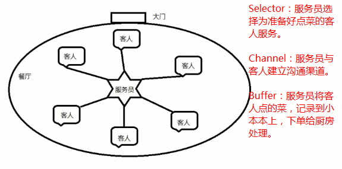
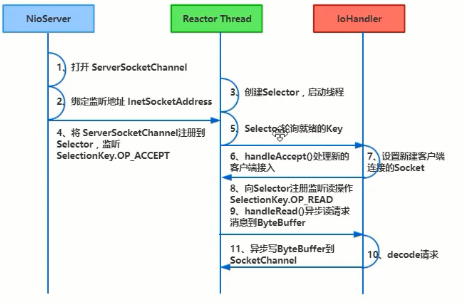
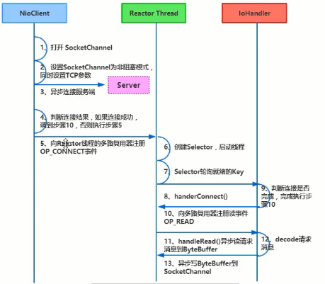
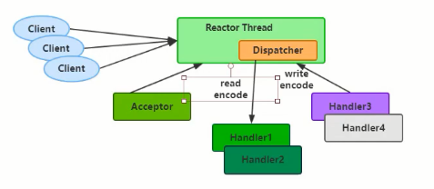
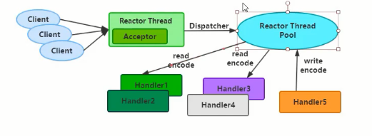
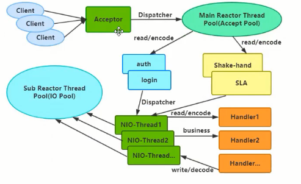
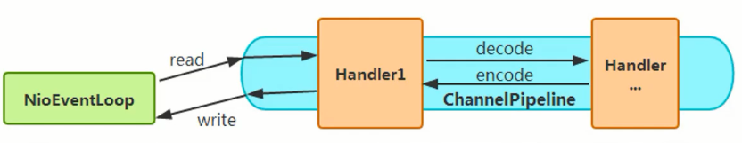

# IO流

> BIO，同步阻塞IO
>
> NIO，同步非阻塞IO，（线程池）
>
> AIO（NIO2），异步非阻塞IO，（事件驱动，回调）

## **常用BIO流：**


## Client-Server通讯

### BIO普通版

```java
//服务端代码示例：
package com.wykd.bio.inputstream;

import java.io.IOException;
import java.io.InputStream;
import java.io.OutputStream;
import java.net.ServerSocket;
import java.net.Socket;

public class InputStreamServer {

    public static void main(String[] args) {
        startServer();
    }


    public static void startServer() {
        try (
                ServerSocket serverSocket = new ServerSocket(9090);
                Socket socket = serverSocket.accept();  //accept ===> socket阻塞
                OutputStream out = socket.getOutputStream();
                InputStream in = socket.getInputStream();
        ) {

            byte[] bytes = new byte[2048];
            int len = -1;
            String result = "";
            while ((len = in.read(bytes)) != -1) {  //read ===> io阻塞
                result += new String(bytes, 0, len);
                System.out.println("接收数据！");
            }
            System.out.println("接收到客户端消息===>" + result);

            out.write("这是来自服务端的消息！".getBytes());
            out.flush();

        } catch (IOException e) {
            e.printStackTrace();
        }
    }
}

```

客户端代码示例：

```java
package com.wykd.bio.inputstream;

import java.io.IOException;
import java.io.InputStream;
import java.io.OutputStream;
import java.net.Socket;

public class InputStreamClient {

    public static void main(String[] args) {
        satrtClient();
    }

    public static void satrtClient() {
        try (
                Socket socket = new Socket("localhost", 9090);
                OutputStream out = socket.getOutputStream();
                InputStream in = socket.getInputStream();
        ) {

            System.out.println("向服务端发送消息！");
            out.write("hello world".getBytes());
            out.flush();

            socket.shutdownOutput();  //该句话非常关键，不关闭输出流的话，但不会关闭socket连接，服务端会一直阻塞在读取方法。

            byte[] bytes = new byte[2048];
            int len = 0;
            String result = "";
            while ((len = in.read(bytes)) != -1) {
                result += new String(bytes, 0, len);
            }
            System.out.println("接收到服务端消息===>" + result);

        } catch (IOException e) {
            e.printStackTrace();
        }
    }
}

```

分别启动服务端，以及客户端。

输出结果：

```
服务端打印：

接收数据！
接收到客户端消息===>hello world

客户端打印：

向服务端发送消息！
接收到服务端消息===>这是来自服务端的消息！
```


### BIO增强版（线程池）

> 服务端增加线程池，每个客户端的连接，由线程池分配一个线程进行数据接收。

```java
//服务端代码：
package com.wykd.bio.inputstream.threadpool;

import java.io.IOException;
import java.io.InputStream;
import java.io.OutputStream;
import java.net.ServerSocket;
import java.net.Socket;
import java.util.concurrent.ExecutorService;
import java.util.concurrent.Executors;

public class InputStreamServer {

    public static void main(String[] args) {

        new InputStreamServer().startServer();
    }


    public void startServer() {

        ExecutorService executorService = Executors.newFixedThreadPool(50);

        ServerSocket serverSocket = null;
        try {
            serverSocket = new ServerSocket(9090);
        } catch (IOException e) {
            e.printStackTrace();
        }

        while (true) {
            try {
                Socket socket = serverSocket.accept();
                //用线程池管理分配线程，接收客户端的消息
                executorService.submit(new ThreadHandler(socket));
            } catch (IOException e) {
                e.printStackTrace();
            }
        }


    }

    class ThreadHandler implements Runnable {

        private Socket socket;

        public ThreadHandler(Socket socket) {
            this.socket = socket;
        }

        @Override
        public void run() {
            try (
                    OutputStream out = socket.getOutputStream();
                    InputStream in = socket.getInputStream();
            ) {

                System.out.println("当前线程名："+Thread.currentThread().getName());
                byte[] bytes = new byte[2048];
                int len = -1;
                String result = "";
                while ((len = in.read(bytes)) != -1) {
                    result += new String(bytes, 0, len);
                }
                System.out.println("接收到客户端消息===>" + result);

            } catch (IOException e) {
                e.printStackTrace();
                try {
                    this.socket.close();
                } catch (IOException ex) {
                    ex.printStackTrace();
                }
            }
        }
    }
}

```

```java
//客户端01代码：
package com.wykd.bio.inputstream.threadpool;

import java.io.IOException;
import java.io.InputStream;
import java.io.OutputStream;
import java.net.Socket;

public class InputStreamClient1 {

    public static void main(String[] args) {
        startClient();
    }

    public static void startClient() {
        try (
                Socket socket = new Socket("localhost", 9090);
                OutputStream out = socket.getOutputStream();
                InputStream in = socket.getInputStream();
        ) {

            System.out.println("向服务端发送消息！");
            out.write("hello world 01".getBytes());
        } catch (IOException e) {
            e.printStackTrace();
        }
    }
}

```

```java
//客户端02代码：
package com.wykd.bio.inputstream.threadpool;

import java.io.IOException;
import java.io.InputStream;
import java.io.OutputStream;
import java.net.Socket;

public class InputStreamClient2 {

    public static void main(String[] args) {
        startClient();
    }

    public static void startClient() {
        try (
                Socket socket = new Socket("localhost", 9090);
                OutputStream out = socket.getOutputStream();
                InputStream in = socket.getInputStream();
        ) {
            System.out.println("向服务端发送消息！");
            out.write("hello world 02".getBytes());
        } catch (IOException e) {
            e.printStackTrace();
        }
    }
}

```

执行结果：

```
当前线程名：pool-1-thread-1
接收到客户端消息===>hello world 01
当前线程名：pool-1-thread-2
接收到客户端消息===>hello world 02
```

### NIO版

> 采用nio，无选择器

```java
//服务端代码：
package com.wykd.bio.inputstream.nio;

import java.io.IOException;
import java.net.InetSocketAddress;
import java.net.SocketAddress;
import java.nio.ByteBuffer;
import java.nio.channels.ServerSocketChannel;
import java.nio.channels.SocketChannel;
import java.util.ArrayList;
import java.util.List;

/**
 * 用nio模拟多路复用
 */
public class InputStreamServer {

    public static void main(String[] args) {

        try {
            new InputStreamServer().startServer();
        } catch (IOException e) {
            e.printStackTrace();
        }
    }

    List<SocketChannel> socketChannelList = new ArrayList<SocketChannel>();
    ByteBuffer byteBuffer = ByteBuffer.allocate(512);

    public void startServer() throws IOException {

        // 类似于new ServerSocket("8081");
        ServerSocketChannel serverSocketChannel = ServerSocketChannel.open();
        SocketAddress socketAddress = new InetSocketAddress("127.0.0.1",8081);
        serverSocketChannel.bind(socketAddress);

        serverSocketChannel.configureBlocking(false); //将socket的accept设置为非阻塞
        while (true){

            for (SocketChannel tempSocketChannel : socketChannelList) {
                int read = tempSocketChannel.read(byteBuffer);
                if(read>0){
                    byteBuffer.flip();
                    byte[] bs = new byte[read];
                    byteBuffer.get(bs);
                    String content = new String(bs);
                    System.out.println(content);
                    byteBuffer.flip();
                }
            }

            SocketChannel socketChannel = serverSocketChannel.accept();
            if(socketChannel != null){
                socketChannel.configureBlocking(false);   //将read设置为非阻塞
                socketChannelList.add(socketChannel);
            }
        }
    }
}

```

```java
//客户端代码1：
package com.wykd.bio.inputstream.nio;

import java.io.IOException;
import java.io.InputStream;
import java.io.OutputStream;
import java.net.Socket;

public class InputStreamClient1 {

    public static void main(String[] args) {
        startClient();
    }

    public static void startClient() {
        try (
                Socket socket = new Socket("localhost", 8081);
                OutputStream out = socket.getOutputStream();
                InputStream in = socket.getInputStream();
        ) {

            System.out.println("向服务端发送消息！");
            out.write("hello world 01".getBytes());
        } catch (IOException e) {
            e.printStackTrace();
        }
    }
}

```

```java
//客户端代码1：
package com.wykd.bio.inputstream.nio;

import java.io.IOException;
import java.io.InputStream;
import java.io.OutputStream;
import java.net.Socket;

public class InputStreamClient2 {

    public static void main(String[] args) {
        startClient();
    }

    public static void startClient() {
        try (
                Socket socket = new Socket("localhost", 8081);
                OutputStream out = socket.getOutputStream();
                InputStream in = socket.getInputStream();
        ) {
            System.out.println("向服务端发送消息！");
            out.write("hello world 02".getBytes());
        } catch (IOException e) {
            e.printStackTrace();
        }
    }
}

```

运行服务端，客户端01，客户端02，执行结果如下：

```
hello world 01
hello world 02
```

### NIO增强版（选择器）

```java
//服务端
package com.wykd.io.nio;

import com.alibaba.fastjson.JSON;

import java.io.IOException;
import java.net.InetSocketAddress;
import java.net.SocketAddress;
import java.nio.ByteBuffer;
import java.nio.channels.*;
import java.util.Iterator;
import java.util.Set;
import java.util.concurrent.ExecutorService;
import java.util.concurrent.Executors;

public class NioServer {

    //监听的端口
    private int port;

    //选择器
    private Selector selector;

    private ByteBuffer byteBuffer = ByteBuffer.allocate(1024);

    private ExecutorService executorService = Executors.newFixedThreadPool(5);

    public static void main(String[] args) {
        new NioServer(8080).listen();
    }


    /**
     * 构造方法，初始化服务端
     * @param port
     */
    public NioServer(int port){

        this.port = port;

        try {
            //1.开启一个服务端
            ServerSocketChannel serverSocketChannel = ServerSocketChannel.open();

            //2.绑定端口
            SocketAddress inetSocketAddress = new InetSocketAddress(port) ;
            serverSocketChannel.bind(inetSocketAddress);
            serverSocketChannel.configureBlocking(false); //将accept设置为非阻塞

            //3.开启一个选择器
            selector = Selector.open();

            //4.当有客户端连接上来，就将客户端注册到selector上，并默认状态为Accepted
            serverSocketChannel.register(selector, SelectionKey.OP_ACCEPT);

        } catch (IOException e) {
            e.printStackTrace();
        }


    }

    /**
     * 开始监听
     */
    public void listen(){

        try {
            //轮训
            while (true) {

                int i = selector.select(2000);
                System.out.println(i);
                if(i==0){
                    System.out.println("监听数为0，进入下次循环！");
                    continue;
                }else{
                    System.out.println("监听数："+i);
                }
                Set<SelectionKey> keys =  selector.selectedKeys();
                System.out.println("========>"+JSON.toJSONString(keys));
                System.out.println("keys长度========>"+keys.size());

                Iterator<SelectionKey> keysIterator = keys.iterator();
                //循环处理 ，每个key代表一种状态
                while(keysIterator.hasNext()){
                    SelectionKey key = keysIterator.next();
                    process(key);
                    keysIterator.remove();

//                    System.out.println("*****************"+key.isAcceptable()+key.isReadable()+key.isWritable());
                }
            }
        }catch(Exception e){
            e.printStackTrace();
        }
    }

    /**
     * 业务逻辑处理
     * @param key
     */
    private void process(SelectionKey key) throws IOException {

        if(key.isAcceptable()){
            //可接收的状态，key.channel获取的是服务端Channel
            ServerSocketChannel serverSocketChannel = (ServerSocketChannel) key.channel();
            SocketChannel socketChannel = serverSocketChannel.accept();
            socketChannel.configureBlocking(false);  //将读取方法设置为非阻塞

            //数据准备就绪，修改客户端注册的状态为：Readable，开始监听并读取客户端的信息。
            socketChannel.register(selector,SelectionKey.OP_READ);

        }else if(key.isReadable()){
            //可读的状态，key.channel获取的是客户端Channel
            SocketChannel socketChannel = (SocketChannel) key.channel();
            //从byteBuffer中读取
            int len = socketChannel.read(byteBuffer);

            if(len>0){

                byteBuffer.flip();  //将Buffer从写模式切换到读模式
                String content = new String(byteBuffer.array(),0,len);
                byteBuffer.clear();

				//线程池执行业务
                executorService.submit(()->{
                    System.out.println("客户端信息："+content);
                    //修改客户端注册的状态为：Writable
                    SelectionKey key2 = null;
                    try {
                        Thread.sleep(5000);
                        key2 = socketChannel.register(selector, SelectionKey.OP_WRITE);
                        key2.attach(content);
                    } catch (ClosedChannelException | InterruptedException e) {
                        e.printStackTrace();
                    }
                });
//
//                socketChannel.write(ByteBuffer.wrap(("服务端反馈=====>"+content).getBytes("utf-8") ));
            }
        }
        else if(key.isWritable()){
            //可写的状态，key.channel获取的是客户端Channel
            SocketChannel socketChannel = (SocketChannel) key.channel();
            String content = (String) key.attachment();
            //写入buffer
            socketChannel.write(ByteBuffer.wrap(("服务端反馈"+content).getBytes()));
            socketChannel.close();
        }
    }
}


```

```java
package com.wykd.io.nio;

import java.io.IOException;
import java.io.InputStream;
import java.io.OutputStream;
import java.net.Socket;
import java.util.concurrent.CountDownLatch;
import java.util.concurrent.ExecutorService;
import java.util.concurrent.Executors;
import java.util.concurrent.atomic.AtomicInteger;

public class NioClient {

   static CountDownLatch countDownLatch = new CountDownLatch(20);

    public static void main(String[] args) {

        for (int i = 0; i < 20; i++) {
            final int num = i;
            new Thread(()->{
                countDownLatch.countDown();
                try {
                    countDownLatch.await();
                } catch (InterruptedException e) {
                    e.printStackTrace();
                }
                new NioClient().startClient(num);
            }).start();


        }
    }

    public  void startClient(int num) {
        System.out.println("num"+num);
        try (
                Socket socket = new Socket("localhost", 8080);
                OutputStream out = socket.getOutputStream();
                InputStream in = socket.getInputStream();
        ) {

            System.out.println("向服务端发送消息！"+"hello world "+num);
            out.write(("hello world "+num).getBytes());
            out.flush();

            socket.shutdownOutput();  //该句话非常关键，不关闭输出流的话，但不会关闭socket连接，服务端会一直阻塞在读取方法。

            byte[] bytes = new byte[2048];
            int len = 0;
            String result = "";
            while ((len = in.read(bytes)) != -1) {
                result += new String(bytes, 0, len);
            }
            System.out.println("接收到服务端消息===>" + result);

        } catch (IOException e) {
            e.printStackTrace();
        }
    }
}


```

```
分别启动服务端，以及客户端，输出结果为：
疑问：acceptable为5次，writable为5次，但执行了异步多线程的readable为7次？？

监听数：1
========>[{"acceptable":true,}]
keys长度========>1

监听数：2
========>[{"acceptable":true,},{"readable":true,}]
keys长度========>2
len为：13
客户端信息：hello world 0

监听数：3
========>[{"readable":true,},{"acceptable":true,},{"readable":true,}]
keys长度========>3
len为：13
客户端信息：hello world 4
len为：-1

监听数：4
========>[{"readable":true,},{"writable":true},{"acceptable":true,},{"writable":true}]
keys长度========>4
len为：13
客户端信息：hello world 2

监听数：3
========>[{"writable":true},{"acceptable":true,},{"readable":true,}]
keys长度========>3
len为：13
客户端信息：hello world 3

监听数：2
========>[{"readable":true,},{"readable":true,}]
keys长度========>2
len为：13
客户端信息：hello world 1
len为：-1

监听数：2
========>[{"writable":true},{"writable":true}]
keys长度========>2！

```


### Netty版

服务端代码示例：
```java
package com.wykd.netty;

import io.netty.bootstrap.ServerBootstrap;
import io.netty.buffer.ByteBuf;
import io.netty.buffer.Unpooled;
import io.netty.channel.*;
import io.netty.channel.nio.NioEventLoopGroup;
import io.netty.channel.socket.SocketChannel;
import io.netty.channel.socket.nio.NioServerSocketChannel;
import io.netty.handler.codec.string.StringDecoder;

public class NettyServer {
    private final int port;

    public NettyServer(int port) {
        this.port = port;
    }

    public static void main(String[] args) throws Exception {
        int port = 8086;
        if (args.length == 1) {
            port = Integer.parseInt(args[0]);
        }
        new NettyServer(port).run();
    }

    public void run() throws Exception {
        //主线程池
        EventLoopGroup bossGroup = new NioEventLoopGroup();
        //从线程池
        EventLoopGroup workerGroup = new NioEventLoopGroup();
        try {
            ServerBootstrap b = new ServerBootstrap();
            b.group(bossGroup, workerGroup)
                    .channel(NioServerSocketChannel.class)
                    .option(ChannelOption.SO_BACKLOG, 128)
                	//保持长连接
                    .childOption(ChannelOption.SO_KEEPALIVE, true)
                    .childHandler(new ChannelInitializer<SocketChannel>() {
                        @Override
                        //客户端初始化处理
                        public void initChannel(SocketChannel ch) throws Exception {
                            
                            ch.pipeline().addLast(new StringDecoder())
                                .addLast(new DemoServerHandler());
                        }
                    });

            // Bind and start to accept incoming connections.
            ChannelFuture f = b.bind(port).sync();

            // Wait until the server socket is closed.
            System.out.println(NettyServer.class.getName() + " started and listen on " + port);
            f.channel().closeFuture().sync();
        } finally {
            workerGroup.shutdownGracefully();
            bossGroup.shutdownGracefully();
        }
    }

    class DemoServerHandler extends ChannelInboundHandlerAdapter {

        @Override
        public void channelRead(ChannelHandlerContext ctx, Object msg) {
            String inStr = (String) msg;
            System.out.println("收到客户端消息: " + inStr);
            String outStr = "来自服务端的消息: " + inStr + System.lineSeparator();
            ByteBuf outBb = Unpooled.copiedBuffer(outStr.getBytes());
            ctx.write(outBb);
        }

        @Override
        public void exceptionCaught(ChannelHandlerContext ctx, Throwable cause) { // (4)
            // Close the connection when an exception is raised.
            cause.printStackTrace();
            ctx.close();
        }

        @Override
        public void channelReadComplete(ChannelHandlerContext ctx) throws Exception {
            ctx.flush();
        }

    }
}

```


客户端代码示例：
```java
package com.wykd.netty;

import io.netty.bootstrap.Bootstrap;
import io.netty.buffer.Unpooled;
import io.netty.channel.*;
import io.netty.channel.nio.NioEventLoopGroup;
import io.netty.channel.socket.SocketChannel;
import io.netty.channel.socket.nio.NioSocketChannel;
import io.netty.handler.codec.string.StringDecoder;


public class NettyClient {
    private String host;
    private int port;

    public NettyClient(String host, int port) {
        this.host = host;
        this.port = port;
    }

    public static void main(String[] args) throws Exception {
        String host = "localhost";
        int port = 8086;
        if (args.length == 2) {
            host = args[0];
            port = Integer.parseInt(args[1]);
        }
        new NettyClient(host, port).run();
    }

    public void run() throws Exception {
        //单线程池
        EventLoopGroup workerGroup = new NioEventLoopGroup();
        try {
            Bootstrap b = new Bootstrap();
            b.group(workerGroup)
                    .channel(NioSocketChannel.class)
                    .option(ChannelOption.SO_KEEPALIVE, true)
                    .handler(new ChannelInitializer<SocketChannel>() {
                        @Override
                        public void initChannel(SocketChannel ch) throws Exception {
                            //先字符串解码，再处理业务数据
                            ch.pipeline().addLast(new StringDecoder())
                                .addLast(new DemoClientHandler());
                        }
                    });

            // 开启客户端，连接IP，以及端口
            ChannelFuture f = b.connect(host, port).sync(); 
            System.out.println(NettyClient.class.getName() + " started and connected to " + host + ":" + port);
            // Wait until the connection is closed.
            f.channel().closeFuture().sync();
        } finally {
            workerGroup.shutdownGracefully();
        }
    }

    class DemoClientHandler extends SimpleChannelInboundHandler {

        @Override
        public void channelActive(ChannelHandlerContext ctx) {
            System.out.println("向服务端发送消息");
            ctx.writeAndFlush(Unpooled.copiedBuffer("Hello!".getBytes()));
        }

        @Override
        public void channelRead0(ChannelHandlerContext ctx, Object msg) {
            String inStr = (String) msg;
            System.out.println("收到服务端消息： " + inStr);
        }

        @Override
        //异常处理
        public void exceptionCaught(ChannelHandlerContext ctx, Throwable cause) { // (4)
            // Close the connection when an exception is raised.
            cause.printStackTrace();
            ctx.close();
        }
    }
}

```


## 文件复制（9种实现方式）

```java
//代码示例：
package com.wykd.bio.fileinputstream;

import com.google.common.io.Files;

import java.io.*;
import java.nio.ByteBuffer;
import java.nio.channels.FileChannel;

public class TestFileCopy {


    public static void main(String[] args) throws IOException {
        long start1 = System.currentTimeMillis();
        copy01(new File("d:\\copy/src.txt"), new File("d:\\copy/desc1.txt"));
        System.out.println("copy01耗时===>"+(System.currentTimeMillis()-start1)+"===>字节流，每次读取1字节");

        long start2 = System.currentTimeMillis();
        copy02(new File("d:\\copy/src.txt"), new File("d:\\copy/desc2.txt"));
        System.out.println("copy02耗时===>"+(System.currentTimeMillis()-start2)+"===>字节流，每次读取1字节数组");

        long start3 = System.currentTimeMillis();
        copy03(new File("d:\\copy/src.txt"), new File("d:\\copy/desc3.txt"));
        System.out.println("copy03耗时===>"+(System.currentTimeMillis()-start3)+"===>字节缓冲流，每次读取1字节");

        long start4 = System.currentTimeMillis();
        copy04(new File("d:\\copy/src.txt"), new File("d:\\copy/desc4.txt"));
        System.out.println("copy04耗时===>"+(System.currentTimeMillis()-start4)+"===>字节缓冲流，每次读取1字节数组,数组长度为1024");

        long start5 = System.currentTimeMillis();
        copy05(new File("d:\\copy/src.txt"), new File("d:\\copy/desc5.txt"));
        System.out.println("copy05耗时===>"+(System.currentTimeMillis()-start5)+"===>字节缓冲流，每次读取1字节数组,数组长度为2048");

        long start6 = System.currentTimeMillis();
        copy06(new File("d:\\copy/src.txt"), new File("d:\\copy/desc6.txt"));
        System.out.println("copy06耗时===>"+(System.currentTimeMillis()-start6)+"===>字符缓冲流");

        long start7 = System.currentTimeMillis();
        copy07(new File("d:\\copy/src.txt"), new File("d:\\copy/desc7.txt"));
        System.out.println("copy07耗时===>"+(System.currentTimeMillis()-start7)+"===>转换流，转换成字符流");

        long start8 = System.currentTimeMillis();
        copy08(new File("d:\\copy/src.txt"), new File("d:\\copy/desc8.txt"));
        System.out.println("copy08耗时===>"+(System.currentTimeMillis()-start8)+"===>Files.copy方法");

        long start9 = System.currentTimeMillis();
        copy09(new File("d:\\copy/src.txt"), new File("d:\\copy/desc9.txt"));
        System.out.println("copy09耗时===>"+(System.currentTimeMillis()-start9)+"===>FileChannel零拷贝");
    }

    /*
     *  字节流，每次读写单个字节
     */
    public static void copy01(File src, File desc) throws IOException {
        FileInputStream fis = new FileInputStream(src);
        FileOutputStream fos = new FileOutputStream(desc);
        int len = 0;
        while ((len = fis.read()) != -1) {
            fos.write(len);
        }
        fos.close();
        fis.close();
    }

    /*
     * 字节流，每次读写 一个字节数组
     */
    public static void copy02(File src, File desc) throws IOException {
        FileInputStream fis = new FileInputStream(src);
        FileOutputStream fos = new FileOutputStream(desc);
        int len = 0;
        byte[] bytes = new byte[1024];
        while ((len = fis.read(bytes)) != -1) {
            fos.write(bytes, 0, len);
        }
        fos.close();
        fis.close();
    }

    /*
     * 字节流缓冲区流，每次读写1个字节
     */
    public static void copy03(File src, File desc) throws IOException {
        BufferedInputStream bis = new BufferedInputStream(new FileInputStream(src));
        BufferedOutputStream bos = new BufferedOutputStream(new FileOutputStream(desc));
        int len = 0;
        while ((len = bis.read()) != -1) {
            bos.write(len);
        }
        bos.close();
        bis.close();
    }

    /*
     * 字节流缓冲区流，每次读写1个字节数组
     */
    public static void copy04(File src, File desc) throws IOException {
        BufferedInputStream bis = new BufferedInputStream(new FileInputStream(src));
        BufferedOutputStream bos = new BufferedOutputStream(new FileOutputStream(desc));
        int len = 0;
        byte[] bytes = new byte[1024];
        while ((len = bis.read(bytes)) != -1) {
            bos.write(bytes, 0, len);
        }
        bos.close();
        bis.close();
    }

    /**
     * 复制copy04方法，字节数组长度增加一倍
     * @param src
     * @param desc
     * @throws IOException
     */
    public static void copy05(File src, File desc) throws IOException {
        BufferedInputStream bis = new BufferedInputStream(new FileInputStream(src));
        BufferedOutputStream bos = new BufferedOutputStream(new FileOutputStream(desc));
        int len = 0;
        byte[] bytes = new byte[2048];
        while ((len = bis.read(bytes)) != -1) {
            bos.write(bytes, 0, len);
        }
        bos.close();
        bis.close();
    }

    /**
     * 用字符流拷贝文件
     * @param src
     * @param dest
     * @throws IOException
     */
    public static void copy06(File src ,File dest) throws IOException {
        //创建字符输入流缓冲流对象,构造方法传递字符输入流,包装数据源文件
        BufferedReader bfr = new BufferedReader(new FileReader(src));
        BufferedWriter bfw = new BufferedWriter(new FileWriter(dest));
        String line = null;
        while((line = bfr.readLine())!=null){
            bfw.write(line);
        }
        bfr.close();
        bfw.close();
    }

    /**
     * 使用转换流，字符流拷贝文件
     * @param src
     * @param dest
     * @throws IOException
     */
    public static void copy07(File src ,File dest) throws IOException {
        InputStreamReader isr = new InputStreamReader(new FileInputStream(src),"utf-8");
        OutputStreamWriter osw= new OutputStreamWriter(new FileOutputStream(dest),"utf-8");
        BufferedReader bfr = new BufferedReader(isr);
        BufferedWriter bfw = new BufferedWriter(osw);
        String line = null;
        while((line = bfr.readLine())!=null){
            bfw.write(line);
        }
        bfr.close();
        bfw.close();
    }

    /**
     * 用Files的copy方法
     * @param src
     * @param dest
     * @throws IOException
     */
    public static void copy08(File src ,File dest) throws IOException {
        Files.copy(src,dest);
    }

    /**
     * 使用FileChannel复制文件，零拷贝，跳过jvm内存，直接操作操作系统的内存
     * @param src
     * @param dest
     * @throws IOException
     */
    public static void copy09(File src ,File dest) throws IOException {

        FileInputStream fis = new FileInputStream(src);
        FileOutputStream fos = new FileOutputStream(dest);

        FileChannel fcin = fis.getChannel();
        FileChannel fcout = fos.getChannel();

        ByteBuffer buffer = ByteBuffer.allocate(1024);

        while(true){
            buffer.clear();
            int r = fcin.read(buffer);
            if(r == -1){
                break;
            }
            buffer.flip();
            fcout.write(buffer);
        }

    }
}

```

```
复制一个10M的文件，执行结果如下：

copy01耗时===>35400===>字节流，每次读取1字节
copy02耗时===>52===>字节流，每次读取1字节数组
copy03耗时===>218===>字节缓冲流，每次读取1字节
copy04耗时===>18===>字节缓冲流，每次读取1字节数组,数组长度为1024
copy05耗时===>19===>字节缓冲流，每次读取1字节数组,数组长度为2048
copy06耗时===>123===>字符缓冲流
copy07耗时===>88===>转换流，转换成字符流
copy08耗时===>47===>Files.copy方法
copy09耗时===>76===>FileChannel零拷贝
```


## NIO流概念

参考文章：https://www.cnblogs.com/snailclimb/p/Buffer.html

图解NIO三大组件：Selector，Channel，Buffer



### Buffer

> 1.当向buffer写入数据时，buffer会记录下写了多少数据。一旦要读取数据，需要通过flip()方法将Buffer从写模式切换到读模式。在读模式下，可以读取之前写入到buffer的所有数据。
>
> 2.一旦读完了所有的数据，就需要清空缓冲区，让它可以再次被写入。有两种方式能清空缓冲区：调用clear()或compact()方法。
>
> - flip方法将Buffer从写模式切换到读模式。调用flip()方法会将position设回0，并将limit设置成之前position的值。


**写入buffer：**

```java
// 从Channel读取，并写入Buffer
int bytesRead = inChannel.read(buf);  

//通过put方法写入Buffer
buf.put("127");
```


**读取buffer：**

```java
// 从Buffer读取，写入Channel
int bytesWritten = inChannel.write(buf);  

//使用get()方法从Buffer中读取数据
byte aByte = buf.get();
```

**position，limit，capacity变化代码演示：**

```java
package com.wykd.nio;

import java.io.FileInputStream;
import java.io.FileNotFoundException;
import java.io.IOException;
import java.nio.ByteBuffer;
import java.nio.channels.FileChannel;

/**
 * 功能：
 * Created by [Alex]
 * 2020/5/7 14:10
 */
public class TestBuffer {


    public static void main(String[] args) {

        try {
            FileInputStream fis = new FileInputStream("d://abc.txt");
            
            //指定大小的缓冲区
            ByteBuffer buffer = ByteBuffer.allocate(1024);
            
            //包装了一个字节数组的缓冲区
            //byte[] tbytes = new byte[1024];
            //ByteBuffer buffer = ByteBuffer.warp(tbytes)
            
            FileChannel fc = fis.getChannel();

            //1.从channel读取并写入buffer
            int len = fc.read(buffer);
            printBufferInfo("fc.read(buffer)===>",buffer);

            //2.从写模式切换到读取模式，position设回0，并将limit设置成之前position的值。
            buffer.flip();
            printBufferInfo("buffer.flip()===>",buffer);

            //3.从buffer中读取字节
            if (len > 0) {

                byte[] bytes = new byte[len];
                int count = 0;
                while (buffer.remaining() >0){
                    bytes[count] = buffer.get();
                    count++;
                }
//                System.out.println(new String(bytes));
                printBufferInfo("buffer.get()===>",buffer);
            }

            //4.清理buffer，指针归位，回到初始状态
            buffer.clear();
            printBufferInfo("buffer.clear()===>",buffer);

            fc.close();

        } catch (FileNotFoundException e) {
            e.printStackTrace();
        } catch (IOException e) {
            e.printStackTrace();
        }


    }

    /**
     * 打印
     * @param type
     * @param buffer
     */
    private static void printBufferInfo(String type ,ByteBuffer buffer) {
        System.out.println(type + "position:" + buffer.position() + " limit:" + buffer.limit() + " capacity" + buffer.capacity());
    }


}

```

```
打印结果：

fc.read(buffer)===>	position:90  limit:1024 	capacity1024
buffer.flip()===>	position:0 	 limit:90 		capacity1024
buffer.get()===>	position:90  limit:90 		capacity1024
buffer.clear()===>	position:0 	 limit:1024 	capacity1024
```

**写模式，读模式下的buffer示意图：**


### Channel

> Channel 必须要配合 Buffer一起使用


### Selector

> Selector 会不断地轮询注册在其上的 Channel，如果某个 Channel 上面发生了读或者写事件，这个 Channel 就处于就绪状态，会被 Selector 轮询出来，然后通过 SelectionKey 可以获取就绪 Channel 的集合，进行后续的 I/O 操作。
>


## Netty

服务端时序图



客户端时序图：



### NioEventLoop

> NioEventLoop聚合了多路复用器Selector，可以同时处理成百上千个客户端Channel

```java
EventLoopGroup bossGroup = new NioEventLoopGroup();
```

```java
private static final int DEFAULT_EVENT_LOOP_THREADS = 
    Math.max(1, SystemPropertyUtil.getInt("io.netty.eventLoopThreads", NettyRuntime.availableProcessors() * 2));

protected MultithreadEventLoopGroup(int nThreads, Executor executor, Object... args) {
	super(nThreads == 0 ? DEFAULT_EVENT_LOOP_THREADS : nThreads, executor, args);
}
```

从上述源码中，NettyRuntime.availableProcessors() * 2，默认线程池大小为CPU个数*2

### Reactor线程模型

单线程模型



多线程模型：



主从Reactor多线程模型：




### 零拷贝

### Pooled内存池

### Pipeline

