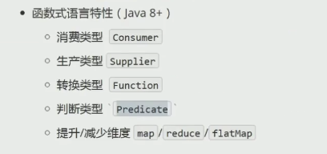

# JDK8新特性

## lambada

参考链接：https://www.zhihu.com/question/20125256/answer/324121308



## 常见函数式接口类1：

### 转换类型：Function

> 源码解读：

```java
@FunctionalInterface
public interface Function<T, R> {
    R apply(T t);
}
```

### 判断类型：Predicate

```java
@FunctionalInterface
public interface Predicate<T> {
    boolean test(T t);
}
```

### 消费类型：Consumer

```java
@FunctionalInterface
public interface Consumer<T> {
    void accept(T t);
}
```

```
list.forEach(result -> { System.out.println(result)});
```


### 生产类型：Supplier

```java
@FunctionalInterface
public interface Supplier<T> {
    T get();
}
```

## 常见函数式接口类2：

### Runnable

```java
@FunctionalInterface
public interface Runnable {
    public abstract void run();
}
```

### Callable

> 源码解读：

```
@FunctionalInterface
public interface Callable<V> {
    V call() throws Exception;
}
```

### Comparator

> 源码解读：

```
@FunctionalInterface
public interface Comparator<T> {
	int compare(T o1, T o2);
}
```

代码实例：**根据年龄对学生排序**

```java
import com.alibaba.fastjson.JSON;

import java.util.ArrayList;
import java.util.Collections;
import java.util.List;

public class TestComparator {

    public static void main(String[] args) {

        List<Student> studentList = new ArrayList<Student>(){
            {
                add(new Student("钱七", 70));
                add(new Student("李四", 40));
                add(new Student("张三", 30));
                add(new Student("赵六", 60));
                add(new Student("王五", 50));
            }
        };

        System.out.println("排序前==>"+JSON.toJSONString(studentList));

        Collections.sort(studentList, (s1, s2) -> s1.age - s2.age);
        System.out.println("排序后===>"+JSON.toJSONString(studentList));
    }


    static class Student {
        private String name;
        private int age;

        public Student(String name, int age) {
            this.name = name;
            this.age = age;
        }

        public String getName() {
            return name;
        }

        public void setName(String name) {
            this.name = name;
        }

        public int getAge() {
            return age;
        }

        public void setAge(int age) {
            this.age = age;
        }
    }


}

运算结果：
排序前==>[{"age":70,"name":"钱七"},{"age":40,"name":"李四"},{"age":30,"name":"张三"},{"age":60,"name":"赵六"},{"age":50,"name":"王五"}]
排序后===>[{"age":30,"name":"张三"},{"age":40,"name":"李四"},{"age":50,"name":"王五"},{"age":60,"name":"赵六"},{"age":70,"name":"钱七"}]

```


## 经典例子：

### 聚合reduce

```java
 Stream.of(0,1,2,3,4,5,6,7,8,9)
                .reduce(Integer::sum)  //聚合求和
                .ifPresent(System.out::println);
```

```
 //BigDecimal
        List<BigDecimal> decimals = new LinkedList<>();
        decimals.add(BigDecimal.valueOf(5.9));
        decimals.add(BigDecimal.valueOf(1.0));
        decimals.add(BigDecimal.valueOf(19.79));
        decimals.add(BigDecimal.valueOf(3.2));
        decimals.add(BigDecimal.valueOf(5.7));

        BigDecimal sum = decimals.stream().reduce(BigDecimal.ZERO, BigDecimal::add);
        System.out.println(sum);
```

