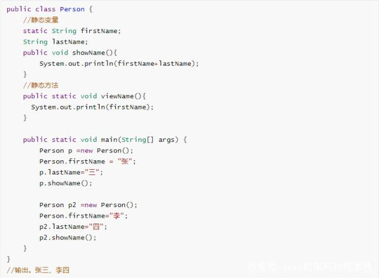
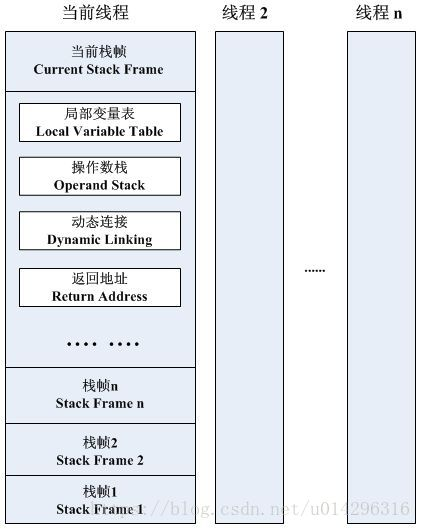
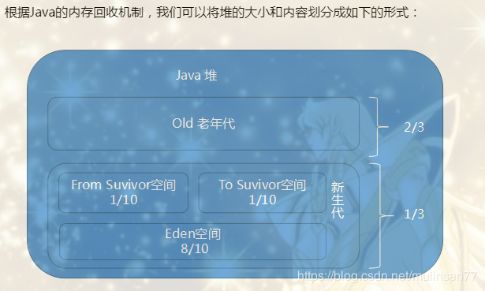

# JVM

> JDK：Java Development Kit（ Java开发软件包）
>
> JRE：Java Runtime Envirmoment （Java运行环境）
>
> JVM：Java Virturn Machine （Java虚拟机）

## JVM内存模型


### JVM内存存放分析

- 方法区：线程共享，运行时常量池。存储**基本类型常量**（public static final），**静态方法，静态变量**（static变量），class
- 堆（heap）：线程共享，存储**new的对象（注意：不是对象引用，是对象本身），数组**
- 栈（stack）：线程独有，存储**局部变量**，**对象的引用**

#### 具体例子分析：




### 成员变量和局部变量的区别

​    (1)在类中的位置不同
​        成员变量：类中方法外
​        局部变量：方法定义中或者方法声明上
​    (2)在内存中的位置不同
​        成员变量：在堆中
​        局部变量：在栈中
​    (3)生命周期不同
​        成员变量：随着对象的创建而存在，随着对象的消失而消失
​        局部变量：随着方法的调用而存在，随着方法的调用完毕而消失
​    (4)初始化值不同
​        成员变量：有默认值
​        局部变量：没有默认值，必须定义，赋值，然后才能使用

## 栈内存

> 栈内存包括3个方面：
>
> 1.程序计数器。
>
> 2.虚拟机栈：每一个方法，会启用一个栈帧。每个栈帧包括：**局部变量表，操作数栈**，动态连接等
>
> ​		2.1 注：**基本数据类型**（char、byte、short、int、long、float、double、boolean）就是存放在局部变量表中。
>
> 3.本地方法栈：native方法，调用系统的C语言方法，可通过linux命令查看，如：man 2 select

栈帧示意图：



### 出栈入栈示例

```java
package com.wykd.jvm;

public class JVMTest {
    public static void main(String[] args) {
        int a = 10;
        int b = 5;
        int c = a * b;
        System.out.println(c);
    }
}
```

```java
编译命令：	 javac JVMTest.java
反编译命令：  javap -v JVMTest.class > jvm.txt
执行命令：    java com.wykd.jvm.JVMTest
```

字节码反编译结果为：

字节码指令，参考：https://www.cnblogs.com/longjee/p/8675771.html

```
Classfile /D:/Alex_Java/workspace/idea_workspace/wykd-java/ww-basic/src/main/java/com/wykd/jvm/JVMTest.class
  Last modified 2020-5-4; size 418 bytes
  MD5 checksum 69259f29d94aef33546f535d3e75fa35
  Compiled from "JVMTest.java"
public class com.wykd.jvm.JVMTest
  minor version: 0
  major version: 52
  flags: ACC_PUBLIC, ACC_SUPER
Constant pool:
   #1 = Methodref          #5.#14         // java/lang/Object."<init>":()V
   #2 = Fieldref           #15.#16        // java/lang/System.out:Ljava/io/PrintStream;
   #3 = Methodref          #17.#18        // java/io/PrintStream.println:(I)V
   #4 = Class              #19            // com/wykd/jvm/JVMTest
   #5 = Class              #20            // java/lang/Object
   #6 = Utf8               <init>
   #7 = Utf8               ()V
   #8 = Utf8               Code
   #9 = Utf8               LineNumberTable
  #10 = Utf8               main
  #11 = Utf8               ([Ljava/lang/String;)V
  #12 = Utf8               SourceFile
  #13 = Utf8               JVMTest.java
  #14 = NameAndType        #6:#7          // "<init>":()V
  #15 = Class              #21            // java/lang/System
  #16 = NameAndType        #22:#23        // out:Ljava/io/PrintStream;
  #17 = Class              #24            // java/io/PrintStream
  #18 = NameAndType        #25:#26        // println:(I)V
  #19 = Utf8               com/wykd/jvm/JVMTest
  #20 = Utf8               java/lang/Object
  #21 = Utf8               java/lang/System
  #22 = Utf8               out
  #23 = Utf8               Ljava/io/PrintStream;
  #24 = Utf8               java/io/PrintStream
  #25 = Utf8               println
  #26 = Utf8               (I)V
{
  public com.wykd.jvm.JVMTest();
    descriptor: ()V
    flags: ACC_PUBLIC
    Code:
      stack=1, locals=1, args_size=1
         0: aload_0
         1: invokespecial #1                  // Method java/lang/Object."<init>":()V
         4: return
      LineNumberTable:
        line 3: 0

  public static void main(java.lang.String[]);			//对应代码中的main方法
    descriptor: ([Ljava/lang/String;)V
    flags: ACC_PUBLIC, ACC_STATIC
    Code:
      stack=2, locals=4, args_size=1
         0: bipush        10				//将10，压入栈
         2: istore_1						//将栈顶的变量取出，移入局部变量表的1号位置
         3: iconst_5						//将5压入栈
         4: istore_2						//将栈顶的变量取出，移入局部变量表的2号位置
         5: iload_1							//将局部变量表的1号变量，压入栈顶
         6: iload_2							//将局部变量表的2号变量，压入栈顶
         7: imul							//取出并计算栈顶的2个变量，并压入栈顶
         8: istore_3						//将栈顶的变量取出，移入局部变量表的3号位置
         9: getstatic     #2                  // Field java/lang/System.out:Ljava/io/PrintStream;
        12: iload_3							//从局变量的3号位置，取出变量，并压入栈顶
        13: invokevirtual #3                  // 调用System.out的打印方法，Method java/io/PrintStream.println:(I)V
        16: return
      LineNumberTable:
        line 5: 0
        line 6: 3
        line 7: 5
        line 8: 9
        line 9: 16
}
SourceFile: "JVMTest.java"

```

### 内存异常分析

> **StackOverflowError**：如果线程请求的栈深度大于虚拟机所允许的深度，将抛出StackOverflowError

> **OutOfMemoryError**：多线程环境下，虚拟机在扩展栈时，无法申请到足够的内存空间。
>
> 解决办法：减少单个线程占用的的内存容量；一个线程默认占用1M内存；将Xss改小，除了能解决异常，还能增加并发线程数的能力。

#### StackOverflowError代码演示：

```java
package com.wykd.jvm;

import java.util.concurrent.atomic.AtomicInteger;

public class StackTest {

    AtomicInteger count = new AtomicInteger(0);
    public static void main(String[] args) {
        try {
            new StackTest().recursion();
        }catch(Exception e){
            e.printStackTrace();
        }
    }

    public void recursion() throws RuntimeException{
        System.out.println("执行次数为"+count.incrementAndGet());
        recursion();
    }
}

```

```
此处省略6500行：
...
执行次数为6505
执行次数为6506
执行次数为6507
执行次数为6508
Exception in thread "main" java.lang.StackOverflowError
	at sun.nio.cs.UTF_8$Encoder.encodeLoop(UTF_8.java:691)
	at java.nio.charset.CharsetEncoder.encode(CharsetEncoder.java:579)
	at sun.nio.cs.StreamEncoder.implWrite(StreamEncoder.java:271)
	at sun.nio.cs.StreamEncoder.write(StreamEncoder.java:125)
	at java.io.OutputStreamWriter.write(OutputStreamWriter.java:207)
```


| 属性 | 描述                                                         |
| ---- | ------------------------------------------------------------ |
| -Xss | 每个线程的栈内存大小，根据jvm规范，一个线程默认最大栈大小为1M |

## 堆内存

> 堆内存包含2个方面：
>
> 1.新生代，包括：Eden空间，From survivor空间 ，To survivor空间.  
>
> ​		1.1 Eden空间不够，会触发MinorGC，对象移入交换区（From，To）.
>
> ​		1.2 MinorGC后，对象在交换区的年龄加1，当超过15次后，晋升到老年代。
>
> 2.老年代
>
> ​		2.1 老年代内存空间不够，会触发FullGC，会导致jvm停摆，应尽量避免。



| 属性 | 描述       |
| ---- | ---------- |
| -Xms | 初始堆内存 |
| -Xmx | 最大堆内存 |


