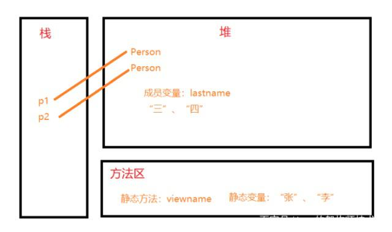

# JVM

> JDK：Java Development Kit（ Java开发软件包）
>
> JRE：Java Runtime Envirmoment （Java运行环境）
>
> JVM：Java Virturn Machine （Java虚拟机）

## JVM内存模型


### JVM内存存放分析

- 方法区：线程共享，包含“运行时常量池”。存储**基本类型常量**（public static final），**静态方法，静态变量**（static变量），class
- 堆（heap）：线程共享，存储**new的对象（注意：不是对象引用，是对象本身），数组**
- 栈（stack）：线程独有，存储**局部变量**，**对象的引用**

### 具体例子分析：




## 堆外内存（直接内存）

Unsafe直接操作直接内存

EHcache  中间件

## 方法区

> 常量池：运行时常量池，静态常量池
>
> class文件
>
> 元空间


## 栈内存

> 每个线程，会开启一个虚拟机栈。
>
> 每个虚拟机栈，默认1M大小；若栈内存溢出，可适量增加栈大小（XSS），同时也会减少高并发数量。
>
> 栈内存包括3个方面：
>
> 1.程序计数器。
>
> 2.虚拟机栈：每一个方法，会启用一个栈帧，并先后压入虚拟机栈中。
>
> ​		2.1 局部变量表包含：基本数据类型，引用类型
>
> ​		2.2  操作数栈是执行引擎的工作区，执行引擎类似于CPU，负责运算，比如加减乘除等
>
> 3.本地方法栈：native方法，调用系统的C语言方法，可通过linux命令查看，如：man 2 select

栈帧示意图：


### 出栈入栈示例

```java
package com.wykd.jvm;

public class JVMTest {
    public static void main(String[] args) {
        int a = 10;
        int b = 5;
        int c = a * b;
        System.out.println(c);
    }
}
```

```java
编译命令：	 javac JVMTest.java
反编译命令：  javap -v JVMTest.class > jvm.txt
执行命令：    java com.wykd.jvm.JVMTest
```

字节码反编译结果为：

字节码指令集1：

参考：https://www.cnblogs.com/longjee/p/8675771.html

字节码指令集2：

https://cloud.tencent.com/developer/article/1333540

```
Classfile /D:/Alex_Java/workspace/idea_workspace/wykd-java/ww-basic/src/main/java/com/wykd/jvm/JVMTest.class
  Last modified 2020-5-4; size 418 bytes
  MD5 checksum 69259f29d94aef33546f535d3e75fa35
  Compiled from "JVMTest.java"
public class com.wykd.jvm.JVMTest
  minor version: 0
  major version: 52
  flags: ACC_PUBLIC, ACC_SUPER
Constant pool:
   #1 = Methodref          #5.#14         // java/lang/Object."<init>":()V
   #2 = Fieldref           #15.#16        // java/lang/System.out:Ljava/io/PrintStream;
   #3 = Methodref          #17.#18        // java/io/PrintStream.println:(I)V
   #4 = Class              #19            // com/wykd/jvm/JVMTest
   #5 = Class              #20            // java/lang/Object
   #6 = Utf8               <init>
   #7 = Utf8               ()V
   #8 = Utf8               Code
   #9 = Utf8               LineNumberTable
  #10 = Utf8               main
  #11 = Utf8               ([Ljava/lang/String;)V
  #12 = Utf8               SourceFile
  #13 = Utf8               JVMTest.java
  #14 = NameAndType        #6:#7          // "<init>":()V
  #15 = Class              #21            // java/lang/System
  #16 = NameAndType        #22:#23        // out:Ljava/io/PrintStream;
  #17 = Class              #24            // java/io/PrintStream
  #18 = NameAndType        #25:#26        // println:(I)V
  #19 = Utf8               com/wykd/jvm/JVMTest
  #20 = Utf8               java/lang/Object
  #21 = Utf8               java/lang/System
  #22 = Utf8               out
  #23 = Utf8               Ljava/io/PrintStream;
  #24 = Utf8               java/io/PrintStream
  #25 = Utf8               println
  #26 = Utf8               (I)V
{
  public com.wykd.jvm.JVMTest();
    descriptor: ()V
    flags: ACC_PUBLIC
    Code:
      stack=1, locals=1, args_size=1
         0: aload_0
         1: invokespecial #1                  // Method java/lang/Object."<init>":()V
         4: return
      LineNumberTable:
        line 3: 0

  public static void main(java.lang.String[]);			//对应代码中的main方法
    descriptor: ([Ljava/lang/String;)V
    flags: ACC_PUBLIC, ACC_STATIC
    Code:
      stack=2, locals=4, args_size=1
         0: bipush        10				//将10，压入栈
         2: istore_1						//将栈顶的变量取出，移入局部变量表的1号位置
         3: iconst_5						//将5压入栈
         4: istore_2						//将栈顶的变量取出，移入局部变量表的2号位置
         5: iload_1							//将局部变量表的1号变量，压入栈顶
         6: iload_2							//将局部变量表的2号变量，压入栈顶
         7: imul							//取出并计算栈顶的2个变量，将计算结果压入栈顶
         8: istore_3						//将栈顶的变量取出，移入局部变量表的3号位置
         9: getstatic     #2                  // Field java/lang/System.out:Ljava/io/PrintStream;
        12: iload_3							//从局变量的3号位置，取出变量，并压入栈顶
        13: invokevirtual #3                  // 调用System.out的打印方法，Method java/io/PrintStream.println:(I)V
        16: return
      LineNumberTable:
        line 5: 0
        line 6: 3
        line 7: 5
        line 8: 9
        line 9: 16
}
SourceFile: "JVMTest.java"

```


### 内存异常分析

> **StackOverflowError**：如果线程请求的栈深度大于虚拟机所允许的深度，将抛出StackOverflowError

> **OutOfMemoryError**：多线程环境下，虚拟机在扩展栈时，无法申请到足够的内存空间。
>
> 解决办法：减少单个线程占用的的内存容量；一个线程默认占用1M内存；将Xss改小，除了能解决异常，还能增加并发线程数的能力。

### StackOverflowError代码演示：

```java
package com.wykd.jvm;

import java.util.concurrent.atomic.AtomicInteger;

public class StackTest {

    AtomicInteger count = new AtomicInteger(0);
    public static void main(String[] args) {
        try {
            new StackTest().recursion();
        }catch(Exception e){
            e.printStackTrace();
        }
    }

    public void recursion() throws RuntimeException{
        System.out.println("执行次数为"+count.incrementAndGet());
        recursion();
    }
}

```

```
此处省略6500行：
...
执行次数为6505
执行次数为6506
执行次数为6507
执行次数为6508
Exception in thread "main" java.lang.StackOverflowError
	at sun.nio.cs.UTF_8$Encoder.encodeLoop(UTF_8.java:691)
	at java.nio.charset.CharsetEncoder.encode(CharsetEncoder.java:579)
	at sun.nio.cs.StreamEncoder.implWrite(StreamEncoder.java:271)
	at sun.nio.cs.StreamEncoder.write(StreamEncoder.java:125)
	at java.io.OutputStreamWriter.write(OutputStreamWriter.java:207)
```


| 属性 | 描述                                                         |
| ---- | ------------------------------------------------------------ |
| -Xss | 每个线程的栈内存大小，根据jvm规范，一个线程默认最大栈大小为1M |

## 堆内存

> 堆内存包含2个方面：
>
> 1.新生代，包括：Eden空间，From survivor空间 ，To survivor空间.  
>
> ​		1.1 Eden空间不够，会触发MinorGC，未被回收的对象移入交换区（From，To）.  第2次minorGC开始在from,to之间复制
>
> ​        1.2  survivor可以认为是缓冲区，设置2个缓冲区是为了解决碎片内存问题，如下图
>
> ​		1.2 MinorGC后，对象在交换区的年龄加1，当超过15次后，晋升到老年代。
>
> 
>
> 2.老年代
>
> ​		2.1 老年代内存空间不够，会触发FullGC，会导致jvm停摆，应尽量避免。


| 属性 | 描述       |
| ---- | ---------- |
| -Xms | 初始堆内存 |
| -Xmx | 最大堆内存 |


OutOfMemory代码示例

```java
package com.wykd.jvm;

public class TestOutOfMemory {

    /**
     * -Xms30m -Xmx30m -XX:+PrintGCDetails
     * @param args
     *
     * 情况1:分配的空间不够
     * 情况2：GC占据98%，只回收了2%的内存
     */
    public static void main(String[] args) {
        String[] strings = new String[10*1024*1024];
    }

}

```

```java
[GC (Allocation Failure) [PSYoungGen: 2334K->904K(9216K)] 2334K->912K(29696K), 0.0014293 secs] [Times: user=0.00 sys=0.00, real=0.00 secs] 
[GC (Allocation Failure) [PSYoungGen: 904K->856K(9216K)] 912K->864K(29696K), 0.0014071 secs] [Times: user=0.00 sys=0.00, real=0.00 secs] 
[Full GC (Allocation Failure) [PSYoungGen: 856K->0K(9216K)] [ParOldGen: 8K->779K(20480K)] 864K->779K(29696K), [Metaspace: 3445K->3445K(1056768K)], 0.0069764 secs] [Times: user=0.00 sys=0.00, real=0.00 secs] 
[GC (Allocation Failure) [PSYoungGen: 0K->0K(9216K)] 779K->779K(29696K), 0.0003802 secs] [Times: user=0.00 sys=0.00, real=0.00 secs] 
[Full GC (Allocation Failure) [PSYoungGen: 0K->0K(9216K)] [ParOldGen: 779K->761K(20480K)] 779K->761K(29696K), [Metaspace: 3445K->3445K(1056768K)], 0.0085538 secs] [Times: user=0.03 sys=0.00, real=0.02 secs] 
Heap
 PSYoungGen      total 9216K, used 246K [0x00000000ff600000, 0x0000000100000000, 0x0000000100000000)
  eden space 8192K, 3% used [0x00000000ff600000,0x00000000ff63d890,0x00000000ffe00000)
  from space 1024K, 0% used [0x00000000ffe00000,0x00000000ffe00000,0x00000000fff00000)
  to   space 1024K, 0% used [0x00000000fff00000,0x00000000fff00000,0x0000000100000000)
 ParOldGen       total 20480K, used 761K [0x00000000fe200000, 0x00000000ff600000, 0x00000000ff600000)
  object space 20480K, 3% used [0x00000000fe200000,0x00000000fe2be648,0x00000000ff600000)
 Metaspace       used 3477K, capacity 4496K, committed 4864K, reserved 1056768K
  class space    used 379K, capacity 388K, committed 512K, reserved 1048576K
Exception in thread "main" java.lang.OutOfMemoryError: Java heap space
	at com.wykd.jvm.TestOutOfMemory.main(TestOutOfMemory.java:13)

Process finished with exit code 1

```


### 回收复制算法

minor gc 时，from->to，先将from区的对象进行gc回收，无法回收的对象，复制到to区，然后将from清空。

下一次minor gc 时，to->from，先将to区的对象进行gc回收，无法回收的对象，复制到from区，然后将to清空。

每次执行了回收复制算法后，无法回收的对象，年龄+1，15次仍然未被回收的对象，转入老年代。

- 


## 内存泄露：

GC Root无法回收的对象，就会造成内存泄露。

典型例子：ArrayList的remove方法中，有避免内存泄露的例子。如下代码演示：

```java
 public E remove(int index) {
        rangeCheck(index);

        modCount++;
        E oldValue = elementData(index);

        int numMoved = size - index - 1;
        if (numMoved > 0)
            System.arraycopy(elementData, index+1, elementData, index,
                             numMoved);
        elementData[--size] = null; // clear to let GC do its work

        return oldValue;
    }
```

## GC ROOT 可达性分析算法

> - GC Roots是一些由堆外指向堆内的引用：
> - 将一系列被称为GC Roots的变量作为初始的存活对象合集，然后从该合集出发，所有能够被该集合引用到的对象，并将其加入到该集合中，而不能被该合集所引用到的对象，并可对其宣告死亡。


GC Roots 对象包括如下几种：

- 虚拟机栈中，栈桢中的局部变量引用的对象；
- 方法区中的静态变量和常量引用的对象
- 已启动且未停止的 Java 线程。

**手动触发gc**:

```
system.gc();
```

**打印gc信息**

```
-XX:+PrintGC
-XX:+PrintGCDetails
```

