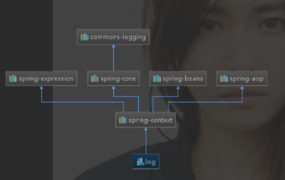
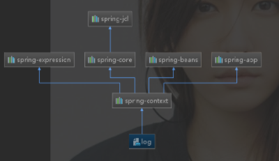
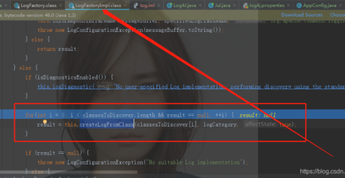
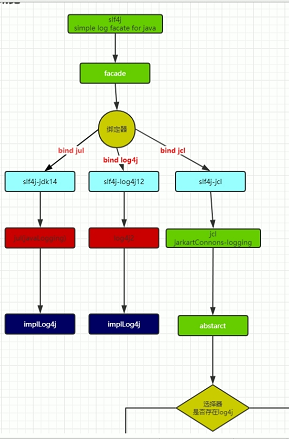
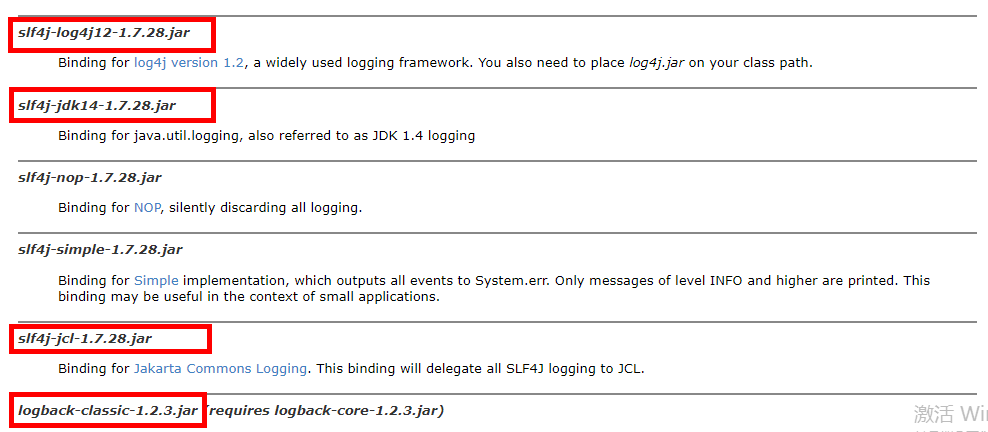
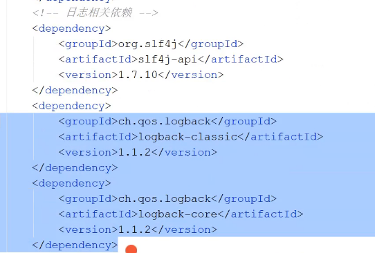

# 日志

## Spring4与Spring5内置log比较

> Spring4版本 引入的是commons-logging.jar
>
> 注意：有log4j的jar包时，通过log4j输出日志，没有则通过jul（即：jdk14，控制台显示为红色）输出日志。



## 

> Spring5版本 引入的是Spring-jcl.jar
>
> 注意：有log4j12的jar包时，通过log4j输出日志，有slf4j的jar包时，通过slf4j输出日志，没有则通过jul（即：jdk14，控制台显示为红色）输出日志。



### Spring4，commons-logging 的源码：




```java
private static final String[] classesToDiscover = new String[]{
	"org.apache.commons.logging.impl.Log4JLogger",
	 "org.apache.commons.logging.impl.Jdk14Logger", 
	"org.apache.commons.logging.impl.Jdk13LumberjackLogger", 
	"org.apache.commons.logging.impl.SimpleLog"};
```


### Spring5，spring-jcl源码：

```java
static {
        logApi = LogFactory.LogApi.JUL;
        ClassLoader cl = LogFactory.class.getClassLoader();

        try {
            cl.loadClass("org.apache.logging.log4j.spi.ExtendedLogger");
            logApi = LogFactory.LogApi.LOG4J;
        } catch (ClassNotFoundException var6) {
            try {
                cl.loadClass("org.slf4j.spi.LocationAwareLogger");
                logApi = LogFactory.LogApi.SLF4J_LAL;
            } catch (ClassNotFoundException var5) {
                try {
                    cl.loadClass("org.slf4j.Logger");
                    logApi = LogFactory.LogApi.SLF4J;
                } catch (ClassNotFoundException var4) {
                    ;
                }
            }
        }
    }


public static Log createLog(String name) {
        switch(logApi) {
        case LOG4J:
            return LogAdapter.Log4jAdapter.createLog(name);
        case SLF4J_LAL:
            return LogAdapter.Slf4jAdapter.createLocationAwareLog(name);
        case SLF4J:
            return LogAdapter.Slf4jAdapter.createLog(name);
        default:
            return LogAdapter.JavaUtilAdapter.createLog(name);
        }
    }
```


## Log4j,Log4j2

```xml
<!-- https://mvnrepository.com/artifact/log4j/log4j -->
<dependency>
    <groupId>log4j</groupId>
    <artifactId>log4j</artifactId>
    <version>1.2.17</version>
</dependency>

```

配置文件:

### log4j.properties

```properties
#############
# 输出到控制台
#############

# log4j.rootLogger日志输出类别和级别：只输出不低于该级别的日志信息DEBUG < INFO < WARN < ERROR < FATAL
# WARN：日志级别     CONSOLE：输出位置自己定义的一个名字       logfile：输出位置自己定义的一个名字
log4j.rootLogger=WARN,CONSOLE,logfile
# 配置CONSOLE输出到控制台
log4j.appender.CONSOLE=org.apache.log4j.ConsoleAppender 
# 配置CONSOLE设置为自定义布局模式
log4j.appender.CONSOLE.layout=org.apache.log4j.PatternLayout 
# 配置CONSOLE日志的输出格式  [frame] 2019-08-22 22:52:12,000  %r耗费毫秒数 %p日志的优先级 %t线程名 %C所属类名通常为全类名 %L代码中的行号 %x线程相关联的NDC %m日志 %n换行
log4j.appender.CONSOLE.layout.ConversionPattern=[frame] %d{yyyy-MM-dd HH:mm:ss,SSS} - %-4r %-5p [%t] %C:%L %x - %m%n

################
# 输出到日志文件中
################

# 配置logfile输出到文件中 文件大小到达指定尺寸的时候产生新的日志文件
log4j.appender.logfile=org.apache.log4j.RollingFileAppender
# 保存编码格式
log4j.appender.logfile.Encoding=UTF-8
# 输出文件位置此为项目根目录下的logs文件夹中
log4j.appender.logfile.File=logs/root.log
# 后缀可以是KB,MB,GB达到该大小后创建新的日志文件
log4j.appender.logfile.MaxFileSize=10MB
# 设置滚定文件的最大值3 指可以产生root.log.1、root.log.2、root.log.3和root.log四个日志文件
log4j.appender.logfile.MaxBackupIndex=3  
# 配置logfile为自定义布局模式
log4j.appender.logfile.layout=org.apache.log4j.PatternLayout
log4j.appender.logfile.layout.ConversionPattern=%d{yyyy-MM-dd HH:mm:ss} %F %p %m%n

##########################
# 对不同的类输出不同的日志文件
##########################

# club.bagedate包下的日志单独输出
log4j.logger.club.bagedate=DEBUG,bagedate
# 设置为false该日志信息就不会加入到rootLogger中了
log4j.additivity.club.bagedate=false
# 下面就和上面配置一样了
log4j.appender.bagedate=org.apache.log4j.RollingFileAppender
log4j.appender.bagedate.Encoding=UTF-8
log4j.appender.bagedate.File=logs/bagedate.log
log4j.appender.bagedate.MaxFileSize=10MB
log4j.appender.bagedate.MaxBackupIndex=3
log4j.appender.bagedate.layout=org.apache.log4j.PatternLayout
log4j.appender.bagedate.layout.ConversionPattern=%d{yyyy-MM-dd HH:mm:ss} %F %p %m%n
```


log4j2.xml

```xml
<?xml version="1.0" encoding="UTF-8"?>
<!--status:Log4j2内部日志的输出级别,设置为TRACE对学习Log4j2非常有用 -->
<!--monitorInterval:定时检测配置文件的修改,有变化则自动重新加载配置,时间单位为秒,最小间隔为5s -->
<Configuration status="WARN" monitorInterval="600">
    <!--properties:设置全局变量 -->
    <properties>
        <!--LOG_HOME:指定当前日志存放的目录 -->
        <property name="LOG_HOME">logs</property>
        <!--FILE_NAME:指定日志文件的名称 -->
        <property name="FILE_NAME">test</property>
    </properties>
    <!--Appenders:定义日志输出目的地，内容和格式等 -->
    <Appenders>
        
        <!--Console:日志输出到控制台标准输出 -->
        <Console name="Console" target="SYSTEM_OUT">
            <!--pattern:日期,线程名,日志级别,日志名称,日志信息,换行 -->
            <PatternLayout pattern="%d{yyyy-MM-dd HH:mm:ss.SSS} [%t] %-5level [%L] - %msg%n" />
        </Console>
        
        
        <!--RollingFile:日志输出到文件,下面的文件都使用相对路径 -->
        <!--fileName:当前日志输出的文件名称 -->
        <!--filePattern:备份日志文件名称，备份目录为logs下面以年月命名的目录，备份时使用gz格式压缩 -->
        <RollingFile name="RollingFile" fileName="${LOG_HOME}/${FILE_NAME}.log"
            filePattern="${LOG_HOME}/$${date:yyyy-MM}/${FILE_NAME}-%d{yyyy-MM-dd}-%i.log.gz">
            <PatternLayout pattern="%d{yyyy-MM-dd HH:mm:ss.SSS} [%t] %-5level [%L] - %msg%n" />
            <!--Policies:触发策略决定何时执行备份 -->
            <Policies>
                <!--TimeBasedTriggeringPolicy:日志文件按照时间备份 -->
                <!--interval:每1天生成一个新文件，时间单位需要结合filePattern时间%d{yyyy-MM-dd} -->
                <!--同理，如果要每1小时生成一个新文件，则改成%d{yyyy-MM-ddHH} -->
                <!--modulate:对备份日志的生成时间纠偏，纠偏以0为基准进行，"0+interval"决定启动后第一次备份时间 -->
                <TimeBasedTriggeringPolicy interval="1" modulate="true" />
                <!--SizeBasedTriggeringPolicy:日志文件按照大小备份 -->
                <!--size:指定日志文件最大为100MB，单位可以为KB、MB或GB -->
                <SizeBasedTriggeringPolicy size="100MB" />
            </Policies>
            <!--DefaultRolloverStrategy:翻转策略决定如何执行备份 -->
            <!--max:最多保存5个备份文件，结合时间使用后，在每个时间段内最多有5个备份，多出来的会被覆盖 -->
            <!--compressionLevel:配置日志压缩级别，范围0-9，0不压缩，1压缩速度最快，9压缩率最好，目前只对于zip压缩文件类型有效 -->
            <DefaultRolloverStrategy max="5" compressionLevel="1">
                <!--Delete:删除匹配到的过期备份文件 -->
                <!--maxDepth:由于备份文件保存在${LOG_HOME}/$${date:yyyy-MM},所以目录深度设置为2 -->
                <Delete basePath="${LOG_HOME}" maxDepth="2">
                    <!--IfFileName:匹配文件名称 -->
                    <!--glob:匹配2级目录深度下的以.log.gz结尾的备份文件 -->
                    <IfFileName glob="*/*.log.gz" />
                    <!--IfLastModified:匹配文件修改时间 -->
                    <!--age:匹配超过180天的文件，单位D、H、M、S分别表示天、小时、分钟、秒-->
                    <IfLastModified age="180D" />
                </Delete>
            </DefaultRolloverStrategy>
        </RollingFile>
    </Appenders>
    
    <!--Loggers:定义日志级别和使用的Appenders -->
    <Loggers>
        <!--name: 打印日志的类的包路径 -->
        <!--additivity: true当前的Logger打印的日志附加到Root，false仅仅打印到RollingFile -->
        <Logger name="org.apache.logging.log4j" level="ERROR" additivity="true">
            <AppenderRef ref="RollingFile" />
        </Logger>
        <!--Root:日志默认打印到控制台 -->
        <!--level日志级别: ALL < TRACE < DEBUG < INFO < WARN < ERROR < FATAL < OFF -->
        <Root level="ERROR">
            <AppenderRef ref="Console" />
        </Root>
    </Loggers>
</Configuration>
```


## Slf4j



```xml
<!-- https://mvnrepository.com/artifact/org.slf4j/slf4j-api -->
<dependency>
    <groupId>org.slf4j</groupId>
    <artifactId>slf4j-api</artifactId>
    <version>1.8.0-alpha2</version>
</dependency>

```

> Slf4j通过绑定器，实现不同的日志形式




```java
import org.slf4j.Logger;
import org.slf4j.LoggerFactory;

public class HelloWorld {
  public static void main(String[] args) {
    Logger logger = LoggerFactory.getLogger(HelloWorld.class);
    logger.info("Hello World");
  }
}
```


## Logback(SpringBoot默认日志)



参考：https://blog.csdn.net/flysun3344/article/details/80555746

### logback.xml

```xml
<?xml version="1.0" encoding="UTF-8"?>
<!-- 日志级别从低到高分为TRACE < DEBUG < INFO < WARN < ERROR < FATAL，如果设置为WARN，则低于WARN的信息都不会输出 -->
<!-- scan:当此属性设置为true时，配置文档如果发生改变，将会被重新加载，默认值为true -->
<!-- scanPeriod:设置监测配置文档是否有修改的时间间隔，如果没有给出时间单位，默认单位是毫秒。
                 当scan为true时，此属性生效。默认的时间间隔为1分钟。 -->
<!-- debug:当此属性设置为true时，将打印出logback内部日志信息，实时查看logback运行状态。默认值为false。 -->
<configuration  scan="true" scanPeriod="10 seconds">
    <contextName>logback</contextName>
 
    <!-- name的值是变量的名称，value的值时变量定义的值。通过定义的值会被插入到logger上下文中。定义后，可以使“${}”来使用变量。 -->
    <property name="log.path" value="G:/logs/pmp" />
 
    <!--0. 日志格式和颜色渲染 -->
    <!-- 彩色日志依赖的渲染类 -->
    <conversionRule conversionWord="clr" converterClass="org.springframework.boot.logging.logback.ColorConverter" />
    <conversionRule conversionWord="wex" converterClass="org.springframework.boot.logging.logback.WhitespaceThrowableProxyConverter" />
    <conversionRule conversionWord="wEx" converterClass="org.springframework.boot.logging.logback.ExtendedWhitespaceThrowableProxyConverter" />
    <!-- 彩色日志格式 -->
    <property name="CONSOLE_LOG_PATTERN" value="${CONSOLE_LOG_PATTERN:-%clr(%d{yyyy-MM-dd HH:mm:ss.SSS}){faint} %clr(${LOG_LEVEL_PATTERN:-%5p}) %clr(${PID:- }){magenta} %clr(---){faint} %clr([%15.15t]){faint} %clr(%-40.40logger{39}){cyan} %clr(:){faint} %m%n${LOG_EXCEPTION_CONVERSION_WORD:-%wEx}}"/>
 
    <!--1. 输出到控制台-->
    <appender name="CONSOLE" class="ch.qos.logback.core.ConsoleAppender">
        <!--此日志appender是为开发使用，只配置最底级别，控制台输出的日志级别是大于或等于此级别的日志信息-->
        <filter class="ch.qos.logback.classic.filter.ThresholdFilter">
            <level>info</level>
        </filter>
        <encoder>
            <Pattern>${CONSOLE_LOG_PATTERN}</Pattern>
            <!-- 设置字符集 -->
            <charset>UTF-8</charset>
        </encoder>
    </appender>
 
    <!--2. 输出到文档-->
   
 
    <!-- 2.2 level为 INFO 日志，时间滚动输出  -->
    <appender name="INFO_FILE" class="ch.qos.logback.core.rolling.RollingFileAppender">
        <!-- 正在记录的日志文档的路径及文档名 -->
        <file>${log.path}/web_info.log</file>
        <!--日志文档输出格式-->
        <encoder>
            <pattern>%d{yyyy-MM-dd HH:mm:ss.SSS} [%thread] %-5level %logger{50} - %msg%n</pattern>
            <charset>UTF-8</charset>
        </encoder>
        <!-- 日志记录器的滚动策略，按日期，按大小记录 -->
        <rollingPolicy class="ch.qos.logback.core.rolling.TimeBasedRollingPolicy">
            <!-- 每天日志归档路径以及格式 -->
            <fileNamePattern>${log.path}/web-info-%d{yyyy-MM-dd}.%i.log</fileNamePattern>
            <timeBasedFileNamingAndTriggeringPolicy class="ch.qos.logback.core.rolling.SizeAndTimeBasedFNATP">
                <maxFileSize>100MB</maxFileSize>
            </timeBasedFileNamingAndTriggeringPolicy>
            <!--日志文档保留天数-->
            <maxHistory>15</maxHistory>
        </rollingPolicy>
        <!-- 此日志文档只记录info级别的 -->
        <filter class="ch.qos.logback.classic.filter.LevelFilter">
            <level>info</level>
            <onMatch>ACCEPT</onMatch>
            <onMismatch>DENY</onMismatch>
        </filter>
    </appender>
 
   
 
    <!-- 2.4 level为 ERROR 日志，时间滚动输出  -->
    <appender name="ERROR_FILE" class="ch.qos.logback.core.rolling.RollingFileAppender">
        <!-- 正在记录的日志文档的路径及文档名 -->
        <file>${log.path}/web_error.log</file>
        <!--日志文档输出格式-->
        <encoder>
            <pattern>%d{yyyy-MM-dd HH:mm:ss.SSS} [%thread] %-5level %logger{50} - %msg%n</pattern>
            <charset>UTF-8</charset> <!-- 此处设置字符集 -->
        </encoder>
        <!-- 日志记录器的滚动策略，按日期，按大小记录 -->
        <rollingPolicy class="ch.qos.logback.core.rolling.TimeBasedRollingPolicy">
            <fileNamePattern>${log.path}/web-error-%d{yyyy-MM-dd}.%i.log</fileNamePattern>
            <timeBasedFileNamingAndTriggeringPolicy class="ch.qos.logback.core.rolling.SizeAndTimeBasedFNATP">
                <maxFileSize>100MB</maxFileSize>
            </timeBasedFileNamingAndTriggeringPolicy>
            <!--日志文档保留天数-->
            <maxHistory>15</maxHistory>
        </rollingPolicy>
        <!-- 此日志文档只记录ERROR级别的 -->
        <filter class="ch.qos.logback.classic.filter.LevelFilter">
            <level>ERROR</level>
            <onMatch>ACCEPT</onMatch>
            <onMismatch>DENY</onMismatch>
        </filter>
    </appender>
 
    <!--
        <logger>用来设置某一个包或者具体的某一个类的日志打印级别、
        以及指定<appender>。<logger>仅有一个name属性，
        一个可选的level和一个可选的addtivity属性。
        name:用来指定受此logger约束的某一个包或者具体的某一个类。
        level:用来设置打印级别，大小写无关：TRACE, DEBUG, INFO, WARN, ERROR, ALL 和 OFF，
              还有一个特俗值INHERITED或者同义词NULL，代表强制执行上级的级别。
              如果未设置此属性，那么当前logger将会继承上级的级别。
        addtivity:是否向上级logger传递打印信息。默认是true。
        <logger name="org.springframework.web" level="info"/>
        <logger name="org.springframework.scheduling.annotation.ScheduledAnnotationBeanPostProcessor" level="INFO"/>
    -->
 
    <!--
        使用mybatis的时候，sql语句是debug下才会打印，而这里我们只配置了info，所以想要查看sql语句的话，有以下两种操作：
        第一种把<root level="info">改成<root level="DEBUG">这样就会打印sql，不过这样日志那边会出现很多其他消息
        第二种就是单独给dao下目录配置debug模式，代码如下，这样配置sql语句会打印，其他还是正常info级别：
        【logging.level.org.mybatis=debug logging.level.dao=debug】
     -->
 
    <!--
        root节点是必选节点，用来指定最基础的日志输出级别，只有一个level属性
        level:用来设置打印级别，大小写无关：TRACE, DEBUG, INFO, WARN, ERROR, ALL 和 OFF，
        不能设置为INHERITED或者同义词NULL。默认是DEBUG
        可以包含零个或多个元素，标识这个appender将会添加到这个logger。
    -->
 
    <!-- 4. 最终的策略 -->
    <!-- 4.1 开发环境:打印控制台-->
    <springProfile name="dev">
        <logger name="com.sdcm.pmp" level="debug"/>
    </springProfile>
 
    <root level="info">
        <appender-ref ref="CONSOLE" />
        <appender-ref ref="INFO_FILE" />
        <appender-ref ref="ERROR_FILE" />
    </root>
 
    <!-- 4.2 生产环境:输出到文档
    <springProfile name="pro">
        <root level="info">
            <appender-ref ref="CONSOLE" />
            <appender-ref ref="DEBUG_FILE" />
            <appender-ref ref="INFO_FILE" />
            <appender-ref ref="ERROR_FILE" />
            <appender-ref ref="WARN_FILE" />
        </root>
    </springProfile> -->
 
</configuration>
```


## 异常问题：

> slf4j的绑定器绑定了log4j的包；通过桥接器引入jar包（jar包用的log4j）,导致了循环依赖，最终导致栈溢出。

