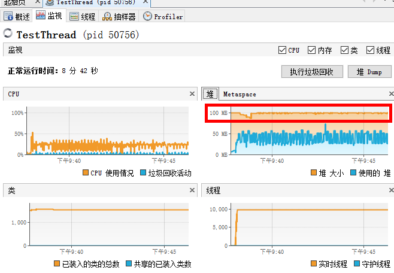
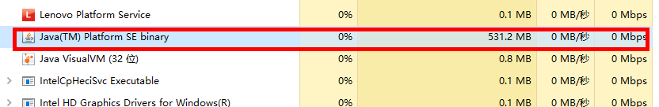

# Thread

## 测试：多线程会额外占用栈内存

> 每个java线程需要一个操作系统线程支持，会占用栈内存

**1.挂起一万个线程:**

```java
import java.util.concurrent.CountDownLatch;

public class TestThread {
    public static void main(String[] args) {
        CountDownLatch countdonw = new CountDownLatch(1);
		try{
			Thread.sleep(20000L);
		} catch (Exception e) {
            e.printStackTrace();
        }
            for (int i = 0; i < 10000; i++) {

            new Thread(()->{
                System.out.println("当前线程名："+Thread.currentThread().getName());
                try {
                    countdonw.await();
                } catch (InterruptedException e1) {
                    e1.printStackTrace();
                }
            }).start();

            System.out.println(""+i);
        }
	}
}
```

**2.启动TestThread类，限定Java类启动最大占用堆内存100m：**


**3.VisualVM查看内存占用情况：**



**4.查看java进程耗用内存情况：**



**结论：经过测试，530M内存，减去限定的100M堆内存，新起的10000个线程占用了将近400M的内存**

## 手写一个线程池

### BlockingQuene

|      | 异常情况抛出异常 | 异常情况返回特殊值 | 阻塞   |
| ---- | ---------------- | ------------------ | ------ |
| 插入 | add(e)           | offer(e)           | put(e) |
| 移除 | remove()         | poll()             | take() |

### 模拟固定大小的线程池

要点：

> - 线程池包括2部分：存放任务的队列，线程集合
> - 

WFixedSizeThreadPool类：

```java
package org.wykd.hand.writing;

import java.util.ArrayList;
import java.util.Collections;
import java.util.List;
import java.util.concurrent.BlockingQueue;
import java.util.concurrent.LinkedBlockingQueue;

public class WFixedSizeThreadPool {

    /**
     * 存放任务的队列
     */
    public BlockingQueue<Runnable> taskQuene;

    /**
     * 线程集合；worker代表一个线程组中的一个线程
     */
    public List<Worker> workers;

    //线程池是否工作的标识
    public volatile boolean working = true;

    /**
     * @param poolSize      线程池大小
     * @param taskQueneSize 任务队列大小
     */
    public WFixedSizeThreadPool(int poolSize, int taskQueneSize) {

        if (poolSize <= 0 || taskQueneSize <= 0) {
            throw new IllegalArgumentException("参数错误");
        }
        taskQuene = new LinkedBlockingQueue(taskQueneSize);
        this.workers = Collections.synchronizedList(new ArrayList<Worker>());

        for (int i = 0; i < poolSize; i++) {
            //初始化时，新增指定个数的线程
            Worker w = new Worker(this);
            w.start();  //会触发worker的run方法
            this.workers.add(w);
        }

    }

    /**
     * 参考多线程的submit方法
     */
    public boolean submit(Runnable task) {
        //将task添加到 任务队列中
        if (!this.working) {
            return false;
        }
        return this.taskQuene.offer(task);
    }

    public void shutdown() {
        this.working = false;

        //把阻塞的线程中断
        for (Thread t : this.workers
        ) {
            if (t.getState().equals(Thread.State.BLOCKED)
                    || t.getState().equals(Thread.State.WAITING)
                    || t.getState().equals(Thread.State.TIMED_WAITING)) {
                t.interrupt();
            }
        }
    }
}

```

Worker类：

```java
package org.wykd.hand.writing;

public class Worker extends Thread{

    private WFixedSizeThreadPool pool;

    public Worker(WFixedSizeThreadPool pool){
        this.pool = pool;
    }

    /**
     * 当执行start方法时，会触发该方法
     */
    public void run() {
        int taskCount = 0;

        while(this.pool.working  || this.pool.taskQuene.size()>0){
            Runnable task = null;

            try {
                //从任务队列中拿到新任务，并执行任务
                if(this.pool.working){
                    //阻塞方法, 在任务添加完毕之前，需要阻塞等待。
                    task =  this.pool.taskQuene.take();
                }else{
                    //队列中存在，则取出来，不存在，则往下执行。
                    task =  this.pool.taskQuene.poll();
                }

            } catch (InterruptedException e) {
                e.printStackTrace();
            }
            if(task != null){
                task.run();  //执行任务
                System.out.println(Thread.currentThread().getName() + taskCount++);
            }
        }
    }
}

```

Main方法类：

```java
package org.wykd.hand.writing;

import java.util.concurrent.ExecutorService;
import java.util.concurrent.Executors;

/**
 * Hello world!
 */
public class App {
    public static void main(String[] args) {
        int taskNum = 6;
        WFixedSizeThreadPool pool = new WFixedSizeThreadPool(3,taskNum);
        for (int i = 0; i < taskNum; i++) {
            pool.submit(new Runnable() {
                @Override
                public void run() {
                    System.out.println("任务开始进行。。。。");
                }
            });
        }
        //任务添加完毕后，调用shutdown方法，不再添加任务到连接池的阻塞队列中。
        pool.shutdown();
    }
}

```