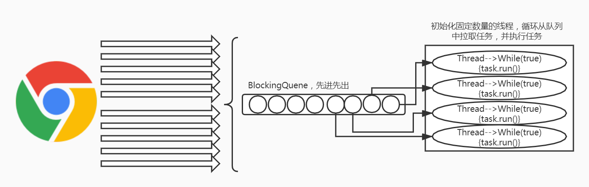
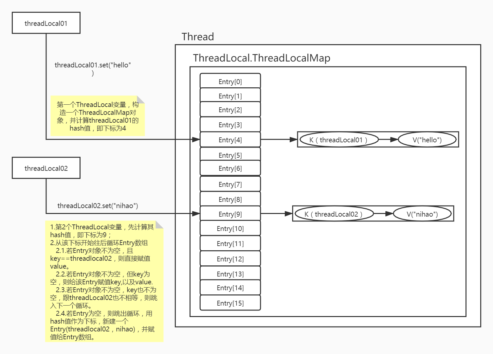

# Thread

## 测试：多线程会额外占用栈内存

> 每个java线程需要一个操作系统线程支持，会占用栈内存

**1.挂起一万个线程:**

```java
import java.util.concurrent.CountDownLatch;

public class TestThread {
    public static void main(String[] args) {
        CountDownLatch countdonw = new CountDownLatch(1);
		try{
			Thread.sleep(20000L);
		} catch (Exception e) {
            e.printStackTrace();
        }
            for (int i = 0; i < 10000; i++) {

            new Thread(()->{
                System.out.println("当前线程名："+Thread.currentThread().getName());
                try {
                    countdonw.await();
                } catch (InterruptedException e1) {
                    e1.printStackTrace();
                }
            }).start();

            System.out.println(""+i);
        }
	}
}
```

**2.启动TestThread类，限定Java类启动最大占用堆内存100m：**


**3.VisualVM查看内存占用情况：**


**4.查看java进程耗用内存情况：**


**结论：经过测试，530M内存，减去限定的100M堆内存，新起的10000个线程占用了将近400M的内存**

## 手写一个线程池

### BlockingQuene

|      | 异常情况抛出异常 | 异常情况返回特殊值 | 阻塞   |
| ---- | ---------------- | ------------------ | ------ |
| 插入 | add(e)           | offer(e)           | put(e) |
| 移除 | remove()         | poll()             | take() |

### 模拟固定大小的线程池

 

要点：

> - 新建一个线程池类，包括2部分：存放任务的阻塞队列，线程集合
> - 请求应实现Runnable接口，在多线程组中的线程，则可以通过task.run执行任务。

WFixedSizeThreadPool类：

```java
package org.wykd.hand.writing;

import java.util.ArrayList;
import java.util.Collections;
import java.util.List;
import java.util.concurrent.BlockingQueue;
import java.util.concurrent.LinkedBlockingQueue;

public class WFixedSizeThreadPool {

    /**
     * 存放任务的队列
     */
    public BlockingQueue<Runnable> taskQuene;

    /**
     * 线程集合；worker代表一个线程组中的一个线程
     */
    public List<Worker> workers;

    //线程池是否工作的标识
    public volatile boolean working = true;

    /**
     * @param poolSize      线程池大小
     * @param taskQueneSize 任务队列大小
     */
    public WFixedSizeThreadPool(int poolSize, int taskQueneSize) {

        if (poolSize <= 0 || taskQueneSize <= 0) {
            throw new IllegalArgumentException("参数错误");
        }
        taskQuene = new LinkedBlockingQueue(taskQueneSize);
        this.workers = Collections.synchronizedList(new ArrayList<Worker>());

        for (int i = 0; i < poolSize; i++) {
            //初始化时，新增指定个数的线程
            Worker w = new Worker(this);
            w.start();  //会触发worker的run方法
            this.workers.add(w);
        }

    }

    /**
     * 参考多线程的submit方法
     */
    public boolean submit(Runnable task) {
        //将task添加到 任务队列中
        if (!this.working) {
            return false;
        }
        return this.taskQuene.offer(task);
    }

    public void shutdown() {
        this.working = false;

        //把阻塞的线程中断
        for (Thread t : this.workers
        ) {
            if (t.getState().equals(Thread.State.BLOCKED)
                    || t.getState().equals(Thread.State.WAITING)
                    || t.getState().equals(Thread.State.TIMED_WAITING)) {
                t.interrupt();
            }
        }
    }
}

```

Worker类：

```java
package org.wykd.hand.writing;

public class Worker extends Thread{

    private WFixedSizeThreadPool pool;

    public Worker(WFixedSizeThreadPool pool){
        this.pool = pool;
    }

    /**
     * 当执行start方法时，会触发该方法
     */
    public void run() {
        int taskCount = 0;

        while(this.pool.working  || this.pool.taskQuene.size()>0){
            Runnable task = null;

            try {
                //从任务队列中拿到新任务，并执行任务
                if(this.pool.working){
                    //阻塞方法, 在任务添加完毕之前，需要阻塞等待。
                    task =  this.pool.taskQuene.take();
                }else{
                    //队列中存在，则取出来，不存在，则往下执行。
                    task =  this.pool.taskQuene.poll();
                }

            } catch (InterruptedException e) {
                e.printStackTrace();
            }
            if(task != null){
                task.run();  //执行任务
                System.out.println(Thread.currentThread().getName() + taskCount++);
            }
        }
    }
}

```

Main方法类：

```java
package org.wykd.hand.writing;

import java.util.concurrent.ExecutorService;
import java.util.concurrent.Executors;

/**
 * Hello world!
 */
public class App {
    public static void main(String[] args) {
        int taskNum = 6;
        WFixedSizeThreadPool pool = new WFixedSizeThreadPool(3,taskNum);
        for (int i = 0; i < taskNum; i++) {
            pool.submit(new Runnable() {
                @Override
                public void run() {
                    System.out.println("任务开始进行。。。。");
                }
            });
        }
        //任务添加完毕后，调用shutdown方法，不再添加任务到连接池的阻塞队列中。
        pool.shutdown();
    }
}

```

## Callable

```java
package com.wykd.thread;

import java.util.HashMap;
import java.util.Map;
import java.util.concurrent.Callable;
import java.util.concurrent.ExecutionException;
import java.util.concurrent.ExecutorService;
import java.util.concurrent.Executors;
import java.util.concurrent.FutureTask;

/**
 * 	多线程编程
 * 		Callable
 * 		线程池
 * @author Alex
 */
public class CallableDemo {

	public static void main(String[] args) {
		
		new CallableDemo().feignWykdUser();
		
		new CallableDemo().feignWykdUserThread();
		
		new CallableDemo().feignWykdUserThreadPool();
		
	}
	
	ExecutorService executorService = Executors.newFixedThreadPool(2);
	
	/**
	 * 同步执行
	 * @return
	 */
	public Map feignWykdUser() {
		
		long start = System.currentTimeMillis();
		Map returnMap = new HashMap();
		String result1 = feignGetStringByUserId(100L);
		returnMap.put("String", result1);
		String result2 = feignWykdUserHello("hello");
		returnMap.put("helloInfo", result2);
		
		long end = System.currentTimeMillis();
		System.out.println("总执行时间："+(end-start));
		
		returnMap.put("time", end-start);
		return returnMap;
	}
	
	/**
	 * 使用了callable
	 * @return
	 */
	public Map feignWykdUserThread() {
		
		long start = System.currentTimeMillis();
		Map returnMap = new HashMap();
		
		Callable<String> StringCall = new Callable<String>() {
			@Override
			public String call() throws Exception {
				long start = System.currentTimeMillis();
				String result = feignGetStringByUserId(100L);
				long end = System.currentTimeMillis();
				System.out.println("StringCallCall执行时间："+(end-start));
				return result;
			}
		};
		
		Callable<String> helloInfoCall = new Callable<String>() {
			@Override
			public String call() throws Exception {
				long start = System.currentTimeMillis();
				String result = feignWykdUserHello("hello");
				long end = System.currentTimeMillis();
				System.out.println("helloInfoCall执行时间："+(end-start));
				return result;
			}
		};
		
		FutureTask<String> helloInfo = new FutureTask<>(helloInfoCall);
		FutureTask<String> String = new FutureTask<>(StringCall);
		
		new Thread(helloInfo).start();
		new Thread(String).start();
		
		
		try {
			returnMap.put("helloInfo", helloInfo.get());
			returnMap.put("String", String.get());
		} catch (InterruptedException e) {
			// TODO Auto-generated catch block
			e.printStackTrace();
		} catch (ExecutionException e) {
			// TODO Auto-generated catch block
			e.printStackTrace();
		}
		
		long end = System.currentTimeMillis();
		System.out.println("总执行时间："+(end-start));
		returnMap.put("time", end-start);
		return returnMap;
	}
	
	/**
	 * 使用了线程池
	 * @return
	 */
	public Map feignWykdUserThreadPool() {
		long start = System.currentTimeMillis();
		Map returnMap = new HashMap();
		
		Callable<String> StringCall = new Callable<String>() {
			@Override
			public String call() throws Exception {
				long start = System.currentTimeMillis();
				String result = feignGetStringByUserId(100L);
				long end = System.currentTimeMillis();
				System.out.println("StringCallCall执行时间："+(end-start));
				return result;
			}
		};
		
		Callable<String> helloInfoCall = new Callable<String>() {
			@Override
			public String call() throws Exception {
				long start = System.currentTimeMillis();
				String result = feignWykdUserHello("hello");
				long end = System.currentTimeMillis();
				System.out.println("helloInfoCall执行时间："+(end-start));
				return result;
			}
		};
		
		FutureTask<String> helloInfo = new FutureTask<>(helloInfoCall);
		FutureTask<String> String = new FutureTask<>(StringCall);
		
		executorService.submit(helloInfo);
		executorService.submit(String);
		
		try {
			returnMap.put("helloInfo", helloInfo.get());
			returnMap.put("String", String.get());
		} catch (InterruptedException e) {
			// TODO Auto-generated catch block
			e.printStackTrace();
		} catch (ExecutionException e) {
			// TODO Auto-generated catch block
			e.printStackTrace();
		}
		long end = System.currentTimeMillis();
		System.out.println("总共执行时间："+(end-start));
		returnMap.put("time", end-start);
		return returnMap;
	}
	
	
	
	public String feignGetStringByUserId(long str) {
		try {
			Thread.sleep(10000);
		} catch (InterruptedException e) {
			// TODO Auto-generated catch block
			e.printStackTrace();
		}
		return "feignGetStringByUserId";
	}
	
	public String feignWykdUserHello(String str) {
		try {
			Thread.sleep(5000);
		} catch (InterruptedException e) {
			// TODO Auto-generated catch block
			e.printStackTrace();
		}
		return "feignWykdUserHello";
	}
}


```

## CountDownLatch

```java
package com.wykd.cwx.latch;

import java.util.Random;

/**
 * @ClassName Consumer
 * @Description TODO
 * @Author maxiao
 * @Date 2020/3/5 上午11:23
 * @Version V1.0
 */
public class Consumer implements Runnable {

    private Message msg;

    public Consumer(Message msg) {
        this.msg = msg;
    }

    public String getKey() {
        return msg.key;
    }

    Random random = new Random();

    public Consumer(String key, String code) {
        msg = new Message();
        msg.key = key;
        msg.code = code;
    }

    @Override
    public void run() {
        System.out.println(Thread.currentThread().getName()+"---"+msg.key + "开始消费");
        try {
            Thread.sleep(random.nextInt(1000));
        } catch (InterruptedException e) {
            e.printStackTrace();
        }

        System.out.println(msg.key + ":消费成功");

        Producer producer = TestCyclic.map.get(getKey());
        producer.setCode(msg.code);
        //这里表示闭锁，此线程处时完成，切换到发出事件线程。
        producer.countDownLatch.countDown();

    }
}

```


```java
package com.wykd.cwx.latch;

import java.util.Collection;

/**
 * @ClassName MainThread
 * @Description 主线程处理
 * @Author maxiao
 * @Date 2020/3/5 下午3:11
 * @Version V1.0
 */
public class MainThread implements Runnable {

    public int count;

    long time;

    public MainThread(int count){
        this.count=count;
        time=System.currentTimeMillis();
    }

    @Override
    public void run() {
        boolean flag=true;
        Collection<Producer> values = TestCyclic.map.values();
        for (Producer producer:values){
            if (!producer.flag()){
                flag=producer.flag();
            }
            System.out.println(producer.flag()+"---"+producer.msg);
        }
        if (flag){
            System.out.println("处理成功;"+(System.currentTimeMillis()-time));
        }else {
            System.out.println("处理失败;"+(System.currentTimeMillis()-time));
        }
    }
}

```


```java
package com.wykd.cwx.latch;

/**
 * @ClassName Message
 * @Description TODO
 * @Author maxiao
 * @Date 2020/3/5 上午11:27
 * @Version V1.0
 */
public class Message {

    public String key;

    public String code;

    public String value;

    public boolean flag(){
        return "000".equals(code);
    }

    @Override
    public String toString() {
        return "key:" + key + ",code:" + code + ",value:" + value;
    }
}

```


```java
package com.wykd.cwx.latch;

import java.util.Random;
import java.util.concurrent.CountDownLatch;
import java.util.concurrent.CyclicBarrier;
import java.util.concurrent.TimeUnit;

/**
 * @ClassName Producer
 * @Description TODO
 * @Author maxiao
 * @Date 2020/3/5 上午11:22
 * @Version V1.0
 */
public class Producer implements Runnable {

    public Message msg;

    private CyclicBarrier cyclicBarrier;

    CountDownLatch countDownLatch = new CountDownLatch(1);

    Random random = new Random();

    public Producer(String key) {
        msg = new Message();
        msg.key = key;
    }

    public String getKey() {
        return msg.key;
    }

    public void setCode(String code) {
        msg.code = code;
    }

    public Producer(String key, CyclicBarrier cyclicBarrier) {
        msg = new Message();
        msg.key = key;
        this.cyclicBarrier = cyclicBarrier;
    }

    public boolean flag(){
        return msg.flag();
    }

    @Override
    public void run() {
        TestCyclic.map.put(getKey(), this);
        System.out.println(Thread.currentThread().getName()+"---"+getKey() + ":发送事件");
        try {
            //这里采用闭锁的线程切换功能。
            countDownLatch.await(1500, TimeUnit.MILLISECONDS);
        } catch (Exception e) {
            e.printStackTrace();
        }


        System.out.println("唤起线程："+Thread.currentThread().getName());
        System.out.println("msg:"+msg);

        // 等待所有任务准备就绪
        try {
            cyclicBarrier.await(2000,TimeUnit.MILLISECONDS);
        } catch (Exception e) {
            e.printStackTrace();
        }


    }
}

```


```java
package com.wykd.cwx.latch;

import java.util.HashMap;
import java.util.Map;
import java.util.concurrent.CountDownLatch;
import java.util.concurrent.CyclicBarrier;
import java.util.concurrent.ExecutorService;
import java.util.concurrent.Executors;

/**
 * @ClassName TestCyclic
 * @Description TODO
 * @Author maxiao
 * @Date 2020/3/5 上午11:25
 * @Version V1.0
 */
public class TestCyclic {

    public static Map<String,Producer> map=new HashMap<>();
    public static Map<String, CountDownLatch> latchMap=new HashMap<>();

    public static void main(String[] args) {
        int counts = 3;//线程大小
        CyclicBarrier cyclicBarrier = new CyclicBarrier(counts, new MainThread(counts));
        ExecutorService executorService = Executors.newFixedThreadPool(counts);
        executorService.execute(new Producer("111",cyclicBarrier));
        executorService.execute(new Producer("222",cyclicBarrier));
        executorService.execute(new Producer("333",cyclicBarrier));

        try {
            Thread.sleep(1000);
        } catch (InterruptedException e) {
            e.printStackTrace();
        }

        System.out.println("下面模拟接收消费----------------");

        ExecutorService executorService1 = Executors.newFixedThreadPool(counts);
        executorService1.execute(new Consumer("333","000"));
        executorService1.execute(new Consumer("111","000"));
        //executorService1.execute(new Consumer("222","000"));

        executorService.shutdown();
        executorService1.shutdown();
    }

}

```

## ThreadLocal

参考：https://www.cnblogs.com/KingJack/p/10599921.html



> set方法源码解读：

```java
public void set(T value) {
    Thread t = Thread.currentThread();
    ThreadLocalMap map = getMap(t);
    if (map != null)
        map.set(this, value);
    else
        createMap(t, value);
}

void createMap(Thread t, T firstValue) {
      t.threadLocals = new ThreadLocalMap(this, firstValue);
}
ThreadLocalMap getMap(Thread t) {
      return t.threadLocals;
}

```

```java
ThreadLocalMap(ThreadLocal<?> firstKey, Object firstValue) {
    table = new Entry[INITIAL_CAPACITY];
    int i = firstKey.threadLocalHashCode & (INITIAL_CAPACITY - 1);
    table[i] = new Entry(firstKey, firstValue);
    size = 1;
    setThreshold(INITIAL_CAPACITY);
}

 private void set(ThreadLocal<?> key, Object value) {

     // We don't use a fast path as with get() because it is at
     // least as common to use set() to create new entries as
     // it is to replace existing ones, in which case, a fast
     // path would fail more often than not.

     Entry[] tab = table;
     int len = tab.length;
     int i = key.threadLocalHashCode & (len-1);

     for (Entry e = tab[i];
          e != null;
          e = tab[i = nextIndex(i, len)]) {
         ThreadLocal<?> k = e.get();

         if (k == key) {
             e.value = value;
             return;
         }

         if (k == null) {
             replaceStaleEntry(key, value, i);
             return;
         }
     }

     tab[i] = new Entry(key, value);
     int sz = ++size;
     if (!cleanSomeSlots(i, sz) && sz >= threshold)
         rehash();
 }
```

> Get方法解读
>
> 

```java
public T get() {
        Thread t = Thread.currentThread();
        ThreadLocalMap map = getMap(t);
        if (map != null) {
            ThreadLocalMap.Entry e = map.getEntry(this);
            if (e != null) {
                @SuppressWarnings("unchecked")
                T result = (T)e.value;
                return result;
            }
        }
    	//若未取到值，则调用set方法，并返回初始值
        return setInitialValue();
    }

private T setInitialValue() {
        T value = initialValue();  	//获取初始值
        Thread t = Thread.currentThread();
        ThreadLocalMap map = getMap(t);
        if (map != null)
            map.set(this, value);
        else
            createMap(t, value);
        return value;
    }
```

```java
private Entry getEntry(ThreadLocal<?> key) {
            int i = key.threadLocalHashCode & (table.length - 1);
            Entry e = table[i];
            if (e != null && e.get() == key)
                return e;
            else
                return getEntryAfterMiss(key, i, e);
        }
```

