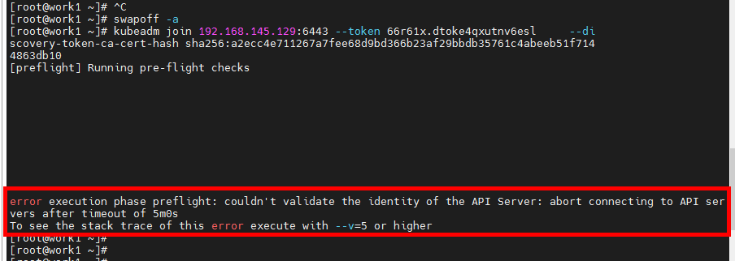

# Kubernate

## 一、准备工作：

### 1.准备好3台虚拟机：

> 1.能ping通www.baidu.com
>
> 2.安装好wget命令


### 2.依次设置3台机器的名称【非必要步骤】

修改主机名

```shell
hostnamectl set-hostname master
```


修改hosts：

```shell
vi /etc/hosts
```


### 3.关键前置条件：

#### 3.1 关闭swap


执行关闭命令如下：

```shell
swapoff -a
```


#### 3.2 关闭selinux

```shell
getenforce
```


```
vi /etc/sysconfig/selinux
```

将SELINUX设置为：disabled


#### 3.3 开启linux的ipv4的网络nat端口转发


将0改为1

执行命令如下：

```shell
 echo "1" > /proc/sys/net/ipv4/ip_forward
```


#### 3.4 更新yum源

删除/etc/yum.repos.d/下所有文件


再执行如下命令：

```shell
wget -O /etc/yum.repos.d/CentOS-Base.repo http://mirrors.aliyun.com/repo/Centos-7.repo

wget -P /etc/yum.repos.d/ http://mirrors.aliyun.com/repo/epel-7.repo

wget https://mirrors.aliyun.com/docker-ce/linux/centos/docker-ce.repo
```

```shell
cat <<EOF > /etc/yum.repos.d/kubernetes.repo
[kubernetes]
name=Kubernetes
baseurl=https://mirrors.aliyun.com/kubernetes/yum/repos/kubernetes-el7-x86_64
enabled=1
gpgcheck=0
EOF
```

最终生成4个文件：


3.5 执行命令：

```shell
yum clean all && yum makecache fast
```


### 4.版本


## 二、Docker安装

```shell
yum install docker-ce-18.09.9 docker-ce-cli-18.09.9 containerd.io -y
```

更改加速器：/etc/docker/deamon.json

```json
{
 "registry-mirrors": ["https://kxqivjqn.mirror.aliyuncs.com"],
 "exec-opts":["native.cgroupdriver=systemd"]
}

```

设置开机启动（很重要）

```
systemctl enable docker && systemctl start docker
```

## 三、安装k8s三大组件

3.1安装

```shell
yum install -y kubelet-1.16.4 kubeadm-1.16.4 kubectl-1.16.4
```

3.2设置开机启动

```
systemctl enable kubelet && systemctl start kubelet
```

3.3添加 kubectl 上下文到环境中

```
echo "source <(kubectl completion bash)" >> ~/.bash_profile

#进入/root目录
source .bash_profile 
```


## 四、vmware克隆2份主机，修改work主机的IP，以及主机名

## 五、master节点初始化

### 5.1 执行kubeadm初始化

```shell
kubeadm init --image-repository registry.aliyuncs.com/google_containers --kubernetes-version v1.16.4 --pod-network-cidr=10.244.0.0/16
```

#### 5.1.1 报错的情况，需进行核心优化

核心优化：

```
vi /etc/sysctl.d/k8s.conf

# 内容：
net.bridge.bridge-nf-call-ip6tables = 1
net.bridge.bridge-nf-call-iptables = 1


# 执行以下命令：
sysctl -p /etc/sysctl.d/k8s.conf
```

增加br_netfilter模块：

```shell
cat > /etc/rc.sysinit << EOF
#!/bin/bash
for file in /etc/sysconfig/modules/*.modules ; do
[ -x $file ] && $file
done
EOF
cat > /etc/sysconfig/modules/br_netfilter.modules << EOF
modprobe br_netfilter
EOF
chmod 755 /etc/sysconfig/modules/br_netfilter.modules
lsmod |grep br_netfilter
```


#### 5.1.2 当执行如下图，说明核心优化成功，

```
sysctl -p /etc/sysctl.d/k8s.conf
```


再次执行以下命令：

```
kubeadm init --image-repository registry.aliyuncs.com/google_containers --kubernetes-version v1.16.4 --pod-network-cidr=10.244.0.0/16
```

#### 5.1.3 当出现initialized successfully 表示初始化成功！


```
To start using your cluster, you need to run the following as a regular user:

  mkdir -p $HOME/.kube
  sudo cp -i /etc/kubernetes/admin.conf $HOME/.kube/config
  sudo chown $(id -u):$(id -g) $HOME/.kube/config

You should now deploy a pod network to the cluster.
Run "kubectl apply -f [podnetwork].yaml" with one of the options listed at:
  https://kubernetes.io/docs/concepts/cluster-administration/addons/

Then you can join any number of worker nodes by running the following on each as root:

kubeadm join 192.168.145.129:6443 --token 66r61x.dtoke4qxutnv6esl \
    --discovery-token-ca-cert-hash sha256:a2ecc4e711267a7fee68d9bd366b23af29bbdb35761c4abeeb51f7144863db10

```

### 5.2  按照提示执行第一步：

```
mkdir -p $HOME/.kube
  sudo cp -i /etc/kubernetes/admin.conf $HOME/.kube/config
  sudo chown $(id -u):$(id -g) $HOME/.kube/config
```

### 5.3 按照提示执行第二步

```
kubectl apply -f [podnetwork].yaml
```

kube-flannel.yaml 内容如下：

```yaml
---
apiVersion: policy/v1beta1
kind: PodSecurityPolicy
metadata:
  name: psp.flannel.unprivileged
  annotations:
    seccomp.security.alpha.kubernetes.io/allowedProfileNames: docker/default
    seccomp.security.alpha.kubernetes.io/defaultProfileName: docker/default
    apparmor.security.beta.kubernetes.io/allowedProfileNames: runtime/default
    apparmor.security.beta.kubernetes.io/defaultProfileName: runtime/default
spec:
  privileged: false
  volumes:
    - configMap
    - secret
    - emptyDir
    - hostPath
  allowedHostPaths:
    - pathPrefix: "/etc/cni/net.d"
    - pathPrefix: "/etc/kube-flannel"
    - pathPrefix: "/run/flannel"
  readOnlyRootFilesystem: false
  # Users and groups
  runAsUser:
    rule: RunAsAny
  supplementalGroups:
    rule: RunAsAny
  fsGroup:
    rule: RunAsAny
  # Privilege Escalation
  allowPrivilegeEscalation: false
  defaultAllowPrivilegeEscalation: false
  # Capabilities
  allowedCapabilities: ['NET_ADMIN']
  defaultAddCapabilities: []
  requiredDropCapabilities: []
  # Host namespaces
  hostPID: false
  hostIPC: false
  hostNetwork: true
  hostPorts:
  - min: 0
    max: 65535
  # SELinux
  seLinux:
    # SELinux is unsed in CaaSP
    rule: 'RunAsAny'
---
kind: ClusterRole
apiVersion: rbac.authorization.k8s.io/v1beta1
metadata:
  name: flannel
rules:
  - apiGroups: ['extensions']
    resources: ['podsecuritypolicies']
    verbs: ['use']
    resourceNames: ['psp.flannel.unprivileged']
  - apiGroups:
      - ""
    resources:
      - pods
    verbs:
      - get
  - apiGroups:
      - ""
    resources:
      - nodes
    verbs:
      - list
      - watch
  - apiGroups:
      - ""
    resources:
      - nodes/status
    verbs:
      - patch
---
kind: ClusterRoleBinding
apiVersion: rbac.authorization.k8s.io/v1beta1
metadata:
  name: flannel
roleRef:
  apiGroup: rbac.authorization.k8s.io
  kind: ClusterRole
  name: flannel
subjects:
- kind: ServiceAccount
  name: flannel
  namespace: kube-system
---
apiVersion: v1
kind: ServiceAccount
metadata:
  name: flannel
  namespace: kube-system
---
kind: ConfigMap
apiVersion: v1
metadata:
  name: kube-flannel-cfg
  namespace: kube-system
  labels:
    tier: node
    app: flannel
data:
  cni-conf.json: |
    {
      "cniVersion": "0.2.0",
      "name": "cbr0",
      "plugins": [
        {
          "type": "flannel",
          "delegate": {
            "hairpinMode": true,
            "isDefaultGateway": true
          }
        },
        {
          "type": "portmap",
          "capabilities": {
            "portMappings": true
          }
        }
      ]
    }
  net-conf.json: |
    {
      "Network": "10.244.0.0/16",
      "Backend": {
        "Type": "vxlan"
      }
    }
---
apiVersion: apps/v1
kind: DaemonSet
metadata:
  name: kube-flannel-ds-amd64
  namespace: kube-system
  labels:
    tier: node
    app: flannel
spec:
  selector:
    matchLabels:
      app: flannel
  template:
    metadata:
      labels:
        tier: node
        app: flannel
    spec:
      affinity:
        nodeAffinity:
          requiredDuringSchedulingIgnoredDuringExecution:
            nodeSelectorTerms:
              - matchExpressions:
                  - key: beta.kubernetes.io/os
                    operator: In
                    values:
                      - linux
                  - key: beta.kubernetes.io/arch
                    operator: In
                    values:
                      - amd64
      hostNetwork: true
      tolerations:
      - operator: Exists
        effect: NoSchedule
      serviceAccountName: flannel
      initContainers:
      - name: install-cni
        image: quay.io/coreos/flannel:v0.11.0-amd64
        command:
        - cp
        args:
        - -f
        - /etc/kube-flannel/cni-conf.json
        - /etc/cni/net.d/10-flannel.conflist
        volumeMounts:
        - name: cni
          mountPath: /etc/cni/net.d
        - name: flannel-cfg
          mountPath: /etc/kube-flannel/
      containers:
      - name: kube-flannel
        image: quay.io/coreos/flannel:v0.11.0-amd64
        command:
        - /opt/bin/flanneld
        args:
        - --ip-masq
        - --kube-subnet-mgr
        resources:
          requests:
            cpu: "100m"
            memory: "50Mi"
          limits:
            cpu: "100m"
            memory: "50Mi"
        securityContext:
          privileged: false
          capabilities:
             add: ["NET_ADMIN"]
        env:
        - name: POD_NAME
          valueFrom:
            fieldRef:
              fieldPath: metadata.name
        - name: POD_NAMESPACE
          valueFrom:
            fieldRef:
              fieldPath: metadata.namespace
        volumeMounts:
        - name: run
          mountPath: /run/flannel
        - name: flannel-cfg
          mountPath: /etc/kube-flannel/
      volumes:
        - name: run
          hostPath:
            path: /run/flannel
        - name: cni
          hostPath:
            path: /etc/cni/net.d
        - name: flannel-cfg
          configMap:
            name: kube-flannel-cfg
---
apiVersion: apps/v1
kind: DaemonSet
metadata:
  name: kube-flannel-ds-arm64
  namespace: kube-system
  labels:
    tier: node
    app: flannel
spec:
  selector:
    matchLabels:
      app: flannel
  template:
    metadata:
      labels:
        tier: node
        app: flannel
    spec:
      affinity:
        nodeAffinity:
          requiredDuringSchedulingIgnoredDuringExecution:
            nodeSelectorTerms:
              - matchExpressions:
                  - key: beta.kubernetes.io/os
                    operator: In
                    values:
                      - linux
                  - key: beta.kubernetes.io/arch
                    operator: In
                    values:
                      - arm64
      hostNetwork: true
      tolerations:
      - operator: Exists
        effect: NoSchedule
      serviceAccountName: flannel
      initContainers:
      - name: install-cni
        image: quay.io/coreos/flannel:v0.11.0-arm64
        command:
        - cp
        args:
        - -f
        - /etc/kube-flannel/cni-conf.json
        - /etc/cni/net.d/10-flannel.conflist
        volumeMounts:
        - name: cni
          mountPath: /etc/cni/net.d
        - name: flannel-cfg
          mountPath: /etc/kube-flannel/
      containers:
      - name: kube-flannel
        image: quay.io/coreos/flannel:v0.11.0-arm64
        command:
        - /opt/bin/flanneld
        args:
        - --ip-masq
        - --kube-subnet-mgr
        resources:
          requests:
            cpu: "100m"
            memory: "50Mi"
          limits:
            cpu: "100m"
            memory: "50Mi"
        securityContext:
          privileged: false
          capabilities:
             add: ["NET_ADMIN"]
        env:
        - name: POD_NAME
          valueFrom:
            fieldRef:
              fieldPath: metadata.name
        - name: POD_NAMESPACE
          valueFrom:
            fieldRef:
              fieldPath: metadata.namespace
        volumeMounts:
        - name: run
          mountPath: /run/flannel
        - name: flannel-cfg
          mountPath: /etc/kube-flannel/
      volumes:
        - name: run
          hostPath:
            path: /run/flannel
        - name: cni
          hostPath:
            path: /etc/cni/net.d
        - name: flannel-cfg
          configMap:
            name: kube-flannel-cfg
---
apiVersion: apps/v1
kind: DaemonSet
metadata:
  name: kube-flannel-ds-arm
  namespace: kube-system
  labels:
    tier: node
    app: flannel
spec:
  selector:
    matchLabels:
      app: flannel
  template:
    metadata:
      labels:
        tier: node
        app: flannel
    spec:
      affinity:
        nodeAffinity:
          requiredDuringSchedulingIgnoredDuringExecution:
            nodeSelectorTerms:
              - matchExpressions:
                  - key: beta.kubernetes.io/os
                    operator: In
                    values:
                      - linux
                  - key: beta.kubernetes.io/arch
                    operator: In
                    values:
                      - arm
      hostNetwork: true
      tolerations:
      - operator: Exists
        effect: NoSchedule
      serviceAccountName: flannel
      initContainers:
      - name: install-cni
        image: quay.io/coreos/flannel:v0.11.0-arm
        command:
        - cp
        args:
        - -f
        - /etc/kube-flannel/cni-conf.json
        - /etc/cni/net.d/10-flannel.conflist
        volumeMounts:
        - name: cni
          mountPath: /etc/cni/net.d
        - name: flannel-cfg
          mountPath: /etc/kube-flannel/
      containers:
      - name: kube-flannel
        image: quay.io/coreos/flannel:v0.11.0-arm
        command:
        - /opt/bin/flanneld
        args:
        - --ip-masq
        - --kube-subnet-mgr
        resources:
          requests:
            cpu: "100m"
            memory: "50Mi"
          limits:
            cpu: "100m"
            memory: "50Mi"
        securityContext:
          privileged: false
          capabilities:
             add: ["NET_ADMIN"]
        env:
        - name: POD_NAME
          valueFrom:
            fieldRef:
              fieldPath: metadata.name
        - name: POD_NAMESPACE
          valueFrom:
            fieldRef:
              fieldPath: metadata.namespace
        volumeMounts:
        - name: run
          mountPath: /run/flannel
        - name: flannel-cfg
          mountPath: /etc/kube-flannel/
      volumes:
        - name: run
          hostPath:
            path: /run/flannel
        - name: cni
          hostPath:
            path: /etc/cni/net.d
        - name: flannel-cfg
          configMap:
            name: kube-flannel-cfg
---
apiVersion: apps/v1
kind: DaemonSet
metadata:
  name: kube-flannel-ds-ppc64le
  namespace: kube-system
  labels:
    tier: node
    app: flannel
spec:
  selector:
    matchLabels:
      app: flannel
  template:
    metadata:
      labels:
        tier: node
        app: flannel
    spec:
      affinity:
        nodeAffinity:
          requiredDuringSchedulingIgnoredDuringExecution:
            nodeSelectorTerms:
              - matchExpressions:
                  - key: beta.kubernetes.io/os
                    operator: In
                    values:
                      - linux
                  - key: beta.kubernetes.io/arch
                    operator: In
                    values:
                      - ppc64le
      hostNetwork: true
      tolerations:
      - operator: Exists
        effect: NoSchedule
      serviceAccountName: flannel
      initContainers:
      - name: install-cni
        image: quay.io/coreos/flannel:v0.11.0-ppc64le
        command:
        - cp
        args:
        - -f
        - /etc/kube-flannel/cni-conf.json
        - /etc/cni/net.d/10-flannel.conflist
        volumeMounts:
        - name: cni
          mountPath: /etc/cni/net.d
        - name: flannel-cfg
          mountPath: /etc/kube-flannel/
      containers:
      - name: kube-flannel
        image: quay.io/coreos/flannel:v0.11.0-ppc64le
        command:
        - /opt/bin/flanneld
        args:
        - --ip-masq
        - --kube-subnet-mgr
        resources:
          requests:
            cpu: "100m"
            memory: "50Mi"
          limits:
            cpu: "100m"
            memory: "50Mi"
        securityContext:
          privileged: false
          capabilities:
             add: ["NET_ADMIN"]
        env:
        - name: POD_NAME
          valueFrom:
            fieldRef:
              fieldPath: metadata.name
        - name: POD_NAMESPACE
          valueFrom:
            fieldRef:
              fieldPath: metadata.namespace
        volumeMounts:
        - name: run
          mountPath: /run/flannel
        - name: flannel-cfg
          mountPath: /etc/kube-flannel/
      volumes:
        - name: run
          hostPath:
            path: /run/flannel
        - name: cni
          hostPath:
            path: /etc/cni/net.d
        - name: flannel-cfg
          configMap:
            name: kube-flannel-cfg
---
apiVersion: apps/v1
kind: DaemonSet
metadata:
  name: kube-flannel-ds-s390x
  namespace: kube-system
  labels:
    tier: node
    app: flannel
spec:
  selector:
    matchLabels:
      app: flannel
  template:
    metadata:
      labels:
        tier: node
        app: flannel
    spec:
      affinity:
        nodeAffinity:
          requiredDuringSchedulingIgnoredDuringExecution:
            nodeSelectorTerms:
              - matchExpressions:
                  - key: beta.kubernetes.io/os
                    operator: In
                    values:
                      - linux
                  - key: beta.kubernetes.io/arch
                    operator: In
                    values:
                      - s390x
      hostNetwork: true
      tolerations:
      - operator: Exists
        effect: NoSchedule
      serviceAccountName: flannel
      initContainers:
      - name: install-cni
        image: quay.io/coreos/flannel:v0.11.0-s390x
        command:
        - cp
        args:
        - -f
        - /etc/kube-flannel/cni-conf.json
        - /etc/cni/net.d/10-flannel.conflist
        volumeMounts:
        - name: cni
          mountPath: /etc/cni/net.d
        - name: flannel-cfg
          mountPath: /etc/kube-flannel/
      containers:
      - name: kube-flannel
        image: quay.io/coreos/flannel:v0.11.0-s390x
        command:
        - /opt/bin/flanneld
        args:
        - --ip-masq
        - --kube-subnet-mgr
        resources:
          requests:
            cpu: "100m"
            memory: "50Mi"
          limits:
            cpu: "100m"
            memory: "50Mi"
        securityContext:
          privileged: false
          capabilities:
             add: ["NET_ADMIN"]
        env:
        - name: POD_NAME
          valueFrom:
            fieldRef:
              fieldPath: metadata.name
        - name: POD_NAMESPACE
          valueFrom:
            fieldRef:
              fieldPath: metadata.namespace
        volumeMounts:
        - name: run
          mountPath: /run/flannel
        - name: flannel-cfg
          mountPath: /etc/kube-flannel/
      volumes:
        - name: run
          hostPath:
            path: /run/flannel
        - name: cni
          hostPath:
            path: /etc/cni/net.d
        - name: flannel-cfg
          configMap:
            name: kube-flannel-cfg

```

执行命令：

```
kubectl apply -f kube-flannel.yaml
```


```
# 获取节点
kubectl get nodes
```


### 

## 六、work节点初始化

### 6.1 执行master初始化的提示第三步：

```shell
kubeadm join 192.168.145.129:6443 --token 66r61x.dtoke4qxutnv6esl \
    --discovery-token-ca-cert-hash sha256:a2ecc4e711267a7fee68d9bd366b23af29bbdb35761c4abeeb51f7144863db10
```

### 6.3 报错：解决办法:关闭master节点的防火墙即可



### 6.3 成功加入集群效果图：

