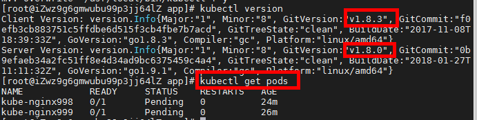

# Kubernate

## kubectl：

参考1：https://zhuanlan.zhihu.com/p/38118017

参考2：https://github.com/kubernetes/kubernetes/tree/release-1.18/CHANGELOG

```
# 解压
tar -zxvf kubernetes-client-linux-amd64.tar.gz

# 拷贝kubectl命令到/usr/local/bin/目录
cp kubectl /usr/local/bin/

# 授权
chomd +x kubectl

# 查看kubectl的版本
kubectl version
```


## Minikube

### 安装

参考：

https://blog.csdn.net/qq_26819733/article/details/83591891

需要改成0.25版本，不然会卡住

#### 问题1：ERROR FileContent--proc-sys-net-bridge-bridge-nf-call-iptables 设置错误导致K8s安装失败

https://blog.csdn.net/u013355826/article/details/86591688?utm_medium=distribute.pc_relevant.none-task-blog-BlogCommendFromMachineLearnPai2-1.nonecase&depth_1-utm_source=distribute.pc_relevant.none-task-blog-BlogCommendFromMachineLearnPai2-1.nonecase


#### 问题2：**k8s The HTTP call equal to 'curl -sSL http://localhost:10255/healthz' failed with error: Get http**

https://www.jianshu.com/p/9c8182dd9fc6

#### 问题3：dashboard问题

[https://www.centos.bz/2018/01/%E4%BD%BF%E7%94%A8minikube%E5%9C%A8%E6%9C%AC%E6%9C%BA%E6%90%AD%E5%BB%BAkubernetes%E9%9B%86%E7%BE%A4/](https://www.centos.bz/2018/01/使用minikube在本机搭建kubernetes集群/)

#### 问题4：Error starting host: Error attempting to cache minikube ISO from URL: Error downloading Minikube ISO

解决办法：--vm-driver=none

#### 问题5：kubectl get pods报错

```
[root@iZwz9g6gmwubu99p3jj64lZ kubernetes]# kubectl get pods
Error from server (NotAcceptable): the server was unable to respond with a content type that the client supports (get pods)

```

查看kubectl的服务端，客户端版本，发现并不一致

```
[root@iZwz9g6gmwubu99p3jj64lZ kubernetes]# kubectl version
Client Version: version.Info{Major:"1", Minor:"18", GitVersion:"v1.18.3", GitCommit:"2e7996e3e2712684bc73f0dec0200d64eec7fe40", GitTreeState:"clean", BuildDate:"2020-05-20T12:52:00Z", GoVersion:"go1.13.9", Compiler:"gc", Platform:"linux/amd64"}
Server Version: version.Info{Major:"1", Minor:"8", GitVersion:"v1.8.0", GitCommit:"0b9efaeb34a2fc51ff8e4d34ad9bc6375459c4a4", GitTreeState:"clean", BuildDate:"2018-01-27T11:11:32Z", GoVersion:"go1.9.1", Compiler:"gc", Platform:"linux/amd64"}

```

解决办法：修改版本号，获取1.8.3的下载链接

https://dl.k8s.io/v1.8.3/kubernetes-client-linux-amd64.tar.gz

问题解决：



### 命令

```
# 启动minikube
minikube start

# minikube默认需要虚拟机来初始化kunernetes环境,需要加上–vm-driver=none
minikube start --vm-driver=none

# 查看minikube的版本
minikube version
```

```
# 查看pod
kubectl get pods

# 查看集群信息
kubectl cluster-info
```

```
# 国内镜像启动
minikube start --vm-driver=none  --registry-mirror=https://registry.docker-cn.com
```

```
# 显示minikube服务
minikube service list
```