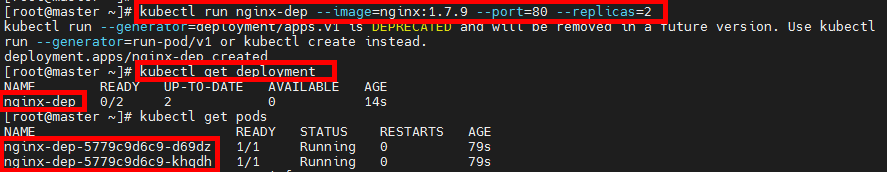
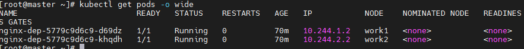
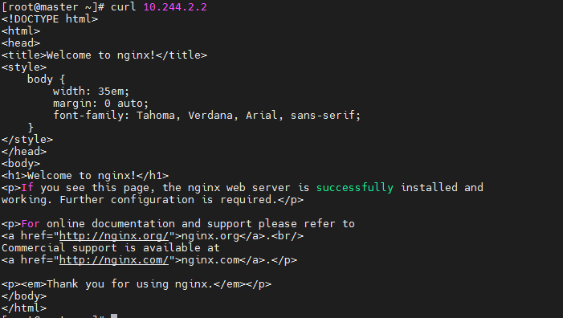
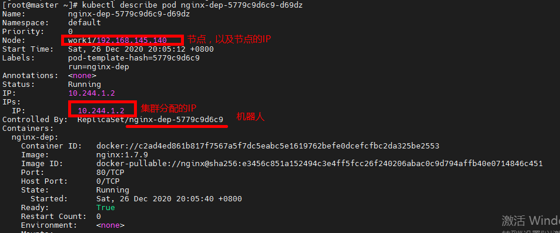
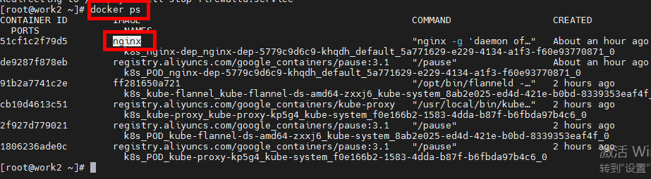
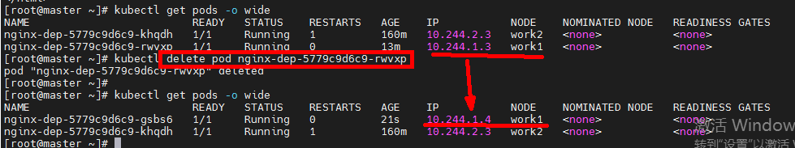
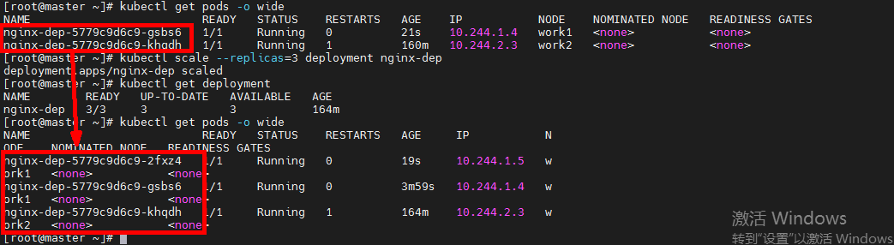
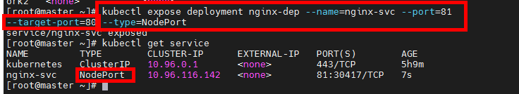
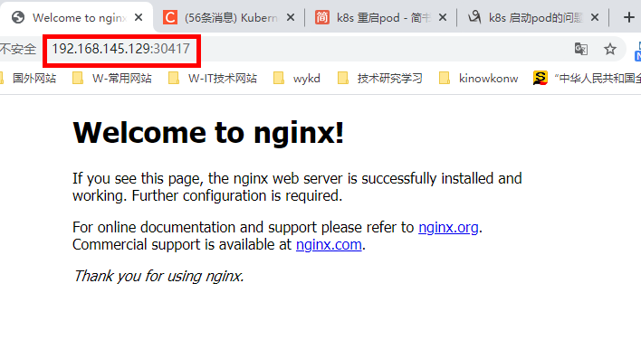

# Kubernate

## 1.常用查看命令

```
# 查看节点
kubectl get pods

# 查看controller[机器人]
kubectl get deployment

# 查看pod
kubectl get pods

# 查看集群信息
kubectl cluster-info

# 查看服务
kubectl get service
```

## 2.创建Pod

### 2.1 构建controller机器人，创建Pod以及容器

```
# replicas代表备份，多少个node,这里写多少
kubectl run nginx-dep --image=nginx:1.7.9 --port=80 --replicas=2
```



::: tip

pod是最小单元，为Docker提供了容器运行环境。

:::

```shell
# 查看pod的详情
kubectl get pods -o wide
```



> 1.生成的pod分别属于不同的node
>
> 2.node的IP是master初始化的时候，生成的。

```
# 参考master初始化命令如下：
kubeadm init --image-repository registry.aliyuncs.com/google_containers --kubernetes-version v1.16.4 --pod-network-cidr=10.244.0.0/16
```

在3个节点访问 curl 10.244.2.2 均可获得效果图如下：



### 2.3 pod内的容器：

```
## 查看pod的详细信息
kubectl describe pod nginx-dep-5779c9d6c9-d69dz
```



查看node1的容器，发现已安装了nginx的容器



```
# 进入pod【nginx-dep-5779c9d6c9-cwjth】的容器【容器ID】
kubectl exec -it nginx-dep-5779c9d6c9-cwjth -c nginx-dep /bin/bash 
```

### 2.4 查看日志【重要】

```shell
journalctl -xefu kubelet
```

## 3.弹性伸缩

### 3.1 删除1个pod后，自动增加了新的pod




### 3.2 在现有基础上增加Pod

```shell
## 将pod的数量设置为3【replicas=3】
kubectl scale --replicas=3 deployment nginx-dep
```




### 3.3 外网访问

> 注意：type=NodePort
>
> ```shell
> kubectl expose deployment nginx-dep --name=nginx-svc --port=81 --target-port=80 --type=NodePort
> ```
>
> 



访问宿主机的IP：

