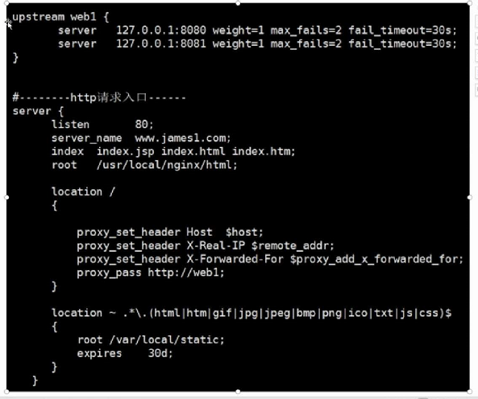
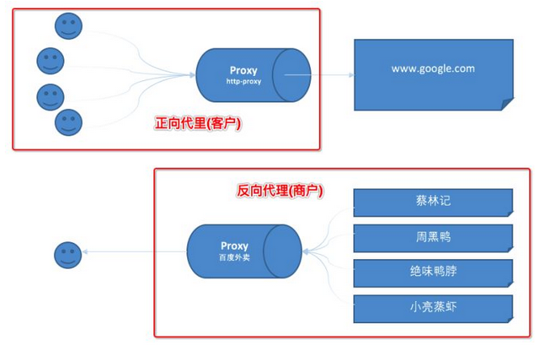

# nginx

> ***Nginx*** 是一个高性能的[HTTP](https://baike.baidu.com/item/HTTP)和[反向代理](https://baike.baidu.com/item/反向代理/7793488)web服务器，以及电子邮件（IMAP/POP3）代理服务器。
>
> 能够支持高达**50,000** 个并发连接数的响应

## nginx安装

linux系统安装nginx参考网站：https://www.cnblogs.com/xxoome/p/5866475.html

先安装：**gcc、pcre-devel、zlib-devel、openssl-devel**

```
yum -y install gcc pcre-devel zlib-devel openssl openssl-devel
```

**安装:**

```
## 解压
tar -zxvf nginx-1.9.9.tar.gz

##进入nginx目录
cd nginx-1.9.9
## 配置
./configure --prefix=/usr/local/nginx

# make
make
make install
```

**验证:**

```
curl -XGET localhost:80
```


## nginx启动关闭

```
#启动nginx
./nginx/sbin/nginx

#关闭nginx
./nginx/sbin/nginx -s stop

#重新加载
./nginx/sbin/nginx -s reload
```


## nginx配置文件

### 动静分离,负载均衡




## 正向代理与反向代理

参考：https://www.cnblogs.com/taostaryu/p/10547132.html



## nginx集群实现

使用keepalived实现nginx的高可用

参考： https://www.cnblogs.com/youzhibing/p/7327342.html#!comments