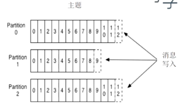
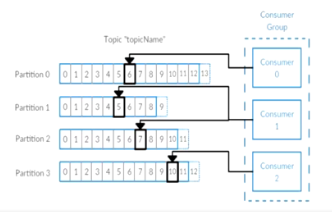
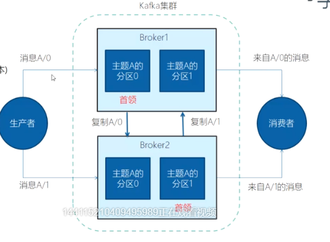
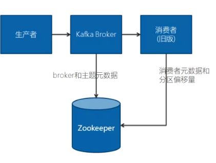
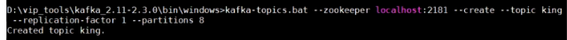
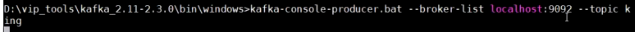
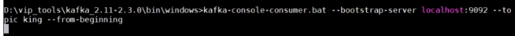

# Kafka消息队列

## 基本概念

### kafka的优点：

> 多生产者，多消费者
>
> 天生的磁盘持久化
>
> 高伸缩性：加分区很方便
>
> 分布式，高性能：分区在不同的服务器，性能增加。

使用场景：

> 活动跟踪（比如：网页操作记录跟踪，操作行为分析）
>
> 传递消息
>
> 收集日志
>
> 提交日志，可作为恢复数据的依据。
>
> 流处理（比如：双11实时统计交易额）

### 消息

> 消息传递：字节数组

### 主题Topic和分区partition



> 分区的作用：[类似于分表]
>
> 1.提升效率，
>
> 2.分布式存储。每个分区可以在不同的服务器。

### 生产者和消费者，偏移量



> 1个消费者可对应消费多个分区的数据，但1个分区的数据只能被1个消费者消费。

### Broker集群，分区副本



> 特点1：分区数据复制，生产的消息-->Broker1的主题A分区0，复制一份到Broker2 作为备份。
>
> 每个分区只有一个首领


### 持久化

> 保存策略，比如：保存7天


### 分区器

消息分到到不同分区。

## 简单使用

> zookeeper的作用类似于注册中心。保存了broker，以及主题元数据，消费者元数据，分区偏移量。
>
> 对应RocketMQ的NameServer.



创建主题，需要连接zookeeper：



启动生产者，需要连接Broker



启动消费者：




## server.properties解析

```
#Broker的id
broker.id=0

#默认连接本机的zookeeper
zookeeper.connect=

#日志目录
log.dirs=

#默认主题的分区数为1
num.partitions=1

# 日志保存时间
log.retention.hours=168
```

