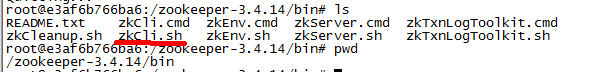
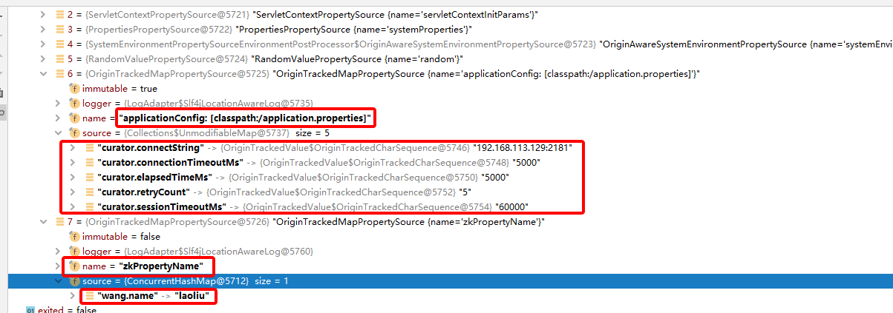

# Zookeeper

## Docker安装

```
# 拉Zookeeper镜像
docker pull zookeeper:3.4.14

# 在宿主机创建文件夹：/usr/local/zookeeper/conf，/usr/local/zookeeper/data，/usr/local/zookeeper/datalog
# 创建容器
docker run -d --name myzk  -p 2181:2181 -p 2888:2888 -p 3888:3888 --restart always -v /usr/local/zookeeper/conf:/conf  -v /usr/local/zookeeper/data:/data -v /usr/local/zookeeper/datalog:/datalog zookeeper:3.4.14 
```

进入容器，docker exec -it myzk /bin/bash

运行客户端：zkCli.sh



## 基本命令

```
# 创建节点
[zk: localhost:2181(CONNECTED) 3] create /zookeeper/wang laowang
Created /zookeeper/wang

# 查看节点
[zk: localhost:2181(CONNECTED) 4] ls /zookeeper
[hello, wang, quota]

# 设置hello节点
[zk: localhost:2181(CONNECTED) 6] set /zookeeper/hello  world

# 获取hello节点
[zk: localhost:2181(CONNECTED) 6] get /zookeeper/hello 
world
```

## Springboot集成zookeeper

参考：https://blog.csdn.net/qq_15199097/article/details/89920570


## 客户端1：zookeeper

引入jar包

```xml
 <dependency>
     <groupId>org.apache.zookeeper</groupId>
     <artifactId>zookeeper</artifactId>
     <version>3.4.6</version>
</dependency>
```

Java代码如下：

```Java
public class TestZookeeperClient {


    public static void main(String[] args) {

        try {
            ZooKeeper zk = new ZooKeeper("192.168.113.129:2181",3000,new Watcher(){
                @Override
                public void process(WatchedEvent watchedEvent) {
                }
            });

            //新增永久节点
//            zk.create("/wang/test2","hello test1".getBytes(), ZooDefs.Ids.OPEN_ACL_UNSAFE, CreateMode.PERSISTENT);

            //修改节点信息
//            zk.setData("/wang/test2","离开的解放路口".getBytes(),-1);

            //临时节点
//            zk.create("/wang/test3","hello test1".getBytes(), ZooDefs.Ids.OPEN_ACL_UNSAFE, CreateMode.EPHEMERAL);

            //创建永久序列节点
//            zk.create("/wang/test4","hello".getBytes(),ZooDefs.Ids.OPEN_ACL_UNSAFE,CreateMode.PERSISTENT_SEQUENTIAL);
//            zk.create("/wang/test4","hello".getBytes(),ZooDefs.Ids.OPEN_ACL_UNSAFE,CreateMode.PERSISTENT_SEQUENTIAL);


            //创建临时序列节点
//            zk.create("/wang/test5","hello".getBytes(),ZooDefs.Ids.OPEN_ACL_UNSAFE,CreateMode.EPHEMERAL_SEQUENTIAL);
//            zk.create("/wang/test5","hello".getBytes(),ZooDefs.Ids.OPEN_ACL_UNSAFE,CreateMode.EPHEMERAL_SEQUENTIAL);
//            Thread.sleep(100*1000);


//            List<String> childs = zk.getChildren("/wang", new Watcher() {
//                @Override
//                public void process(WatchedEvent watchedEvent) {
//
//                }
//            });
//            System.out.println(JSON.toJSONString(childs));


            //注意：该写法只能监听一次
            zk.exists("/wang/hello", new Watcher() {
                @Override
                public void process(WatchedEvent watchedEvent) {
                    if(Event.EventType.NodeDeleted.equals(watchedEvent.getType())){
                        System.out.println("节点被删除了！！");
                    }
                    if(Event.EventType.NodeDataChanged.equals(watchedEvent.getType())){
                        System.out.println("修改了值！！");
                    }
                }
            });


            System.in.read();

            zk.close();


        } catch (IOException e) {
            e.printStackTrace();
        } catch (InterruptedException e) {
            e.printStackTrace();
        } catch (KeeperException e) {
            e.printStackTrace();
        }


    }

}
```


## 客户端2：curator

```xml
<dependency>
    <groupId>org.apache.zookeeper</groupId>
    <artifactId>zookeeper</artifactId>
    <version>3.4.10</version>
</dependency>
<dependency>
    <groupId>org.apache.curator</groupId>
    <artifactId>curator-framework</artifactId>
    <version>2.12.0</version>
</dependency>
<dependency>
    <groupId>org.apache.curator</groupId>
    <artifactId>curator-recipes</artifactId>
    <version>2.12.0</version>
</dependency>
```

application.properties配置

```properties
curator.connectString=192.168.113.129:2181
curator.connectionTimeoutMs=5000
curator.elapsedTimeMs=5000
curator.retryCount=5
curator.sessionTimeoutMs=60000
wang.name=laowang
```


```java
import org.apache.curator.framework.CuratorFramework;
import org.apache.curator.framework.CuratorFrameworkFactory;
import org.apache.curator.retry.RetryNTimes;
import org.springframework.beans.factory.annotation.Value;
import org.springframework.context.annotation.Bean;
import org.springframework.context.annotation.Configuration;

@Configuration
public class CuratorConfiguration {

    @Value("${curator.retryCount}")
    private int retryCount;

    @Value("${curator.elapsedTimeMs}")
    private int elapsedTimeMs;

    @Value("${curator.connectString}")
    private String connectString;

    @Value("${curator.sessionTimeoutMs}")
    private int sessionTimeoutMs;

    @Value("${curator.connectionTimeoutMs}")
    private int connectionTimeoutMs;

    @Bean(initMethod = "start")
    public CuratorFramework curatorFramework() {
        return CuratorFrameworkFactory.newClient(
                connectString,
                sessionTimeoutMs,
                connectionTimeoutMs,
                new RetryNTimes(retryCount, elapsedTimeMs));
    }
}

```


```java
@RestController
public class CuratorController {


    @Autowired
    private Environment environment;

    @GetMapping("/getConfig")
    public String getConfig(){
        return environment.getProperty("wang.name") ;
    }


}
```

从zookeeper加载配置，存放到本地缓存中

```java
import com.alibaba.fastjson.JSON;
import org.apache.curator.framework.CuratorFramework;
import org.apache.zookeeper.CreateMode;
import org.apache.zookeeper.data.Stat;
import org.springframework.beans.factory.annotation.Autowired;
import org.springframework.boot.env.OriginTrackedMapPropertySource;
import org.springframework.context.ConfigurableApplicationContext;
import org.springframework.core.env.MutablePropertySources;
import org.springframework.core.env.PropertySource;
import org.springframework.stereotype.Component;

import javax.annotation.PostConstruct;
import java.util.HashMap;
import java.util.List;
import java.util.concurrent.ConcurrentHashMap;

/**
 * 功能：
 * Created by [Alex]
 * 2020/7/9 10:23
 */
@Component
public class CuratorUtils {

    @Autowired
    private CuratorFramework client;

    private static String path = "/disconfig";

    @PostConstruct
    public void init(){

//        client = CuratorFrameworkFactory.builder().connectString("192.168.113.129:2181")
//                .sessionTimeoutMs(5000)
//                .retryPolicy(new ExponentialBackoffRetry(1000,3))
//                .build();

        try {
            updateConfig();
        } catch (Exception e) {
            e.printStackTrace();
        }
    }


    public void updateConfig() throws Exception {

        Stat stat = client.checkExists().forPath(path);

        if(stat == null){
            System.out.println("若根目录不存在，则创建永久节点");
            //若根目录不存在，则创建永久节点
            client.create().creatingParentContainersIfNeeded().withMode(CreateMode.PERSISTENT)
                    .forPath(path,"zookeeper config".getBytes());
        }else{

            //若存在，则加载该节点的配置信息，并动态加载到Spring容器中
            addZkChildNode2Spring();


        }

    }


    @Autowired
    private ConfigurableApplicationContext applicationContext;

    private static String zkPropertyName = "zkPropertyName";

    private void addZkChildNode2Spring() throws Exception {

        //一个个加载到配置中
        MutablePropertySources propertySources = applicationContext.getEnvironment().getPropertySources();

        boolean exited = false;
        for (PropertySource propertySource : propertySources) {
            if(propertySource.getName().equalsIgnoreCase(zkPropertyName)){
                exited = true;
            }
        }

        if(!exited){
            //不存在，则创建zkPropertyName

            ConcurrentHashMap map = new ConcurrentHashMap();

            //先读取zk的子节点
            List childNodes = client.getChildren().forPath(path);
            System.out.println("子节点："+JSON.toJSONString(childNodes));
            for (int i = 0; i <childNodes.size(); i++) {
                String configKey = (String) childNodes.get(i);
                String configValue = new String(client.getData().forPath(path + "/" + configKey));
                System.out.println(configKey + "=====" + configValue);
                map.put(configKey,configValue);
            }

            propertySources.addLast(new OriginTrackedMapPropertySource(zkPropertyName,map));
        }else{
            //存在，则更改
            PropertySource propertySource = propertySources.get(zkPropertyName);
            ConcurrentHashMap map = (ConcurrentHashMap) propertySource.getSource();

            //先读取zk的子节点
            List childNodes = client.getChildren().forPath(path);
            System.out.println("子节点："+JSON.toJSONString(childNodes));
            for (int i = 0; i <childNodes.size(); i++) {
                String configKey = (String) childNodes.get(i);
                String configValue = new String(client.getData().forPath(path + "/" + configKey));
                System.out.println(configKey + "=====" + configValue);
                map.put(configKey,configValue);
            }

        }


    }

}

```

