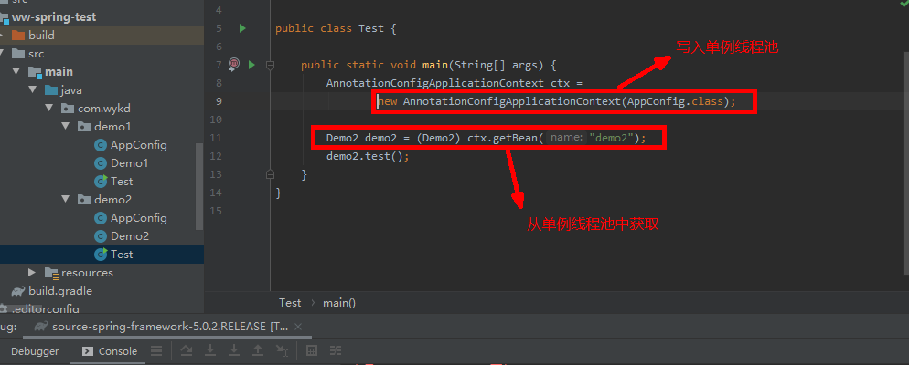
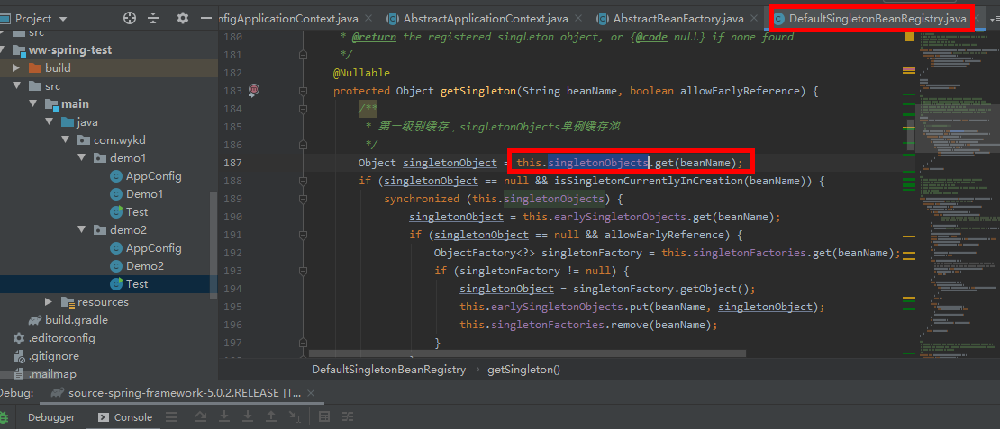
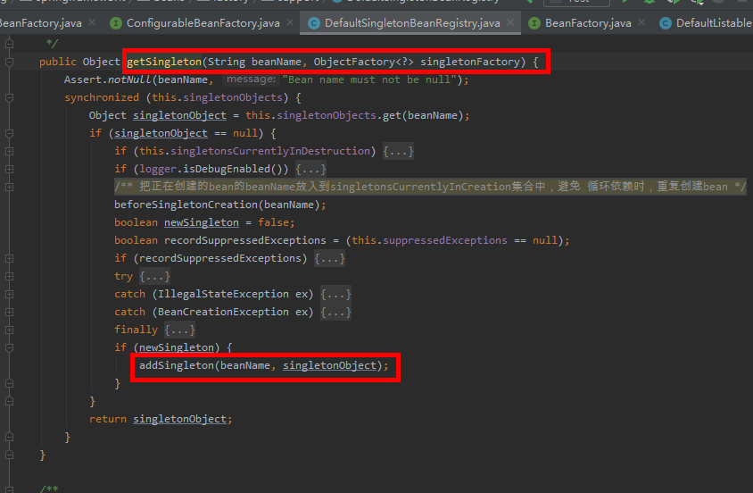
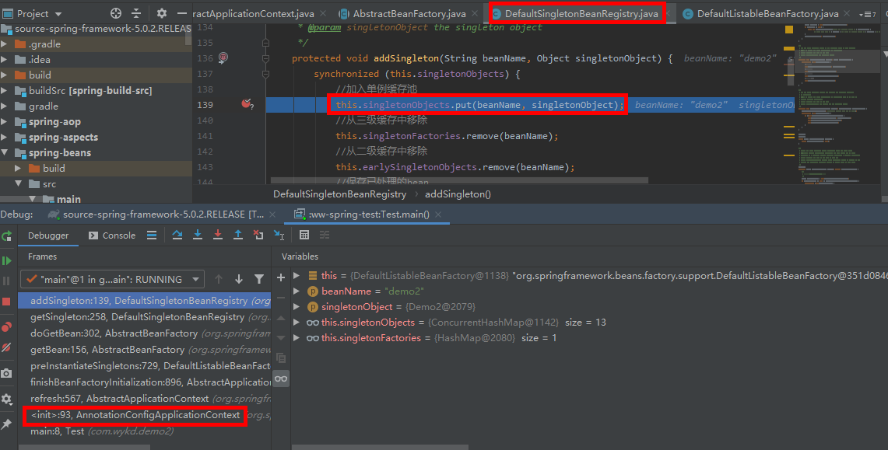
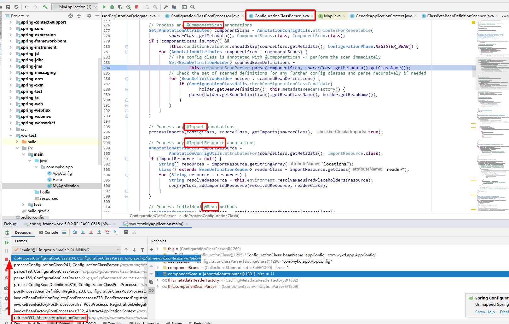

# Spring 

## 整体架构图

> **Core**：包含Spring基本的核心工具类，Spring的其他组件都需要使用这个包中的工具类，是最基本的核心包
>
> **Beans**：该模块是访问配置文件、创建和管理bean以及Spring的IOC操作的所有类，该模块的核心是BeanFactory
>
> **Context**：该模块是基于core和bean构建，相当于对bean进行封装及扩展来对外提供使用，ApplicationContext接口是Context模块的核心
>
> 
>
> **BeanFactory与ApplicationContext 的区别：**
>
>  BeanFactory 容器实例化后并不会自动实例化 Bean，只有当 Bean
> 被使用时 BeanFactory 容器才会对该 Bean 进行实例化与依赖关系的装配
>
> ApplicationContext 容器实例化后会自动对所有的单实例 Bean 进行实例化与
> 依赖关系的装配，使之处于待用状态。


### 各模块依赖关系

> 注意：Spring-jdbc依赖于spring-tx


### 版本命名规则

> Snapshot：快照版
>
> Release：稳定版
>
> GA：正式版
>
> M：里程碑版本
>
> RC：终测版

### BeanFactory核心类

> BeanFactory：定义容器
>
> BeanDefinition：存放配置
>
> BeanDefinitionReader：读取配置


## **Spring源码构建及解读：**

### 源码构建

参考1：https://www.cnblogs.com/enjoyjava/p/11622555.html

参考2：https://blog.csdn.net/bskfnvjtlyzmv867/article/details/81171802

**查看构建spring-framework的gradle的版本**：

https://blog.csdn.net/chenweijiSun/article/details/104814564

#### 在源码中创建测试模块

```groovy
# 创建一个gradle模块，build.gradle添加下面依赖
compile(project(":spring-context"))
```

配置类：

```java
import org.springframework.context.annotation.ComponentScan;
import org.springframework.context.annotation.Configuration;

@ComponentScan("com.wykd.app")
@Configuration
public class AppConfig {
}
```

Demo类：

```java

import org.springframework.stereotype.Component;
@Component
public class Demo {
	public void test(){
		System.out.println("hello , 恭喜 , Spring源码5.0.2版本第一次构建成功！");
	}

}

```

测试类：

```java

import org.springframework.context.annotation.AnnotationConfigApplicationContext;

public class Test {

	public static void main(String[] args) {
        //初始化IOC容器，创建BeanDefinition -> map -> 遍历map --> getBean --> getSingleton不存在实例
		// --> createBean 创建Bean实例 --> addSingleton 把bean放入单例池
		AnnotationConfigApplicationContext ctx =
				new AnnotationConfigApplicationContext(AppConfig.class);
        
        //从单例池取出Bean实例
		Demo demo = (Demo) ctx.getBean("demo");
		demo.test();

	}
}

```

执行结果如下：

```
hello , 恭喜 , Spring源码5.0.2版本第一次构建成功！
```


### 源码解读

参考地址1：https://www.jianshu.com/p/922125d40eb4

参考地址2：https://blog.csdn.net/nuomizhende45/article/details/81158383

参考地址3：https://blog.csdn.net/java_lyvee


::: tip

1.先扫描文件夹，扫描加了@Component注解的文件

2.创建BeanDefinition，将扫描的类属性设置到BeanDefinition中，放入一个Ioc容器的map属性中

[DefaultListableBeanFactory.beanDefinitionMap]

3.遍历BeanDefinitionMap，逐个实例化，并放入单例池中（另一个map）。[DefaultSingletonBeanRegistry.singletonObjects]

:::


### BeanFactory


### ApplicationContext


### IOC容器


::: tip 

DefaultListableBeanFactory   IOC容器;（实现了BeanDefinitionRegistry接口）
DefaultListableBeanFactory.beanDefinitionMap   存放BeanDefinition

:::

::: tip

AnnotationConfigApplicationContext 

:::

```java
public AnnotationConfigApplicationContext(Class<?>... annotatedClasses) {
		//调用了父类的构造方法，初始化了一个IOC容器：DefaultListableBeanFactory ，并把默认的spring内置的bean注册到容器中
		this();
		//将指定的配置类注册到容器中【真的就只注册了 配置类】
		register(annotatedClasses);
		//扫描工程中的bean对象，注册到容器中，执行BeanFactoryPostProcess的实现类 --> 实例化 --> 执行BeanPostProcess的实现类
		refresh();  //调用父类的AbstractApplicationContext 的refresh方法
	}
```

无参构造函数

```java
/**
	 * Create a new AnnotationConfigApplicationContext that needs to be populated
	 * through {@link #register} calls and then manually {@linkplain #refresh refreshed}.
	 */
	//默认构造函数，初始化一个空容器，容器不包含任何 Bean 信息，需要在稍后通过调用其register()
	//方法注册配置类，并调用refresh()方法刷新容器，触发容器对注解Bean的载入、解析和注册过程
	public AnnotationConfigApplicationContext() {

		// 1.调用了父类的无参构造方法：new GenericApplicationContext() ，创建了一个空的IOC容器，DefaultListableBeanFactory

		/**
		 * 2.注册了spring的内核关键bean
		 * 		继承的GenericApplicationContext实现了BeanDefinitionRegistry接口，把this作为参数传递
		 * 		调用GenericApplicationContext的registerBeanDefinition方法
		 * 		从GenericApplicationContext获取beanFactory（DefaultListableBeanFactory）;
		 * 		将BeanDefinition，写入到DefaultListableBeanFactory的beanDefinitionMap中
		 */
		this.reader = new AnnotatedBeanDefinitionReader(this);
		/**
		 * 3.创建一个扫描器，添加过滤规则（扫描带@Component的）
		 */
		this.scanner = new ClassPathBeanDefinitionScanner(this);
	}
```


::: tip

AbstractApplicationContext 

:::

```java
@Override
	public void refresh() throws BeansException, IllegalStateException {
		synchronized (this.startupShutdownMonitor) {
			// Prepare this context for refreshing.
			//调用容器准备刷新的方法，获取容器的当时时间，同时给容器设置同步标识
			prepareRefresh();

			// Tell the subclass to refresh the internal bean factory.
			//告诉子类启动refreshBeanFactory()方法，Bean定义资源文件的载入从
			//子类的refreshBeanFactory()方法启动
			/**
			 * 取出IOC容器
			 * 若是xml方式，还会扫描xml配置，放入map中
			 */
			ConfigurableListableBeanFactory beanFactory = obtainFreshBeanFactory();

			// Prepare the bean factory for use in this context.
			//为BeanFactory配置容器特性，例如类加载器、事件处理器等
			prepareBeanFactory(beanFactory);

			try {
				// Allows post-processing of the bean factory in context subclasses.
				//为容器的某些子类指定特殊的BeanPost事件处理器
				postProcessBeanFactory(beanFactory);

				/**
				 * 1.扫描
				 * 2.遍历所有BeanFactoryPostProcess的实现类，并分别执行postProcessBeanFactory方法。
				 * 		1)最先执行默认：ConfigurationClassPostProcessor（实现了PriorityOrdered，BeanDefinitionRegistryPostProcessor接口）
				 * 			完成注解的所有BeanDefinition的定义，并添加到IOC容器中
				 * 		2)然后执行开发人员自定义的BeanFactoryPostProcess的实现类
				 */
				invokeBeanFactoryPostProcessors(beanFactory);

				// Register bean processors that intercept bean creation.
				//为BeanFactory注册BeanPost事件处理器.
				//BeanPostProcessor是Bean后置处理器，用于监听容器触发的事件
				/**
				 * 注册 BeanPostProcessor 的实现类
				 */
				registerBeanPostProcessors(beanFactory);

				// Initialize message source for this context.
				//初始化信息源，和国际化相关.
				initMessageSource();

				// Initialize event multicaster for this context.
				//初始化容器事件传播器.
				initApplicationEventMulticaster();

				// Initialize other special beans in specific context subclasses.
				//调用子类的某些特殊Bean初始化方法
				onRefresh();

				// Check for listener beans and register them.
				//为事件传播器注册事件监听器, 监听器需要实现 ApplicationListener 接口
				registerListeners();

				// Instantiate all remaining (non-lazy-init) singletons.
				/**
				 * 初始化所有的 singleton beans【非常关键】
				 * getBean -> doCreateBean -> 根据构造方法进行实例化
				 * bean属性注入
				 * 执行后置处理器BeanPostProcessor的方法
				 */
				finishBeanFactoryInitialization(beanFactory);

				// Last step: publish corresponding event.
				//初始化容器的生命周期事件处理器，并发布容器的生命周期事件
				finishRefresh();
			}

			catch (BeansException ex) {
				if (logger.isWarnEnabled()) {
					logger.warn("Exception encountered during context initialization - " +
							"cancelling refresh attempt: " + ex);
				}

				// Destroy already created singletons to avoid dangling resources.
				//销毁已创建的Bean
				destroyBeans();

				// Reset 'active' flag.
				//取消refresh操作，重置容器的同步标识.
				cancelRefresh(ex);

				// Propagate exception to caller.
				throw ex;
			}

			finally {
				// Reset common introspection caches in Spring's core, since we
				// might not ever need metadata for singleton beans anymore...
				resetCommonCaches();
			}
		}
	}
```


### 单例池

::: tip

存放Bean实例 DefaultSingletonBeanRegistry

private final Map<String, Object> singletonObjects = new ConcurrentHashMap(256);

:::



::: tip

refresh() --> finishBeanFactoryInitialization() --> beanFactory.preInstantiateSingletons(); 

--> getBean()   --> doGetBean关键代码1 

-->  getSingleton【singletonObjects.get(beanName)】 ,第一次自然而言取不到单例实例的

:::



::: tip

doGetBean的关键代码2

-->   if(mbd.isSingleton() ) --->   getSingleton(String beanName, ObjectFactory<?> singletonFactory)  -->  

:::

```java
// Create bean instance.
//创建单例模式Bean的实例对象
if (mbd.isSingleton()) {
    //这里使用了一个匿名内部类，创建Bean实例对象，并且注册给所依赖的对象
    sharedInstance = getSingleton(beanName, () -> {
        try {
            //创建一个指定Bean实例对象，如果有父级继承，则合并子类和父类的定义
            return createBean(beanName, mbd, args);
        }
        catch (BeansException ex) {
            //显式地从容器单例模式Bean缓存中清除实例对象
            destroySingleton(beanName);
            throw ex;
        }
    });
    //获取给定Bean的实例对象
    bean = getObjectForBeanInstance(sharedInstance, name, beanName, mbd);
}				
```


::: tip

createBean --> doCreateBean

真正创建Bean的方法，返回Bean实例

:::

```java
//真正创建Bean的方法
	protected Object doCreateBean(final String beanName, final RootBeanDefinition mbd, final @Nullable Object[] args)
			throws BeanCreationException {

		// Instantiate the bean.
		//封装被创建的Bean对象
		BeanWrapper instanceWrapper = null;
		if (mbd.isSingleton()) {
			instanceWrapper = this.factoryBeanInstanceCache.remove(beanName);
		}
		if (instanceWrapper == null) {
			instanceWrapper = createBeanInstance(beanName, mbd, args);
		}
		final Object bean = instanceWrapper.getWrappedInstance();
		//获取实例化对象的类型
		Class<?> beanType = instanceWrapper.getWrappedClass();
		if (beanType != NullBean.class) {
			mbd.resolvedTargetType = beanType;
		}

		// Allow post-processors to modify the merged bean definition.
		//调用PostProcessor后置处理器
		synchronized (mbd.postProcessingLock) {
			if (!mbd.postProcessed) {
				try {
					applyMergedBeanDefinitionPostProcessors(mbd, beanType, beanName);
				}
				catch (Throwable ex) {
					throw new BeanCreationException(mbd.getResourceDescription(), beanName,
							"Post-processing of merged bean definition failed", ex);
				}
				mbd.postProcessed = true;
			}
		}

		// Eagerly cache singletons to be able to resolve circular references
		// even when triggered by lifecycle interfaces like BeanFactoryAware.
		//向容器中缓存单例模式的Bean对象，以防循环引用
		boolean earlySingletonExposure = (mbd.isSingleton() && this.allowCircularReferences &&
				isSingletonCurrentlyInCreation(beanName));
		if (earlySingletonExposure) {
			if (logger.isDebugEnabled()) {
				logger.debug("Eagerly caching bean '" + beanName +
						"' to allow for resolving potential circular references");
			}
			//这里是一个匿名内部类，为了防止循环引用，尽早持有对象的引用
			addSingletonFactory(beanName, () -> getEarlyBeanReference(beanName, mbd, bean));
		}

		// Initialize the bean instance.
		//Bean对象的初始化，依赖注入在此触发
		//这个exposedObject在初始化完成之后返回作为依赖注入完成后的Bean
		Object exposedObject = bean;
		try {
			//将Bean实例对象封装，并且Bean定义中配置的属性值赋值给实例对象
			populateBean(beanName, mbd, instanceWrapper);
			//初始化Bean对象
			exposedObject = initializeBean(beanName, exposedObject, mbd);
		}
		catch (Throwable ex) {
			if (ex instanceof BeanCreationException && beanName.equals(((BeanCreationException) ex).getBeanName())) {
				throw (BeanCreationException) ex;
			}
			else {
				throw new BeanCreationException(
						mbd.getResourceDescription(), beanName, "Initialization of bean failed", ex);
			}
		}

		if (earlySingletonExposure) {
			//获取指定名称的已注册的单例模式Bean对象
			Object earlySingletonReference = getSingleton(beanName, false);
			if (earlySingletonReference != null) {
				//根据名称获取的已注册的Bean和正在实例化的Bean是同一个
				if (exposedObject == bean) {
					//当前实例化的Bean初始化完成
					exposedObject = earlySingletonReference;
				}
				//当前Bean依赖其他Bean，并且当发生循环引用时不允许新创建实例对象
				else if (!this.allowRawInjectionDespiteWrapping && hasDependentBean(beanName)) {
					String[] dependentBeans = getDependentBeans(beanName);
					Set<String> actualDependentBeans = new LinkedHashSet<>(dependentBeans.length);
					//获取当前Bean所依赖的其他Bean
					for (String dependentBean : dependentBeans) {
						//对依赖Bean进行类型检查
						if (!removeSingletonIfCreatedForTypeCheckOnly(dependentBean)) {
							actualDependentBeans.add(dependentBean);
						}
					}
					if (!actualDependentBeans.isEmpty()) {
						throw new BeanCurrentlyInCreationException(beanName,
								"Bean with name '" + beanName + "' has been injected into other beans [" +
								StringUtils.collectionToCommaDelimitedString(actualDependentBeans) +
								"] in its raw version as part of a circular reference, but has eventually been " +
								"wrapped. This means that said other beans do not use the final version of the " +
								"bean. This is often the result of over-eager type matching - consider using " +
								"'getBeanNamesOfType' with the 'allowEagerInit' flag turned off, for example.");
					}
				}
			}
		}

		// Register bean as disposable.
		//注册完成依赖注入的Bean
		try {
			registerDisposableBeanIfNecessary(beanName, bean, mbd);
		}
		catch (BeanDefinitionValidationException ex) {
			throw new BeanCreationException(
					mbd.getResourceDescription(), beanName, "Invalid destruction signature", ex);
		}

		return exposedObject;
	}
```

::: tip

createBean创建实例后，将实例写入单例池

----> 回到doCreateBean ---> getSingleton(String beanName, ObjectFactory<?> singletonFactory)   

---> addSingleton  将实例写入单例缓存池--->  【singletonObjects.put(beanName, singletonObject);】

:::






### BeanFactoryPostProcess


```
### Bean定义修改：
BeanFactoryPostProcess   开发人员修改BeanDefinition

BeanDefinitionRegistryPostProcessor 继承了BeanFactoryPostProcess接口，注册bean定义到容器中

ConfigurationClassPostProcessor 实现了BeanDefinitionRegistryPostProcessor接口，PriorityOrdered接口，用于框架实现BeanDefinition的定义


### 修改Bean实例
BeanPostProcessor  修改bean实例

### Import
ImportBeanDefinitionRegistrar  传入的参数，DefaultListableBeanFactory，从而修改其中的map中的bean定义
```

@Bean @ComponentScan代码示例：

#### 

#### 代码示例

```java
import org.springframework.beans.BeansException;
import org.springframework.beans.factory.config.BeanFactoryPostProcessor;
import org.springframework.beans.factory.config.ConfigurableListableBeanFactory;
import org.springframework.beans.factory.support.GenericBeanDefinition;
import org.springframework.stereotype.Component;

/**
 * 功能：
 * Created by [Alex]
 * 2020/6/17 14:35
 */
@Component
public class MyBeanFactoryPostProcessor implements BeanFactoryPostProcessor {

    @Override
    public void postProcessBeanFactory(ConfigurableListableBeanFactory beanFactory) throws BeansException {
        GenericBeanDefinition beanDefinition = (GenericBeanDefinition) beanFactory.getBeanDefinition("userDao");
        beanDefinition.setBeanClass(UserDaoImpl2.class);
        System.out.println("========MyBeanFactoryPostProcessor.postProcessBeanFactory=========");
        System.out.println("22222222222222222");
    }
}
```


```java
import org.springframework.beans.BeansException;
import org.springframework.beans.factory.config.BeanDefinition;
import org.springframework.beans.factory.config.ConfigurableListableBeanFactory;
import org.springframework.beans.factory.support.BeanDefinitionBuilder;
import org.springframework.beans.factory.support.BeanDefinitionRegistry;
import org.springframework.beans.factory.support.BeanDefinitionRegistryPostProcessor;
import org.springframework.stereotype.Component;

/**
 * 功能：
 * Created by [Alex]
 * 2020/7/16 16:10
 */
@Component
public class MyBeanFactoryPostProcessor2 implements BeanDefinitionRegistryPostProcessor {


    @Override
    public void postProcessBeanDefinitionRegistry(BeanDefinitionRegistry registry) throws BeansException {

        BeanDefinition annotationProcessor = BeanDefinitionBuilder.genericBeanDefinition(UserDaoImpl3.class).getBeanDefinition();
        registry.registerBeanDefinition("userDaoImpl3", annotationProcessor);

       // RootBeanDefinition def = new RootBeanDefinition(ConfigurationClassPostProcessor.class);
//registry.registerBeanDefinition("userDaoImpl3", def);
        
        System.out.println("1111111111111111");
    }

    @Override
    public void postProcessBeanFactory(ConfigurableListableBeanFactory beanFactory) throws BeansException {

    }
}

```


```java
import org.springframework.beans.BeansException;
import org.springframework.beans.factory.config.BeanPostProcessor;
import org.springframework.stereotype.Component;

/**
 * 功能：
 * Created by [Alex]
 * 2020/6/17 15:30
 */
@Component
public class MyBeanPostProcessor implements BeanPostProcessor {

    @Override
    public Object postProcessBeforeInitialization(Object bean, String beanName) throws BeansException {
        System.out.println(beanName+"======MyBeanPostProcessor.postProcessBeforeInitialization======");
        return bean;
    }

    @Override
    public Object postProcessAfterInitialization(Object bean, String beanName) throws BeansException {
        System.out.println(beanName+"======MyBeanPostProcessor.postProcessAfterInitialization======");
        return bean;
    }
}

```


```java
import com.alibaba.fastjson.JSON;
import org.springframework.context.annotation.AnnotationConfigApplicationContext;

/**
 * 功能：
 * Created by [Alex]
 * 2020/6/17 14:54
 */
public class TestBeanDefinition {

    public static void main(String[] args) {


        AnnotationConfigApplicationContext ctx = new AnnotationConfigApplicationContext("com.wykd.bean.bean.definition");

        UserDao dao = (UserDao) ctx.getBean("userDao");
        System.out.println(dao.test());

        System.out.println("getBeanDefinitionNames"+JSON.toJSONString(ctx.getBeanDefinitionNames()));


        UserDao dao2 = (UserDao) ctx.getBean("userDaoImpl3");
        System.out.println(dao2.test());
    }


}
```


```java
public interface UserDao {
    String test();
}

@Component("userDao")
public class UserDaoImpl implements UserDao{
    public String test(){
        return "hello UserDaoImpl";
    }
}

public class UserDaoImpl2 implements UserDao {
    public String test(){
        return "hello UserDaoImpl2";
    }
}


public class UserDaoImpl3 implements UserDao {
    public String test(){
        return "hello UserDaoImpl3";
    }
}

```


```
1111111111111111
========MyBeanFactoryPostProcessor.postProcessBeanFactory=========
22222222222222222
userDao======MyBeanPostProcessor.postProcessBeforeInitialization======
userDao======MyBeanPostProcessor.postProcessAfterInitialization======
userDaoImpl3======MyBeanPostProcessor.postProcessBeforeInitialization======
userDaoImpl3======MyBeanPostProcessor.postProcessAfterInitialization======
hello UserDaoImpl2
hello UserDaoImpl3

```

BeanDefinition的集合

```
[
	"org.springframework.context.annotation.internalConfigurationAnnotationProcessor",
	"org.springframework.context.annotation.internalAutowiredAnnotationProcessor",
	"org.springframework.context.annotation.internalCommonAnnotationProcessor",
	"org.springframework.context.event.internalEventListenerProcessor",
	"org.springframework.context.event.internalEventListenerFactory",
	"myBeanFactoryPostProcessor",
	"myBeanFactoryPostProcessor2",
	"myBeanPostProcessor",
	"userDao",
	"userDaoImpl3"
]
```


## ApplicationEvent

参考：https://www.jianshu.com/p/ef2cee8c5dd1

## WebFlux

### 一个最简单的应用

> Springboot项目

pom.xml

```xml
 <dependency>
            <groupId>org.springframework.boot</groupId>
            <artifactId>spring-boot-starter-webflux</artifactId>
        </dependency>

        <dependency>
            <groupId>io.projectreactor</groupId>
            <artifactId>reactor-test</artifactId>
            <scope>test</scope>
        </dependency>

        <dependency>
            <groupId>org.projectlombok</groupId>
            <artifactId>lombok</artifactId>
            <version>1.16.22</version>
        </dependency>
```

Controller类方法：

```java
import lombok.extern.slf4j.Slf4j;
import org.springframework.web.bind.annotation.GetMapping;
import org.springframework.web.bind.annotation.RestController;
import reactor.core.publisher.Flux;
import reactor.core.publisher.Mono;

@RestController
@Slf4j
public class HelloController {


    @GetMapping("mono")
    public Mono<String> mono() {
        return Mono.just("hello webflux");
    }


    @GetMapping("mono2")
    public Mono<Object> mono2() {

        return Mono.create(monoSink -> {
            log.info("创建Mono");
            monoSink.success("hello webflux");
        }).doOnSubscribe(subscription -> { //当订阅者去订阅发布者的时候，该方法会调用
            log.info("订阅==========>" + subscription);
        }).doOnNext(o -> {      //当订阅者收到数据时，该方法会调用
            log.info("消费==========>" + o);
        });
    }

    @GetMapping("flux")
    public Flux<String> flux() {
        return Flux.just("hello","webflux","spring","boot");
    }
}
```

执行：http://localhost:8080/mono2 ，打印结果：

```
2020-08-04 10:44:43.960  INFO 19416 --- [ctor-http-nio-4] c.w.p.HelloController                    : 订阅==========>MonoSink
2020-08-04 10:44:43.960  INFO 19416 --- [ctor-http-nio-4] c.w.p.HelloController                    : 创建Mono
2020-08-04 10:44:43.960  INFO 19416 --- [ctor-http-nio-4] c.w.p.HelloController                    : 消费==========>hello webflux
```