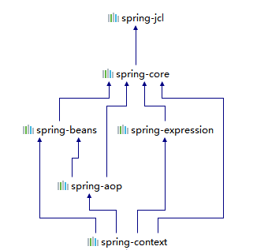
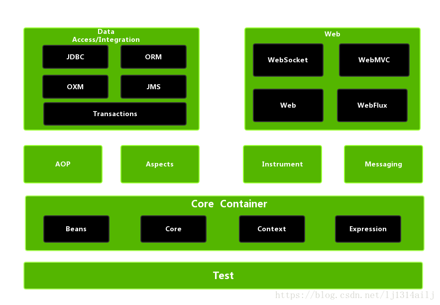
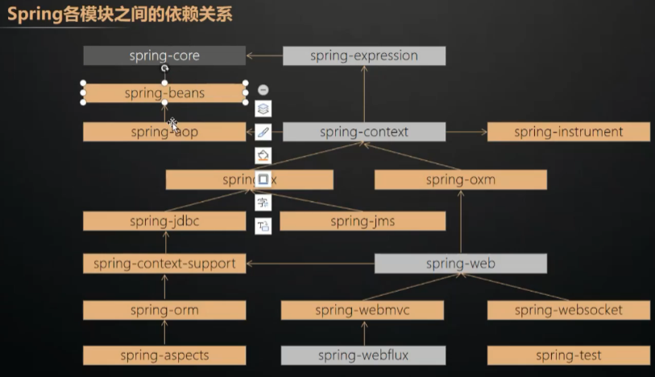
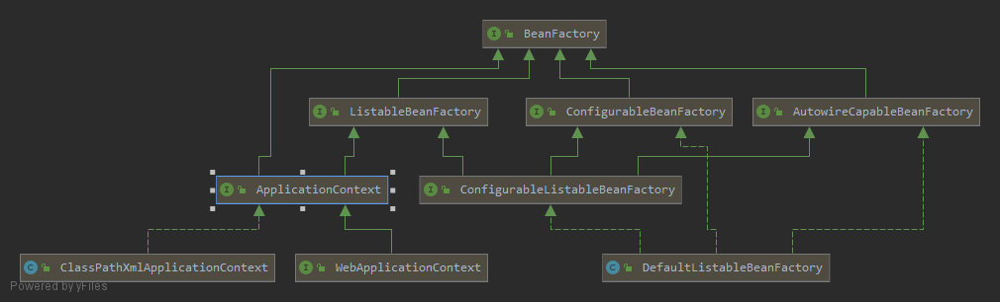
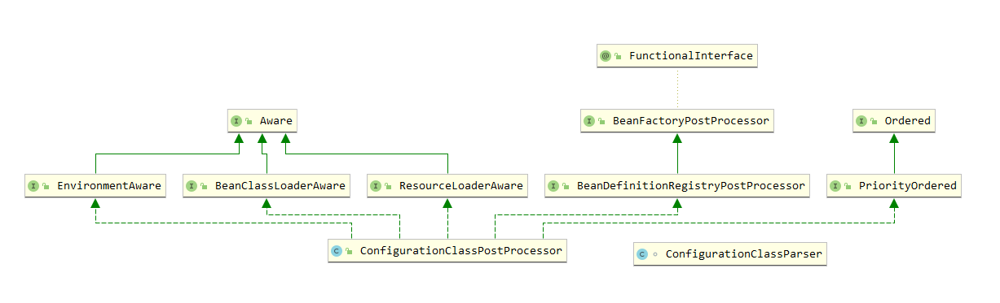

# Spring 

## 整体架构图

> **Core**：包含Spring基本的核心工具类，Spring的其他组件都需要使用这个包中的工具类，是最基本的核心包
>
> **Beans**：该模块是访问配置文件、创建和管理bean以及Spring的IOC操作的所有类，该模块的核心是BeanFactory
>
> **Context**：该模块是基于core和bean构建，相当于对bean进行封装及扩展来对外提供使用，ApplicationContext接口是Context模块的核心
>
> 
>
> **BeanFactory与ApplicationContext 的区别：**
>
>  BeanFactory 容器实例化后并不会自动实例化 Bean，只有当 Bean
> 被使用时 BeanFactory 容器才会对该 Bean 进行实例化与依赖关系的装配
>
> ApplicationContext 容器实例化后会自动对所有的单实例 Bean 进行实例化与
> 依赖关系的装配，使之处于待用状态。




### 各模块依赖关系

> 注意：Spring-jdbc依赖于spring-tx



### 版本命名规则

> Snapshot：快照版
>
> Release：稳定版
>
> GA：正式版
>
> M：里程碑版本
>
> RC：终测版

### BeanFactory核心类

> BeanFactory：定义容器
>
> BeanDefinition：存放配置
>
> BeanDefinitionReader：读取配置




## **Spring源码构建：**

参考：https://www.cnblogs.com/enjoyjava/p/11622555.html

**查看构建spring-framework的gradle的版本**：

https://blog.csdn.net/chenweijiSun/article/details/104814564

### 源码解读

参考地址：https://www.jianshu.com/p/922125d40eb4

```
public AnnotationConfigApplicationContext(Class<?>... annotatedClasses) {
		
		//调用了父类的构造方法，初始化了一个IOC容器：DefaultListableBeanFactory ，并把默认的spring内置的bean注册到容器中
		this();
		
		//将指定的配置类注册到容器中
		register(annotatedClasses);
		
		//扫描工程中的bean对象，注册到容器中，执行BeanFactoryPostProcess的实现类 --> 实例化 --> 执行BeanPostProcess的实现类
		refresh();
	}
```


```
### Bean定义：
DefaultListableBeanFactory  IOC容器
	实现了BeanDefinitionRegistry接口
DefaultListableBeanFactory.beanDefinitionMap
BeanDefinition


### Bean定义修改：
BeanFactoryPostProcess   开发人员修改BeanDefinition

BeanDefinitionRegistryPostProcessor 继承了BeanFactoryPostProcess接口，注册bean定义到容器中

ConfigurationClassPostProcessor 实现了BeanDefinitionRegistryPostProcessor接口，PriorityOrdered接口，用于框架实现BeanDefinition的定义

BeanPostProcessor  修改bean实例


### 修改实例
ImportBeanDefinitionRegistrar  传入的参数，DefaultListableBeanFactory，从而修改其中的map中的bean定义
```


### BeanFactoryPostProcess




## ApplicationEvent

参考：https://www.jianshu.com/p/ef2cee8c5dd1